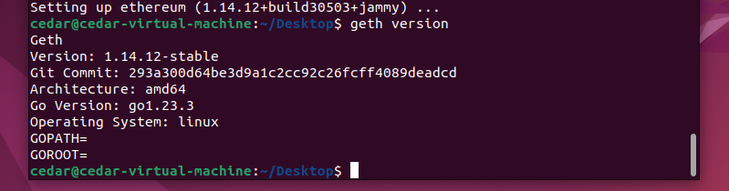

```
sudo apt-get install software-properties-common
sudo add-apt-repository -y ppa:ethereum/ethereum
sudo apt-get update
sudo apt-get install ethereum
```



现在geth不能直接使用了，以太坊已经改为POS共识，除了geth之外还要再安装一个共识的客户端。


