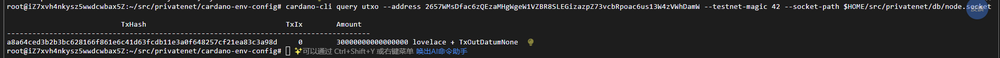
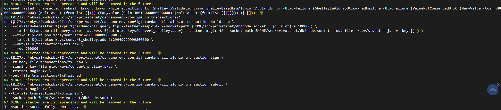
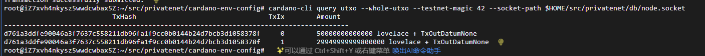
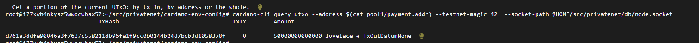
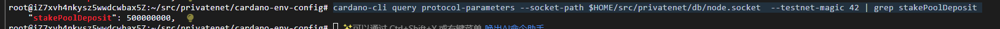

下载：
```
mkdir ~/src
cd src 

wget https://github.com/IntersectMBO/cardano-node/releases/download/10.1.3/cardano-node-10.1.3-linux.tar.gz

mkdir cardano-node
tar -xvf cardano-node-10.1.3-linux.tar.gz -C cardano-node/
cd cardano-node
```

配置环境变量：
```
export PATH=$PATH:/$HOME/src/cardano-node/bin
```

添加topology:
```
cat > ~/src/privatenet/nodeConfig/topology.json <<EOF
{
   "Producers": []
 }
EOF
```

修改config:
```
"EnableP2P": false,
```

创建创世文件：
```
cardano-cli conway genesis create-cardano \
--genesis-dir ./ \
--gen-genesis-keys 1 \
--gen-utxo-keys 1 \
--start-time $(date -u -d "now + 2 minutes" +%FT%Tz) \
--supply 30000000000000000 \
--security-param 45 \
--slot-length 100 \
--slot-coefficient 5/100 \
--testnet-magic  42 \
--byron-template template/byron.json \
--shelley-template template/shelley.json \
--alonzo-template template/alonzo.json \
--conway-template template/conway.json \
--node-config-template template/config.json
```

```
mv node-config.json config.json
```

运行节点：
```
cardano-node run \
--config $HOME/src/privatenet/cardano-env-config/config.json \
--database-path $HOME/src/privatenet/db/ \
--socket-path $HOME/src/privatenet/db/node.socket \
--host-addr 127.0.0.1 \
--port 3001 \
--topology $HOME/src/privatenet/nodeConfig/topology.json \
--shelley-kes-key $HOME/src/privatenet/cardano-env-config/delegate-keys/shelley.000.kes.skey \
--shelley-vrf-key $HOME/src/privatenet/cardano-env-config/delegate-keys/shelley.000.vrf.skey \
--shelley-operational-certificate $HOME/src/privatenet/cardano-env-config/delegate-keys/shelley.000.opcert.json \
--byron-delegation-certificate  $HOME/src/privatenet/cardano-env-config/delegate-keys/byron.000.cert.json \
--byron-signing-key   $HOME/src/privatenet/cardano-env-config/delegate-keys/byron.000.key
```

创建byron.000.key地址：
```
cardano-cli signing-key-address \
    --testnet-magic 42 \
    --secret utxo-keys/byron.000.key > utxo-keys/byron.000.addr
```

查看地址：
```
cardano-cli query utxo --address 2657WMsDfac6zQEzaMHgWgeW1VZBR8SLEGizazpZ73vcbRpoac6us13W4zVWhDamW --testnet-magic 42 --socket-path $HOME/src/privatenet/db/node.socket 
```




将byron类型密钥转化为shelly类型：
```
cardano-cli conway key convert-byron-key \
--byron-payment-key-type \
--byron-signing-key-file utxo-keys/byron.000.key \
--out-file utxo-keys/convert_shelley.skey

cardano-cli conway key verification-key \
--signing-key-file utxo-keys/convert_shelley.skey \
--verification-key-file utxo-keys/convert_shelley.vkey

cardano-cli address build \
--payment-verification-key-file utxo-keys/convert_shelley.vkey \
--testnet-magic 42 \
--out-file utxo-keys/convert_shelley.addr
```

创建权益池：
```
mkdir pool1

// 创建地址：
cardano-cli address key-gen \
--verification-key-file pool1/payment.vkey \
--signing-key-file pool1/payment.skey

// 将权益委托给池中，需要权益密钥：
cardano-cli conway stake-address key-gen \
--verification-key-file pool1/stake.vkey \
--signing-key-file pool1/stake.skey


// 构建地址：
cardano-cli address build \
--payment-verification-key-file pool1/payment.vkey \
--stake-verification-key-file pool1/stake.vkey \
--out-file pool1/payment.addr \
--testnet-magic 42

//向矿池所有者发送资金：
cardano-cli alonzo transaction build-raw \
  --invalid-hereafter $(expr $(cardano-cli query tip --testnet-magic 42 --socket-path $HOME/src/privatenet/db/node.socket | jq .slot) + 100000) \
  --tx-in $(cardano-cli query utxo --address $(cat utxo-keys/convert_shelley.addr) --testnet-magic 42 --socket-path $HOME/src/privatenet/db/node.socket --out-file  /dev/stdout | jq -r 'keys[]') \
  --tx-out $(cat pool1/payment.addr)+50000000000000 \
  --tx-out $(cat utxo-keys/convert_shelley.addr)+29949999999800000 \
  --out-file transactions/tx3.raw \
  --fee 200000

//签署交易：
cardano-cli alonzo transaction sign \
--tx-body-file transactions/tx3.raw \
--signing-key-file utxo-keys/convert_shelley.skey \
--testnet-magic 42 \
--out-file transactions/tx3.signed

//提交到区块链
cardano-cli alonzo transaction submit \
--testnet-magic 42 \
--tx-file transactions/tx3.signed \
--socket-path $HOME/src/privatenet/db/node.socket
```






生成权益池密钥：
```
// 生成冷键:
cardano-cli node key-gen \
--cold-verification-key-file pool1/cold.vkey \
--cold-signing-key-file pool1/cold.skey \
--operational-certificate-issue-counter-file pool1/opcert.counter

// 生成 VRF 密钥
cardano-cli node key-gen-VRF \
--verification-key-file pool1/vrf.vkey \
--signing-key-file pool1/vrf.skey

// 生成 KES 密钥
cardano-cli node key-gen-KES \
--verification-key-file pool1/kes.vkey \
--signing-key-file pool1/kes.skey

// 生成操作证书
cardano-cli node issue-op-cert \
--kes-verification-key-file pool1/kes.vkey \
--cold-signing-key-file pool1/cold.skey \
--operational-certificate-issue-counter pool1/opcert.counter \
--kes-period 0 \
--out-file pool1/opcert.cert
```

为pool1创建拓扑文件并更新BFT节点的拓扑：
```
cat > pool1/topology.json <<EOF
{
   "Producers": [
     {
       "addr": "127.0.0.1",
       "port": 3001,
       "valency": 1
     }
   ]
 }
EOF

cat > ../nodeConfig/topology.json <<EOF
{
   "Producers": [
     {
       "addr": "127.0.0.1",
       "port": 3002,
       "valency": 1
     }
   ]
 }
EOF
```

启动权益池节点:
```
cardano-node run \
--config ../config.json \
--topology topology.json \
--database-path db \
--socket-path node.socket \
--port 3002 \
--shelley-kes-key kes.skey \
--shelley-vrf-key vrf.skey \
--shelley-operational-certificate opcert.cert
```

矿池目前还不能创建区块。还需要将其注册到区块链。
注册权益地址：
```
创建注册证书：
cardano-cli alonzo stake-address registration-certificate \
  --stake-verification-key-file pool1/stake.vkey \
  --out-file pool1/stake.cert

CHANGE=$(($(cardano-cli query utxo --socket-path $HOME/src/privatenet/db/node.socket --address $(cat pool1/payment.addr) --testnet-magic 42 --out-file /dev/stdout | jq -r 'to_entries | .[0].value.value.lovelace') - 3000000))


cardano-cli alonzo transaction build-raw \
--fee 1000000 \
--invalid-hereafter $(expr $(cardano-cli query tip --testnet-magic 42 --socket-path $HOME/src/privatenet/db/node.socket | jq .slot) + 1000) \
--tx-in $(cardano-cli query utxo --socket-path $HOME/src/privatenet/db/node.socket --address $(cat pool1/payment.addr) --testnet-magic 42 --out-file  /dev/stdout | jq -r 'keys[]') \
--tx-out $(cat pool1/payment.addr)+$CHANGE \
--certificate-file pool1/stake.cert \
--out-file transactions/tx4.raw

cardano-cli alonzo transaction sign \
--tx-body-file transactions/tx4.raw \
--signing-key-file pool1/payment.skey \
--signing-key-file pool1/stake.skey \
--testnet-magic 42 \
--out-file transactions/tx4.signed

cardano-cli alonzo transaction submit \
--testnet-magic 42 \
--tx-file transactions/tx4.signed \
--socket-path $HOME/src/privatenet/db/node.socket
```

注册权益池：
```
// 获取文件
wget https://git.io/JJWdJ -O pool1/poolmetadata.json

// 获取元数据哈希并将其保存到文件中
cardano-cli alonzo stake-pool metadata-hash \
--pool-metadata-file pool1/poolmetadata.json --out-file pool1/poolmetadata.hash

//生成注册证书
cardano-cli alonzo stake-pool registration-certificate \
--cold-verification-key-file pool1/cold.vkey \
--vrf-verification-key-file pool1/vrf.vkey \
--pool-pledge 1000000000000 \
--pool-cost 340000000 \
--pool-margin 10/100 \
--pool-reward-account-verification-key-file pool1/stake.vkey \
--pool-owner-stake-verification-key-file pool1/stake.vkey \
--testnet-magic 42 \
--pool-relay-ipv4 127.0.0.1 \
--pool-relay-port 3002 \
--metadata-url https://git.io/JJWdJ \
--metadata-hash $(cat pool1/poolmetadata.hash) \
--out-file pool1/pool-registration.cert

// 创建委托证书以兑现承诺
cardano-cli alonzo stake-address stake-delegation-certificate \
--stake-verification-key-file pool1/stake.vkey \
--cold-verification-key-file pool1/cold.vkey \
--out-file pool1/delegation.cert

// 再次查询协议参数即可找到矿池押金
cardano-cli query protocol-parameters --socket-path $HOME/src/privatenet/db/node.socket  --testnet-magic 42 | grep stakePoolDeposit

// 现在，要存入 500 ada 押金，请同时提交委托证书和注册证书：
CHANGE=$(($(cardano-cli query utxo --socket-path $HOME/src/privatenet/db/node.socket --address $(cat pool1/payment.addr) --testnet-magic 42 --out-file /dev/stdout | jq -r 'to_entries | .[0].value.value.lovelace') - 501000000))


cardano-cli alonzo transaction build-raw \
--fee 1000000 \
--invalid-hereafter $(expr $(cardano-cli query tip --socket-path $HOME/src/privatenet/db/node.socket --testnet-magic 42 | jq .slot) + 10000) \
--tx-in $(cardano-cli query utxo --address $(cat pool1/payment.addr) --socket-path $HOME/src/privatenet/db/node.socket --testnet-magic 42 --out-file  /dev/stdout | jq -r 'keys[]') \
--tx-out $(cat pool1/payment.addr)+$CHANGE \
--certificate-file pool1/pool-registration.cert \
--certificate-file pool1/delegation.cert \
--out-file transactions/tx5.raw


cardano-cli alonzo transaction sign \
--tx-body-file transactions/tx5.raw \
--signing-key-file pool1/payment.skey \
--signing-key-file pool1/stake.skey \
--signing-key-file pool1/cold.skey \
--testnet-magic 42 \
--out-file transactions/tx5.signed

cardano-cli alonzo transaction submit \
--testnet-magic 42 \
--tx-file transactions/tx5.signed \
--socket-path $HOME/src/privatenet/db/node.socket

cardano-cli stake-pool id --cold-verification-key-file pool1/cold.vkey --output-format "hex"
```


为创世委托生成非扩展验证密钥:
```
cardano-cli key non-extended-key \
--extended-verification-key-file genesis-keys/shelley.000.vkey \
--verification-key-file genesis-keys/non.e.shelley.000.vkey
```


将权力下放降至0:
```
cardano-cli alonzo governance action create-protocol-parameters-update \
--out-file transactions/update.D0.proposal \
--epoch $(cardano-cli query tip --socket-path $HOME/src/privatenet/db/node.socket --testnet-magic 42 | jq .epoch) \
--genesis-verification-key-file genesis-keys/non.e.shelley.000.vkey \
--decentralization-parameter 0/100

CHANGE=$(($(cardano-cli query utxo --address $(cat pool1/payment.addr) --socket-path $HOME/src/privatenet/db/node.socket --testnet-magic 42 --out-file  /dev/stdout | jq -cs '.[0] | to_entries | .[] | .value.value.lovelace') - 1000000))

cardano-cli alonzo transaction build-raw \
--fee 1000000 \
--invalid-hereafter $(expr $(cardano-cli query tip --socket-path $HOME/src/privatenet/db/node.socket --testnet-magic 42 | jq .slot) + 1000) \
--tx-in $(cardano-cli query utxo --socket-path $HOME/src/privatenet/db/node.socket  --address $(cat pool1/payment.addr) --testnet-magic 42 --out-file  /dev/stdout | jq -r 'keys[]') \
--tx-out $(cat pool1/payment.addr)+$CHANGE \
--update-proposal-file transactions/update.D0.proposal \
--out-file transactions/update.D0.proposal.txbody

cardano-cli alonzo transaction sign \
--tx-body-file transactions/update.D0.proposal.txbody \
--signing-key-file pool1/payment.skey \
--signing-key-file genesis-keys/shelley.000.skey \
--out-file transactions/update.D0.proposal.txsigned

cardano-cli alonzo transaction submit --testnet-magic 42 --tx-file transactions/update.D0.proposal.txsigned --socket-path $HOME/src/privatenet/db/node.socket 
```


<hr>

生成第二个权益池：
```
mkdir pool2
// 付款键
cardano-cli address key-gen \
--verification-key-file pool2/payment.vkey \
--signing-key-file pool2/payment.skey

// 股份钥匙
cardano-cli stake-address key-gen \
--verification-key-file pool2/stake.vkey \
--signing-key-file pool2/stake.skey

// 构建地址
cardano-cli address build \
--payment-verification-key-file pool2/payment.vkey \
--stake-verification-key-file pool2/stake.vkey \
--out-file pool2/payment.addr \
--testnet-magic 42

// 构建交易以将一些资金发送给第二个池所有者：
cardano-cli transaction build \
--alonzo-era \
--testnet-magic 42 \
--invalid-hereafter $(expr $(cardano-cli query tip --testnet-magic 42 | jq .slot) + 1000) \
--tx-in $(cardano-cli query utxo --address $(cat utxo-keys/user1.payment.addr) --testnet-magic 42 --out-file  /dev/stdout | jq -r 'keys[]') \
--tx-out $(cat pool2/payment.addr)+50000000000000 \
--change-address $(cat utxo-keys/user1.payment.addr) \
--out-file transactions/tx6.raw

// 签署交易
cardano-cli transaction sign \
--tx-body-file transactions/tx6.raw \
--signing-key-file utxo-keys/user1.payment.skey \
--testnet-magic 42 \
--out-file transactions/tx6.signed

// 提交到区块链
cardano-cli transaction submit \
--testnet-magic 42 \
--tx-file transactions/tx6.signed

// 生成冷键：
cardano-cli node key-gen \
--cold-verification-key-file pool2/cold.vkey \
--cold-signing-key-file pool2/cold.skey \
--operational-certificate-issue-counter-file pool2/opcert.counter

// 生成 VRF 密钥
cardano-cli node key-gen-VRF \
--verification-key-file pool2/vrf.vkey \
--signing-key-file pool2/vrf.skey

// 生成 KES 密钥
cardano-cli node key-gen-KES \
--verification-key-file pool2/kes.vkey \
--signing-key-file pool2/kes.skey

// 颁发营业执照
cardano-cli node issue-op-cert \
--kes-verification-key-file pool2/kes.vkey \
--cold-signing-key-file pool2/cold.skey \
--operational-certificate-issue-counter pool2/opcert.counter \
--kes-period 0 \
--out-file pool2/opcert.cert


```

<hr>