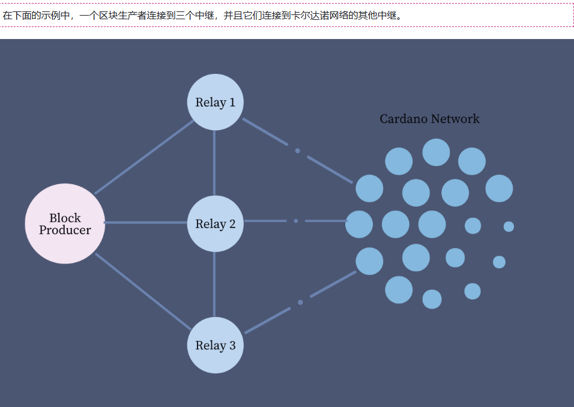

每个权益池都有一个区块生产者和至少一个中继节点。为了确保池产生的块的快速传播，建议在不同的地理位置设置中继。

服务器：1 个用于区块生产者节点 + 至少 2 个用于中继节点

了解与卡尔达诺相关的众多加密密钥对：
- 钱包地址密钥对
    - 卡尔达诺钱包地址只有两部分：支付地址和对应的质押地址。支付地址（及其关联的密钥对）用于存储、接收和发送资金。权益地址（和相关密钥）用于存储和提取奖励，以及定义权益池所有者和奖励帐户，以及钱包的目标权益池委托
    - payment.vkey是支付地址的公共验证密钥文件（不敏感；可以公开共享）
    - payment.skey是高度敏感的支付地址秘密（私有）签名密钥文件
    - stake.vkey - 权益地址公共验证密钥文件（不敏感；可以公开共享）
    - stake.skey - 这是一个敏感的权益地址秘密（私有）签名密钥文件
    - payment.addr - 这是卡尔达诺钱包支付地址
    - stake.addr - 卡尔达诺钱包的权益地址，使用 stake.vkey 文件生成
- 权益池密钥对
    - 权益池冷键
        - cold.skey - 卡尔达诺权益池的秘密（私人）签名密钥文件（极其敏感）。需要cold.skey来注册权益池、更新权益池注册证书参数、轮换权益池 KES 密钥以及停用权益池
        - cold.vkey - 权益池的 Cold.skey 私有签名密钥文件的公共验证密钥文件（cold.vkey 不敏感；可以公开共享）
        - cold.counter - 递增计数器文件，用于跟踪为相关权益池生成操作证书 (opcert) 的次数
    - VRF 热键
        - vrf.skey - Cardano 权益池 VRF 密钥的秘密（私有）签名密钥文件（启动权益池的区块生成节点所需；敏感，但必须放置在热节点上才能启动权益池）
        - vrf.vkey - Cardano 权益池 vrf.skey 的公共验证密钥文件（不敏感，不需要启动权益池的区块生成节点）
    - KES 热键
        - kes.skey - 权益池 KES 密钥的秘密（私有）签名密钥文件（需要启动权益池的出块节点；敏感，但必须放置在热节点上以启动权益池并定期轮换）
        - kes.vkey - Cardano 权益池相应kes.skey的公共验证密钥文件（不敏感，对于区块生产者来说不是必需的）
    
