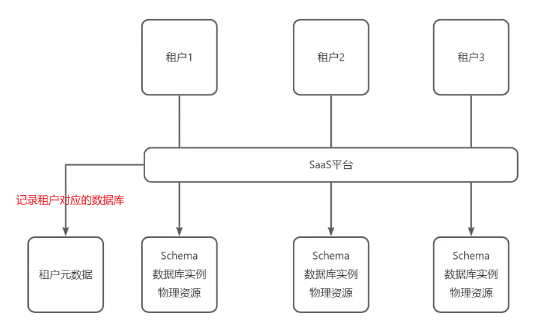
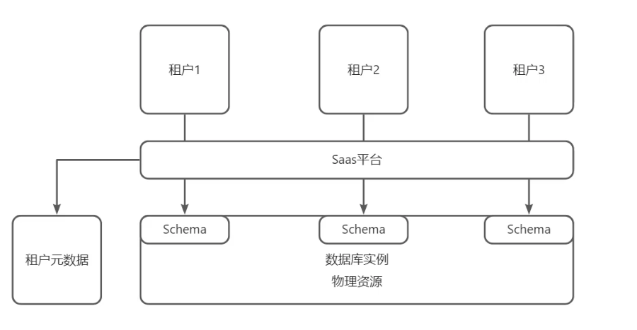
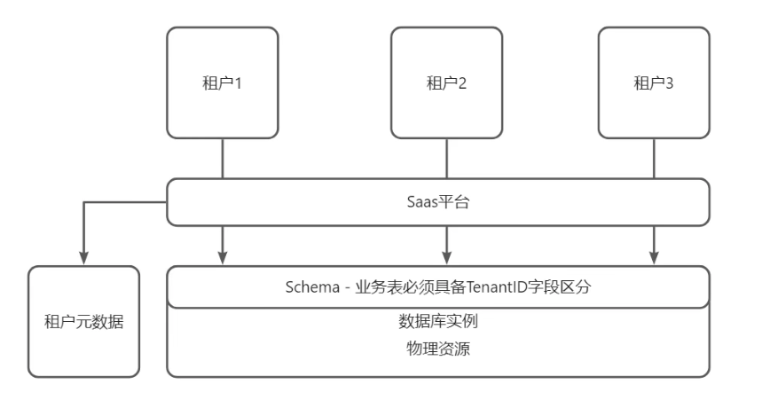
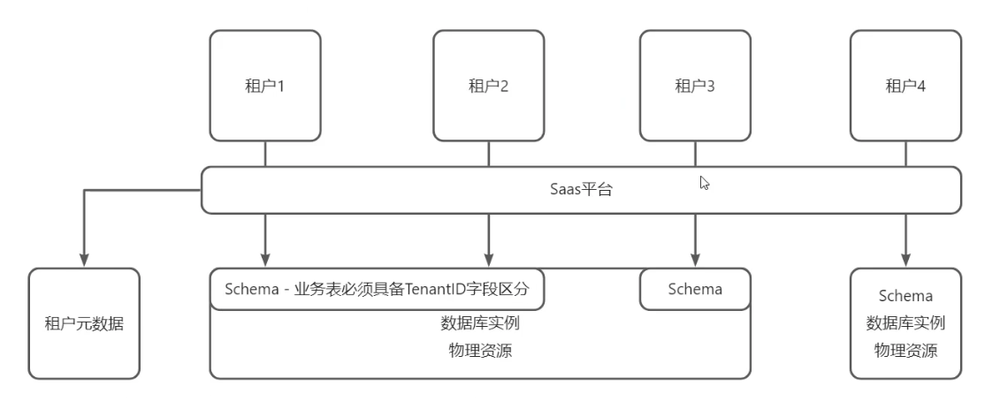
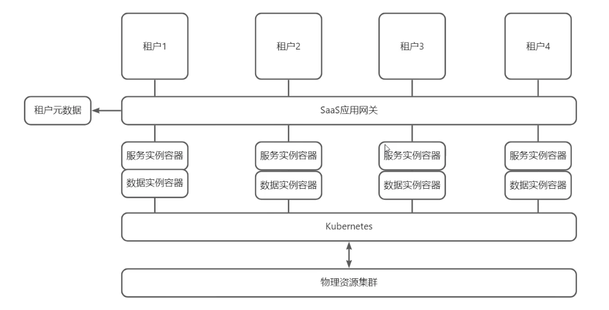
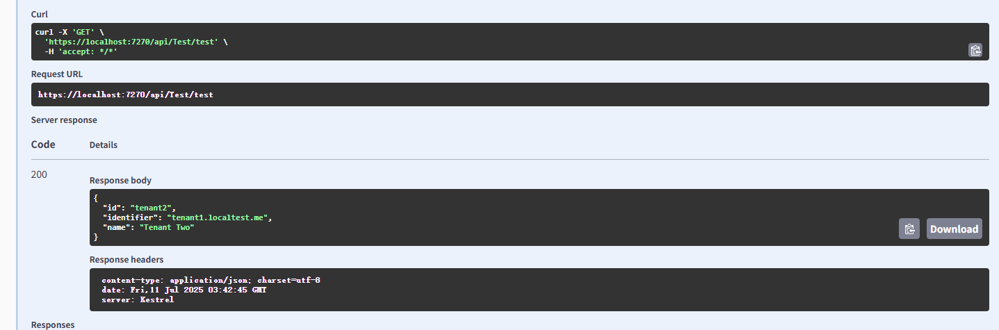
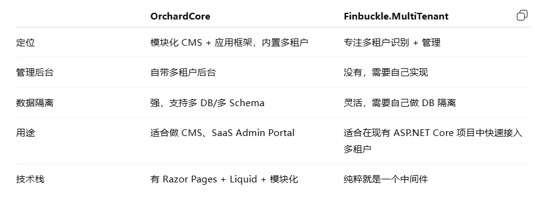
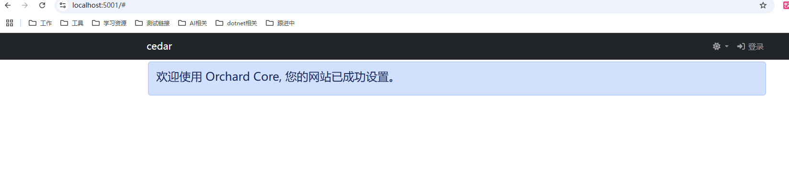

# 多租户
核心：多个租户共享同一个系统实例，租户间实现数据和行为隔离

- 基于订阅
  - 每月付费才能使用该工具
- 远程托管
  - 不是安装在用户服务器上，而是安装在开发公司的服务器或者是亚马逊云等服务器上
- 可以通过互联网访问
  - 用户只需要通过用户名和密码就能使用
- 具有可扩展性
  - 如果有团队，只需要给团队发送链接，通过链接就能注册使用该改工具
- 定期更新
  - 因为是远程托管，所以工具更新用户不需要任何操作，用户可以选择更新这个工具

多租户是支撑SAAS的一种技术架构设计，并不是多租户就是SAAS。

多租户和多用户关键差异：多租户强调重要设计是数据和应用之间的隔离

e.g
- 多用户
  - 你是一个公司内部用的 HR 系统。
  - 员工 A、员工 B、经理 C 都有自己的账号密码。
  - 登录后看到的功能、数据权限不同（员工只能看自己的工资条，经理可以看团队的）。
  - 他们是同一个组织里的不同用户，叫 多用户。
- 多租户
  - 你做了一个 SaaS 平台，比如 薪资管理 SaaS。
  - 客户有：公司 A（健身房）、公司 B（餐厅）、公司 C（物流公司）
  - 每个公司都是你的一个“租户（Tenant）”，相当于租你这套系统来用。
  - 每个公司内部有自己的多用户（员工、HR、老板），但这些公司之间的数据完全隔离，互相看不到对方数据。

产品：teambition
有基础版、企业版、旗舰版，价格不同，功能也存在差异。不同租户用的套餐不一样，面对的应用功能也不一样。


## 隔离方案
### 独立数据库



优点：
- 隔离性高，安全性强
- 每个租户可以定制自己的数据库结构
- 故障隔离，一个租户问题不会影响其他租户

缺点：
- 成本高
- 资源利用率低
- 管理复杂度高，尤其当租户数量多时
- 应用层面客制化能力弱

<hr>
客制化能力 = 你这个系统能不能让不同客户根据自己的需求改造一些功能、界面或流程，而不需要你为每个客户重新单独开发一套系统。
<hr>

### 共享数据但独立数据架构



多个租户共享同一个数据库实例，但每个租户都有独立的数据库模式（Schema）

优点：
- 隔离性较好
- 相比独立数据库，成本较低
- 易于扩展，支持更多租户

缺点：
- 隔离性不如独立数据库
- Schema管理复杂
- 数据库性能可能受Schema数量影响
- 应用层面客制化能力弱

### 共享数据库且共享数据架构



多个租户共享同一个数据库实例和表结构，通过租户标识（Tenant ID）区分不同租户的数据

优点：
- 成本低
- 易于扩展
- 数据存储和查询效率较高

缺点：
- 隔离性最弱，容易出现数据泄露风险
- 查询时需要始终附加租户标识，增加开发复杂度
- 数据迁移和备份较为复杂
- 数据层面和应用层面客制化能力最弱


### 混合模式



结合以上多种模式，根据租户需求动态选择适合的架构。

优点：
- 灵活性高
- 在性能、成本和隔离性之间取得平衡
- 支持差异化服务，满足不同租户需求

缺点：
- 架构复杂度高，管理和维护难度大
- 需要额外逻辑处理不同模式之间的切换

### 容器化隔离模式（单元化部署）


通过虚拟化技术（容器、虚拟机）为每个租户提供独立的应用实例。

前面都是数据层面的，这个是应用层面的。

优点：
- 应用层隔离性强，租户之间干扰少
- 数据隔离性最好
- 支持租户自定义配置
- 安全性较高

缺点：
- 成本最高，资源利用率较低
- 管理复杂度高，需要维护多个实例

## 租户生命周期
- 创建
  - 创建租户实例，分配资源（数据库、存储、配置项），初始化默认配置
- 激活
  - 正常使用相同
- 变更
  - 升级/降级套餐、扩容/缩容资源等
- 挂起
  - 因欠费、违规、停用等原因暂停租户服务，可恢复
- 恢复
  - 挂起的租户重新激活
- 注销
  - 删除租户及相关资源

通常创建saas会结合几个库：
- Stripe\.NET
  - Stripe 的官方 .NET SDK，用来跟 Stripe API（支付、订阅、发票等）交互
  - 一个多租户用来续费，付款
- AspNetCoreRateLimit
  - 速率限制中间件库
  - 防止租户或用户滥用 API（比如限制每分钟最多调用多少次）
  - 对于不同版本的限流规则，比如免费版租户限制 10 req/s，付费版 100 req/s
- OpenTelemetry
  - 做分布式追踪、指标、日志
  - 在多租户场景里，它能帮你追踪每个请求属于哪个租户，看到某个租户在系统里的完整调用链
  - 结合后端 APM（如 Jaeger、Tempo、New Relic、Grafana）就能可视化分析各租户的请求耗时、异常、瓶颈
## Finbuckle.MultiTenant 多租户中间件库
```
 Finbuckle.MultiTenant.AspNetCore
```

Program配置：
```cs
//  添加Finbuckle.MultiTenant服务 
// 注册基本服务并指定 TenantInfo 为在运行时保存租户信息的类
// AddMultiTenant<TTenantInfo> 的类型参数必须是 ITenantInfo 的实现，并包含租户的基本信息
// WithHostStrategy告诉应用程序，确定请求租户的“策略”是查看请求主机，默认提取子域作为租户标识符
// WithConfigurationStore 告诉应用，所有租户的信息都位于用于应用配置的 appsettings.json 文件中
builder.Services.AddMultiTenant<TenantInfo>()
    .WithStrategy<CustomLocalhostStrategy>(ServiceLifetime.Scoped) // ServiceLifetime.Scoped生命周期
    .WithConfigurationStore(builder.Configuration, "Finbuckle:MultiTenant:Stores:ConfigurationStore");


...
// 注意这个顺序
app.UseRouting();

// 添加Finbuckle.MultiTenant中间件
// 该中间件使用已注册的策略、存储和其他 设置
// 应该在UseAuthentication前使用
app.UseMultiTenant();
app.MapControllers();
```

CustomLocalhostStrategy.cs
```cs
public class CustomLocalhostStrategy: IMultiTenantStrategy
{
    public async Task<string?> GetIdentifierAsync(object context)
    {
        return "tenant1.localtest.me";
    }
}
```

```cs
[HttpGet("test")]
public IActionResult Test([FromServices] IMultiTenantContextAccessor<TenantInfo> accessor)
{
    var host = HttpContext.Request.Host.Host;
    var tenantInfo = HttpContext.GetMultiTenantContext<TenantInfo>().TenantInfo;
    var a = accessor.MultiTenantContext.TenantInfo;
    if(tenantInfo != null)
    {
        var tenantId = tenantInfo.Id;
        var identifier = tenantInfo.Identifier;
        var name = tenantInfo.Name;
    }

    return Ok(tenantInfo);
}
```

appsettings.json
```cs
  "Finbuckle": {
    "MultiTenant": {
      "Stores": {
        "ConfigurationStore": {
          "Tenants": [  
            {
              "Id": "tenant1",
              "Identifier": "tenant1.local",
              "Name": "Tenant One"
            },
            {
              "Id": "tenant2",
              "Identifier": "tenant1.localtest.me",
              "Name": "Tenant Two"
            }
          ]
        }
      }
    }
  }
```



## OrchardCore



OrchardCore = CMS + 模块化应用框架，既可以让非程序员拖拽页面和组件，也可以作为框架，自己的dotnet项目结合。

```cs
dotnet new install OrchardCore.ProjectTemplates::*
dotnet new occms -n OrchardCoreMultiTenantDemo
cd OrchardCoreMultiTenantDemo
dotnet run
```

