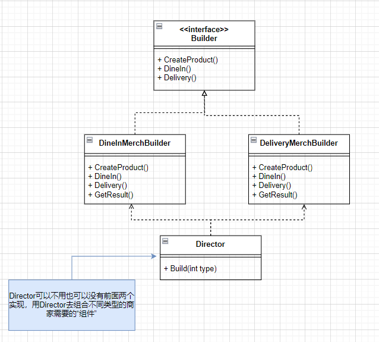

# 1-设计模式-创建型模式
## 1 工厂方法
主要用于定义一个创建对象的接口，让子类决定实例化哪个类。它侧重于单一产品的创建。
场景：有一个件商品，Pickup和Delivery的打包方式是不同的
工厂方法解决的问题：把包装过程抽象成工厂类MerchFoodPreparingFactory，然后具体实现不同包装的工厂，真正使用的时候只需与工厂接口交互，而无需关心具体的类实现（但是需要自己指定具体类）。

```cs
public abstract class MerchFoodPreparing
{
    public abstract Task Box();

    public virtual async Task Waiting()
    {
        //pass base body
    }
    public abstract Task Complete();
}

public class PickupMerchFoodPreparing : MerchFoodPreparing
{
    public override async Task Box()
    {
        // pass body
    }

    public override async Task Complete()
    {
        // pass body
    }

    public override async Task Waiting()
    {
        // pass pockup body
    }
}

public class DeliveryMerchFoodPreparing : MerchFoodPreparing
{
    public override async Task Box()
    {
        // pass body
    }

    public override async Task Complete()
    {
        // pass body
    }

    public override async Task Waiting()
    {
        // pass delivery body
    }
}

public abstract class MerchFoodPreparingFactory
{
    public abstract MerchFoodPreparing MerchFoodPreparing();

    public async Task MerchFoodSaleProcess()
    {
        var merchFoodPreparing = MerchFoodPreparing();
        await merchFoodPreparing.Box();
        await merchFoodPreparing.Waiting();
        await merchFoodPreparing.Complete();
    }
}

public class PickupMerchFoodPreparingFactory : MerchFoodPreparingFactory
{
    public override MerchFoodPreparing MerchFoodPreparing()
    {
        return new PickupMerchFoodPreparing();
    }
}

public class DeliveryMerchFoodPreparingFactory : MerchFoodPreparingFactory
{
    public override MerchFoodPreparing MerchFoodPreparing()
    {
        return new DeliveryMerchFoodPreparing();
    }
}
```

## 2、抽象工厂模式
创建一系列相关的对象， 而无需指定其具体类（意思是只与工厂交互，不知道工厂里面的具体产品类）。
场景：顾客可以选择不同类型的食品（如海鲜和干货），并且根据选择的销售方式（自取或配送）进行处理
    - 食品类型：
        - 海鲜食品（BoxSeaMerchFood）：需要特定的处理和包装方式。
        - 干货食品（BoxDryMerchFood）：有不同的处理流程。
    - 销售方式：
        - 自取（如PickupSeaMerchFood、PickupDryMerchFood）：顾客在店内自取食品。
        - 配送（如DeliverySeaMerchFood、DeliveryDryMerchFood）：食品由配送人员送到顾客指定的地址。
抽象工厂解决的问题：
- AbstractFactory接口定义了两个方法，用于创建不同类型的食品准备实例：SeaMerchFoodPreparing和DryMerchFoodPreparing。
- PickupMerchFoodPreparingAbstractFactory和DeliveryMerchFoodPreparingAbstractFactory是具体的工厂类，分别负责创建自取和配送方式的海鲜和干货食品准备实例。
```cs
public abstract class BoxSeaMerchFood
{
    public abstract Task SeaBox();
    public abstract Task Waiting();
    public virtual async Task Complete(){}
}

public abstract class BoxDryMerchFood
{
    public abstract Task DryBox();
    public abstract Task Waiting();
    public virtual async Task Complete(){}
}

public class PickupSeaMerchFood : BoxSeaMerchFood
{
    public override async Task SeaBox()
    {
        // pass
    }

    public override async Task Waiting()
    {
        // pass
    }
}

public class DeliverySeaMerchFood : BoxSeaMerchFood
{
    public override async Task SeaBox()
    {
        // pass
    }
    public override async Task Waiting()
    {
        // pass
    }
}

public class PickupDryMerchFood : BoxDryMerchFood
{
    public override async Task DryBox()
    {
        // pass
    }
    public override async Task Waiting()
    {
        // pass
    }
}

public class DeliveryDryMerchFood : BoxDryMerchFood
{
    public override async Task DryBox()
    {
        // pass
    }
    public override async Task Waiting()
    {
        // pass
    }
}

interface AbstractFactory
{
    public BoxSeaMerchFood SeaMerchFoodPreparing();
    public BoxDryMerchFood DryMerchFoodPreparing();
}

public class PickupMerchFoodPreparingAbstractFactory : AbstractFactory
{
    public BoxSeaMerchFood SeaMerchFoodPreparing() {
        return new PickupSeaMerchFood();
    }

    public BoxDryMerchFood DryMerchFoodPreparing() {
        return new PickupDryMerchFood();
    }
}

public class DeliveryMerchFoodPreparingAbstractFactory : AbstractFactory
{
    public BoxSeaMerchFood SeaMerchFoodPreparing()
    {
        return new DeliverySeaMerchFood();
    }

    public BoxDryMerchFood DryMerchFoodPreparing()
    {
        return new DeliveryDryMerchFood();
    }
}
```

## 生成器模式
分步骤创建复杂对象。 该模式允许使用相同的创建代码生成不同类型和形式的对象。
场景：顾客可以选择不同的就餐方式，包括“堂食”（Dine In）和“外卖”（Delivery）。每种方式有其独特的准备流程和产品创建逻辑。
    - 食品产品构建：
        - 堂食产品（DineInMerchBuilder）：负责创建适合在店内用餐的食品产品。
        - 外卖产品（DeliveryMerchBuilder）：负责创建适合外带或送货的食品产品。
    - 构建流程：
        - 建造者接口（Builder）：定义了创建产品和处理就餐方式的方法。
        - 具体建造者：实现了Builder接口，具体构建每种产品的逻辑。
        - 获取结果（GetResult）：每个建造者都有一个方法来执行产品创建和相应的就餐处理，并返回最终的产品。

解决：Director类负责管理建造过程。根据输入的类型（堂食或外卖），它选择合适的建造者并调用其构建方法。




```cs
public interface Builder
{
    Task CreateProduct();
    Task DineIn();
    Task Delivery();
}

public class DineInMerchBuilder : Builder
{
    public async Task CreateProduct()
    {
        // pass
    }

    public async Task DineIn()
    {
        // pass
    }

    public Task Delivery()
    {
        throw new NotImplementedException();
    }

    public async Task GetResult()
    {
        CreateProduct();
        DineIn();
        // return DineInMerch
    }
}

public class  DeliveryMerchBuilder : Builder
{
    public async Task CreateProduct()
    {
        // pass
    }

    public async Task DineIn()
    {
        throw new NotImplementedException();
    }

    public async Task Delivery()
    {
        // pass
    }
    public async Task GetResult()
    {
        CreateProduct();
        DineIn();
        // return DeliveryMerch
    }
}

public class Director
{
    public async Task Build(int type)
    {
        if (type == 1)
        {
            var builder = new DineInMerchBuilder();
            await builder.GetResult();
        }
        else
        {
            var builder = new DeliveryMerchBuilder();
            await builder.GetResult();
        }
    }
}
```

## 原型模式
复制已有对象， 而又无需使代码依赖它们所属的类。
场景：在汽车管理系统中，可能需要创建多个相似的汽车对象。这些汽车对象有共同的属性，但某些信息（如车型的详细信息）可能需要根据特定要求进行调整。
解决：为了避免重复创建和占用内存，使用克隆技术可以方便地复制现有的汽车对象。在类中实现克隆方法以提供调用。


```cs
public class Car
{
    public string Name { get; set; }
    public InfoCar InfoCar { get; set; }

    public void Build()
    {
        Console.WriteLine("build...");
    }
    // 实现克隆方法
    public Car Clone()
    {
        // 浅克隆对象 引用类型的InfoCar是引用同个地址
        return (Car)this.MemberwiseClone();
    }
    // 深克隆
    public Car DeepCopy()
    {
        var clone = Clone();
        clone.InfoCar = new InfoCar() { info = InfoCar.info };
        return clone;
    }
}

public class InfoCar
{
    public string info { get; set; }
}
```

## 单例模式
保证一个类只有一个实例， 并提供一个访问该实例的全局节点。

场景：在某些情况下，某个类的实例需要被限制为唯一的。单例模式是用于控制这种实例化的设计模式，确保在应用程序的生命周期内只存在一个该类的实例。这在需要全局访问某个资源或状态时非常有用，例如配置管理、日志记录、数据库连接等。

```cs
// sealed就不能被继承或重写啦
public sealed class Singleton
{
    // 单例不能被随便构造，所以要private
    private Singleton() { }
    private static Singleton _instance;
    // 每次调用拿到的就是同一个实例
    public static Singleton GetInstance()
    {
        if (_instance == null)
        {
            _instance = new Singleton();
        }
        return _instance;
    }
}

public sealed class SingletonSafe
{
    private SingletonSafe() { }
    private static SingletonSafe _instance;
    private static readonly object _lock = new object();
    
    public static SingletonSafe GetInstance()
    {
        if (_instance == null)
        {
            lock (_lock)
            {
                if (_instance == null)
                {
                    _instance = new SingletonSafe();
                }
            }
        }
        return _instance;
    }
} 
```