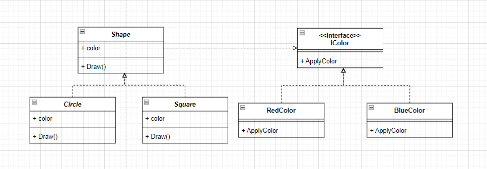
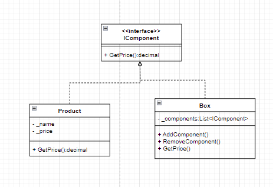
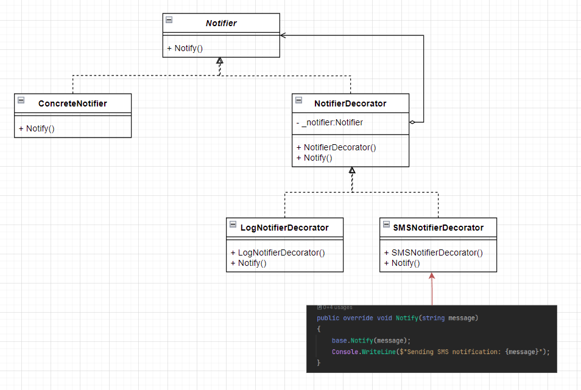

# 2-设计模式-结构型模式

## 适配器模式
使接口不兼容的对象能够相互合作。

场景：在软件开发中，常常会遇到需要整合不同系统或类库的情况。这些系统可能使用不同的接口或协议，使得直接交互变得困难。适配器模式提供了一种解决方案，允许通过适配器将不兼容的接口进行适配，从而使得客户端可以使用统一的接口来访问这些系统。

解决：
- 客户端希望调用 ITarget 接口的方法，但只能访问适配者的接口。
- 客户端创建一个 Adapter 实例，并将适配者对象传递给它。
- 当客户端调用 Request() 方法时，适配器会转发请求到适配者的 SpecificRequest() 方法，从而实现接口适配。
```cs
// 目标接口
public interface ITarget
{
    void Request();
}

// 适配者类
public class Adaptee
{
    public void SpecificRequest()
    {
        Console.WriteLine("Adaptee's specific request");
    }
}

// 适配器类
public class Adapter : ITarget
{
    private readonly Adaptee _adaptee;

    public Adapter(Adaptee adaptee)
    {
        this._adaptee = adaptee;
    }

    public void Request()
    {
        // 调用适配者类的方法
        this._adaptee.SpecificRequest();
    }
}
```

## 桥接模式
将一个大类或一系列紧密相关的类拆分为抽象和实现两个独立的层次结构， 从而能在开发时分别使用。




```cs
// 颜色接口
public interface IColor
{
    void ApplyColor();
}

// 具体颜色类：红色 实现部分
public class RedColor : IColor
{
    public void ApplyColor()
    {
        Console.WriteLine("Applying red color");
    }
}

// 具体颜色类：蓝色 实现部分
public class BlueColor : IColor
{
    public void ApplyColor()
    {
        Console.WriteLine("Applying blue color");
    }
}

// 形状类 抽象部分
public abstract class Shape
{
    protected IColor _color;

    public Shape(IColor color)
    {
        this._color = color;
    }

    public abstract void Draw();
}

// 具体形状类：圆形
public class Circle2 : Shape
{
    public Circle2(IColor color) : base(color)
    {
    }

    public override void Draw()
    {
        Console.Write("Drawing Circle: ");
        _color.ApplyColor();
    }
}

// 具体形状类：正方形
public class Square : Shape
{
    public Square(IColor color) : base(color)
    {
    }

    public override void Draw()
    {
        Console.Write("Drawing Square: ");
        _color.ApplyColor();
    }
}
```

## 组合模式


```cs
// 定义组合中所有对象的通用操作
interface IComponent
{
    decimal GetPrice();
}

// 产品
class Product : IComponent
{
    private string _name;
    private decimal _price;

    public Product(string name, decimal price)
    {
        _name = name;
        _price = price;
    }

    public decimal GetPrice()
    {
        return _price;
    }
}

// 盒子：盒子里面可能是商品也可能是盒子
class Box : IComponent
{
    private List<IComponent> _components = new List<IComponent>();

    public void AddComponent(IComponent component)
    {
        _components.Add(component);
    }

    public void RemoveComponent(IComponent component)
    {
        _components.Remove(component);
    }

    public decimal GetPrice()
    {
        decimal totalPrice = 0;
        foreach (var component in _components)
        {
            totalPrice += component.GetPrice();
        }
        return totalPrice;
    }
}
```

## 装饰模式


```cs
// 基类 Notifier
abstract class Notifier
{
    public abstract void Notify(string message);
}

// 具体组件类
class ConcreteNotifier : Notifier
{
    public override void Notify(string message)
    {
        Console.WriteLine($"Sending notification: {message}");
    }
}

// 装饰器抽象类
abstract class NotifierDecorator : Notifier
{
    protected Notifier _notifier;

    public NotifierDecorator(Notifier notifier)
    {
        _notifier = notifier;
    }

    public override void Notify(string message)
    {
        _notifier.Notify(message);
    }
}

// 短信通知装饰器
class SMSNotifierDecorator : NotifierDecorator
{
    public SMSNotifierDecorator(Notifier notifier) : base(notifier) { }

    public override void Notify(string message)
    {
        base.Notify(message);
        Console.WriteLine($"Sending SMS notification: {message}");
    }
}

// 日志记录装饰器
class LogNotifierDecorator : NotifierDecorator
{
    public LogNotifierDecorator(Notifier notifier) : base(notifier) { }

    public override void Notify(string message)
    {
        base.Notify(message);
        Console.WriteLine($"Logging notification: {message}");
    }
}

// 客户端代码
class Client
{
    static void Main(string[] args)
    {
        // 创建具体组件对象
        Notifier notifier = new ConcreteNotifier();

        // 使用装饰器包装组件对象
        notifier = new SMSNotifierDecorator(notifier);
        notifier = new LogNotifierDecorator(notifier);

        // 发送通知
        notifier.Notify("Hello, world!");
    }
}
```

## 外观模式

```cs

```

## 享元模式

```cs
// 享元接口
interface IShape
{
    void Draw(int r);
}

// 具体的享元对象
class Circle : IShape
{
    private string color;

    public Circle(string color)
    {
        this.color = color;
    }

    public void Draw(int r)
    {
        Console.WriteLine($"绘制 {color} 半径 {r}");
    }
}

// 享元工厂
class ShapeFactory
{
    // 这是为了不重复生成相同半径的圆，保证获取相同半径的圆是同一个对象
    private Dictionary<string, IShape> shapes = new Dictionary<string, IShape>(); 

    public IShape GetCircle(string color)
    {
        if (!shapes.ContainsKey(color))
        {
            shapes[color] = new Circle(color);
        }
        return shapes[color];
    }

    public int GetTotalCircleCount()
    {
        return shapes.Count;
    }
}

class Program3
{
    static void Main(string[] args)
    {
        ShapeFactory shapeFactory = new ShapeFactory();

        IShape redCircle = shapeFactory.GetCircle("Red");
        IShape blueCircle = shapeFactory.GetCircle("Blue");
        IShape greenCircle = shapeFactory.GetCircle("Green");

        // 仅绘制坐标不同的圆形，颜色相同的圆形将共享
        redCircle.Draw(10);
        blueCircle.Draw(20);
        greenCircle.Draw(30);

        // 输出共享的圆形数量
        Console.WriteLine($"共享的圆形数量：{shapeFactory.GetTotalCircleCount()}");

        Console.ReadKey();
    }
}
```

## 代理模式

```cs
// 主题接口
interface IWeatherService
{
    string GetWeatherForecast(string location);
}

// 真实主题
class WeatherService : IWeatherService
{
    public string GetWeatherForecast(string location)
    {
        // 模拟从远程服务器获取天气信息
        Console.WriteLine($"获取 {location} 天气预报...");
        return "晴朗";
    }
}

// 代理
class WeatherServiceProxy : IWeatherService
{
    private WeatherService weatherService = new WeatherService();

    public string GetWeatherForecast(string location)
    {
        // 在访问真实主题之前可以执行一些额外操作，比如检查缓存或权限等

        // 调用真实主题的方法获取天气信息
        return weatherService.GetWeatherForecast(location);
    }
}

class Program2
{
    static void Main(string[] args)
    {
        // 使用代理获取天气信息
        IWeatherService weatherService = new WeatherServiceProxy();
        string weather = weatherService.GetWeatherForecast("New York");
        Console.WriteLine($"天气预报：{weather}");

        Console.ReadKey();
    }
}
```
