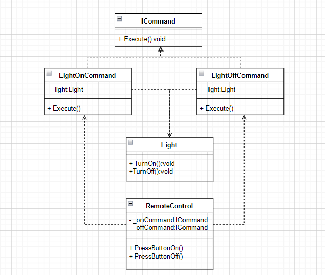
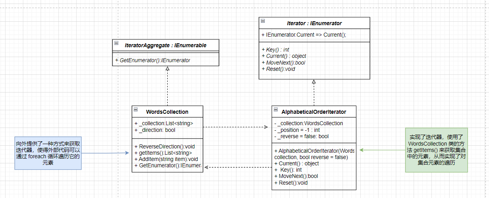
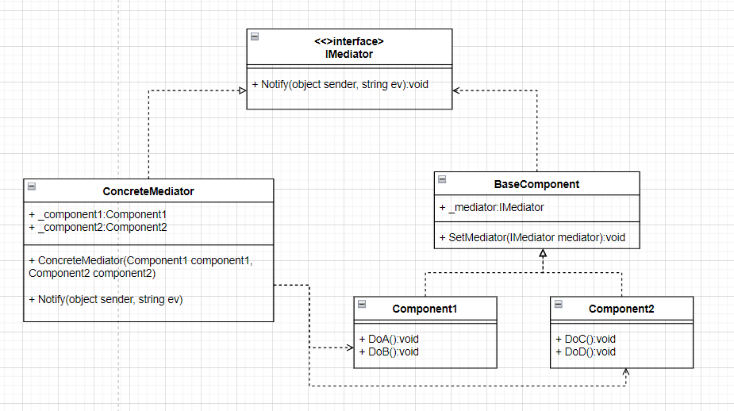

# 3-设计模式-行为模式
## 责任链模式

```cs
// 日志级别
public enum LogLevel
{
    Debug,
    Info,
    Error
}
// 抽象处理者
public interface ILogger
{
    ILogger SetNextHandler(ILogger nextLogger);
    void LogMessage(string message, LogLevel level);
}

//基础处理者
public class BaseLoggerHandler : ILogger
{
    private ILogger nextLogger { get; set; }
    public ILogger SetNextHandler(ILogger nextLogger)
    {
        this.nextLogger = nextLogger;
        return nextLogger;
    }

    public virtual void LogMessage(string message, LogLevel level)
    {
        if (nextLogger != null)
        {
            nextLogger.LogMessage(message, level);
        }
    }
}

public class DebugLogHandler : BaseLoggerHandler
{
    public override void LogMessage(string message, LogLevel level)
    {
        if (level == LogLevel.Debug)
        {
            Console.WriteLine($"debug:{message}");
        }
        else
        {
            base.LogMessage(message,level);
        }
    }
}

public class InfoLogHandler : BaseLoggerHandler
{
    public override void LogMessage(string message, LogLevel level)
    {
        if (level == LogLevel.Info)
        {
            Console.WriteLine($"info:{message}");
        }
        else
        {
            base.LogMessage(message,level);
        }
    }
}

public class ErrorLogHandler : BaseLoggerHandler
{
    public override void LogMessage(string message, LogLevel level)
    {
        if (level == LogLevel.Error)
        {
            Console.WriteLine($"error:{message}");
        }
        else
        {
            base.LogMessage(message,level);
        }
    }
}

public class Client2
{
    public static void Begin(BaseLoggerHandler handler, LogLevel level)
    {
        handler.LogMessage("1",level);
    }
}

public class Program
{
    static void Main(string[] args)
    {
        var errorLog = new ErrorLogHandler();
        var infoLog = new InfoLogHandler();
        var debugLog = new DebugLogHandler();

        infoLog.SetNextHandler(errorLog).SetNextHandler(debugLog);
        
        Client2.Begin(infoLog, LogLevel.Error);
    }
}
```

## 命令模式


```cs
// 命令接口
public interface ICommand
{
    void Execute();
}

// 接收者：电灯
public class Light
{
    public void TurnOn()
    {
        Console.WriteLine("Light is on");
    }

    public void TurnOff()
    {
        Console.WriteLine("Light is off");
    }
}
// 调用者：遥控器
public class RemoteControl
{
    private ICommand _onCommand;
    private ICommand _offCommand;

    public RemoteControl(ICommand onCommand, ICommand offCommand)
    {
        _onCommand = onCommand;
        _offCommand = offCommand;
    }

    public void PressButtonOn()
    {
        _onCommand.Execute();
    }

    public void PressButtonOff()
    {
        _offCommand.Execute();
    }
}

// 具体命令：开灯命令
public class LightOnCommand : ICommand
{
    private Light _light;

    public LightOnCommand(Light light)
    {
        _light = light;
    }

    public void Execute()
    {
        _light.TurnOn();
    }
}

// 具体命令：关灯命令
public class LightOffCommand : ICommand
{
    private Light _light;

    public LightOffCommand(Light light)
    {
        _light = light;
    }

    public void Execute()
    {
        _light.TurnOff();
    }
}

class Program_1
{
    static void Main(string[] args)
    {
        // 创建电灯和对应的命令
        Light light = new Light();
        ICommand turnOnCommand = new LightOnCommand(light);
        ICommand turnOffCommand = new LightOffCommand(light);

        // 创建遥控器
        RemoteControl remoteControl = new RemoteControl(turnOnCommand, turnOffCommand);

        // 执行操作
        remoteControl.PressButtonOn(); // 打开灯
        remoteControl.PressButtonOff(); // 关闭灯

        Console.ReadLine();
    }
}
```

## 迭代器模式


```cs
// IEnumerator C# 中用于实现迭代器
abstract class Iterator : IEnumerator
{
    object IEnumerator.Current => Current();

    public abstract int Key();
    // 返回当前元素
    public abstract object Current();

    public abstract bool MoveNext();

    public abstract void Reset();
}
/*
 * 实现 IEnumerable 接口意味着可以使用 foreach 循环来遍历这个对象的元素。
 * 需要提供一个 GetEnumerator() 方法来返回一个迭代器，该迭代器负责在集合上进行迭代
 */
abstract class IteratorAggregate : IEnumerable
{
    public abstract IEnumerator GetEnumerator();
}

class WordsCollection : IteratorAggregate
{
    List<string> _collection = new List<string>();
        
    bool _direction = false; // 迭代器遍历方向
        
    public void ReverseDirection() // 改变迭代器的遍历方向
    {
        _direction = !_direction;
    }
        
    public List<string> getItems() // 返回集合
    {
        return _collection;
    }
        
    public void AddItem(string item) // 在集合添加元素
    {
        this._collection.Add(item);
    }
        
    public override IEnumerator GetEnumerator()
    {
        // 迭代器是 AlphabeticalOrderIterator 类的实例
        return new AlphabeticalOrderIterator(this, _direction); 
    }
}


class AlphabeticalOrderIterator : Iterator
{
    private WordsCollection _collection; // 存储迭代器要遍历的集合
    
    private int _position = -1; // 迭代器当前位置的索引，默认值为 -1
        
    private bool _reverse = false; // 表示迭代器的遍历方向

    public AlphabeticalOrderIterator(WordsCollection collection, bool reverse = false)
    {
        this._collection = collection;
        this._reverse = reverse;

        if (reverse)
        {
            this._position = collection.getItems().Count;
        }
    }
        
    public override object Current()
    {
        return this._collection.getItems()[_position];
    }

    public override int Key() // 返回当前位置的索引
    {
        return this._position;
    }
    
    // 根据迭代器的遍历方向移动到下一个位置，并返回一个布尔值，指示是否成功移动到下一个元素
    public override bool MoveNext()
    {
        int updatedPosition = this._position + (this._reverse ? -1 : 1);

        if (updatedPosition >= 0 && updatedPosition < this._collection.getItems().Count)
        {
            this._position = updatedPosition;
            return true;
        }
        else
        {
            return false;
        }
    }
    
    // 将迭代器重置到集合的初始位置
    public override void Reset()
    {
        this._position = this._reverse ? this._collection.getItems().Count - 1 : 0;
    }
}

class Program_2
{
    static void Main(string[] args)
    {
        var collection = new WordsCollection();
        collection.AddItem("First");
        collection.AddItem("Second");
        collection.AddItem("Third");

        Console.WriteLine("Straight traversal:");

        foreach (var element in collection)
        {
            Console.WriteLine(element);
        }

        Console.WriteLine("\nReverse traversal:");

        collection.ReverseDirection();

        foreach (var element in collection)
        {
            Console.WriteLine(element);
        }
    }
}
```

## 中介者模式

```cs
// 抽象中介者
public interface IMediator
{
    void Notify(object sender, string ev);
}
// 基础组件
class BaseComponent
{
    protected IMediator _mediator;

    public BaseComponent(IMediator mediator = null)
    {
        this._mediator = mediator;
    }

    public void SetMediator(IMediator mediator)
    {
        this._mediator = mediator;
    }
}

class Component1 : BaseComponent
{
    public void DoA()
    {
        Console.WriteLine("Component 1 does A.");

        this._mediator.Notify(this, "A");
    }

    public void DoB()
    {
        Console.WriteLine("Component 1 does B.");

        this._mediator.Notify(this, "B");
    }
}

class Component2 : BaseComponent
{
    public void DoC()
    {
        Console.WriteLine("Component 2 does C.");

        this._mediator.Notify(this, "C");
    }

    public void DoD()
    {
        Console.WriteLine("Component 2 does D.");

        this._mediator.Notify(this, "D");
    }
}

class ConcreteMediator : IMediator
{
    private Component1 _component1;

    private Component2 _component2;

    public ConcreteMediator(Component1 component1, Component2 component2)
    {
        this._component1 = component1;
        this._component1.SetMediator(this);
        this._component2 = component2;
        this._component2.SetMediator(this);
    } 

    public void Notify(object sender, string ev)
    {
        if (ev == "A")
        {
            Console.WriteLine("Mediator reacts on A and triggers following operations:");
            this._component2.DoC();
        }
        if (ev == "D")
        {
            Console.WriteLine("Mediator reacts on D and triggers following operations:");
            this._component1.DoB();
            this._component2.DoC();
        }
    }
}

class Program5
{
    static void Main(string[] args)
    {
        // The client code.
        Component1 component1 = new Component1();
        Component2 component2 = new Component2();
        new ConcreteMediator(component1, component2);

        Console.WriteLine("Client triggers operation A.");
        component1.DoA();

        Console.WriteLine();

        Console.WriteLine("Client triggers operation D.");
        component2.DoD();
    }
}
```

## 备忘录模式
```cs
public class Originator
{
   private string _state;

   public void SetState(string state)
   {
      _state = state;
   }

   public Memento SaveStateToMemento()
   {
      return new Memento(_state);
   }
   public  void GetStateFromMemento(Memento memento)
   {
      _state = memento.GetState();
   }
}

public class Memento
{
    private readonly string _state;
    public Memento(string state)
    {
        _state = state;
    }
    public string GetState()
    {
        return _state;
    }
}

public  class CareTaker
{
    private  readonly List<Memento> _mementoList = new();

    public void Add(Memento state)
    {
        _mementoList.Add(state);
    }

    public Memento Get(int index)
    {
        return _mementoList[index];
    }
}
```

## 观察者模式
```cs
public interface IObserver
{
    // 接收更新状态
    void Update(ISubject subject);
}
public interface  ISubject
{
    // 注册观察者
    void Attach(IObserver observer);
    // 移除观察者
    void Detach(IObserver observer);
    // 通知观察者
    void Notify();
}
public class ConcreteSubject : ISubject
{
    // 状态
    public int State { get; set; } = -1;
    // 所有订阅了的观察者
    private List<IObserver> _observers = new List<IObserver>();
    public void Attach(IObserver observer)
    {
        _observers.Add(observer);
    }

    public void Detach(IObserver observer)
    {
        _observers.Remove(observer);
    }

    public void Notify()
    {
        foreach (var observer in _observers)
        {
            observer.Update(this);
        }
    }
    public void ChangeState(int state)
    {
        State = state;
        Notify();
    }
}

public class ConcreteObserverA : IObserver
{
    public void Update(ISubject subject)
    {
        if ((subject as ConcreteSubject).State > 0)
        {
            Console.WriteLine("State>0, ConcreteObserverA 收到通知");
        }
    }
}

public class ConcreteObserverB : IObserver
{
    public void Update(ISubject subject)
    {
        if ((subject as ConcreteSubject).State <=0)
        {
            Console.WriteLine("State<=0, ConcreteObserverB 收到通知");
        }
    }
}
```

## 状态模式
```cs
//上下文
public class Context
{
    private IState _state = null;

    public Context(IState state)
    {
        TransitionTo(state);
    }

    public void TransitionTo(IState state)
    {
        _state = state;
        _state.SetContext(this);
    }

    public void Handle()
    {
        _state.Handle();
    }
}

public abstract class IState
{
    protected  Context _context;
    public void SetContext(Context context)
    {
        _context = context;
    }
    public abstract void Handle();
}

public class StateA : IState
{
    public override void Handle()
    {
        Console.WriteLine("is draft");
        _context.TransitionTo(new StateB());
    }
}
public class StateB : IState
{
    public override void Handle()
    {
        Console.WriteLine("is publish");
        _context.TransitionTo(new StateA());
    }
}
```

## 策略模式
```cs
// 策略接口
public interface IStrategy
{
    void DoAlgorithm();
}
// 具体策略
class ConcreteStrategyA : IStrategy
{
    public void DoAlgorithm()
    {
        Console.WriteLine("is A");
    }
}

class ConcreteStrategyB : IStrategy
{
    public void DoAlgorithm()
    {
        Console.WriteLine("is B");
    }
}
// 上下文
class ContextStrategy
{
    private IStrategy _strategy;
    public ContextStrategy(IStrategy strategy)
    {
        this._strategy = strategy;
    }
    public void SetStrategy(IStrategy strategy)
    {
        this._strategy = strategy;
    }
    public void DoSomeBusinessLogic()
    {
        Console.WriteLine("business logic");
        _strategy.DoAlgorithm();
    }
}
```

## 模板方法模式
```cs
// 抽象基类，定义模板方法和抽象步骤
public abstract class ReportGenerator
{
    // 模板方法
    public void GenerateReport()
    {
        CollectData();
        ProcessData();
        FormatData();
        OutputReport();
    }

    // 抽象步骤，由子类实现
    protected abstract void CollectData();
    protected abstract void ProcessData();
    protected abstract void FormatData();
    protected abstract void OutputReport();
}
// 具体子类，实现抽象步骤
public class PDFReportGenerator : ReportGenerator
{
    protected override void CollectData()
    {
        Console.WriteLine("Collecting data for PDF report...");
    }

    protected override void ProcessData()
    {
        Console.WriteLine("Processing data for PDF report...");
    }

    protected override void FormatData()
    {
        Console.WriteLine("Formatting data for PDF report...");
    }

    protected override void OutputReport()
    {
        Console.WriteLine("Outputting PDF report...");
    }
}

public class ExcelReportGenerator : ReportGenerator
{
    protected override void CollectData()
    {
        Console.WriteLine("Collecting data for Excel report...");
    }

    protected override void ProcessData()
    {
        Console.WriteLine("Processing data for Excel report...");
    }

    protected override void FormatData()
    {
        Console.WriteLine("Formatting data for Excel report...");
    }

    protected override void OutputReport()
    {
        Console.WriteLine("Outputting Excel report...");
    }
}

```

## 访问者模式
```cs
// 元素接口，定义接受访问者的方法
public interface IShapes
{
    void Accept(IVisitor visitor);
}

// 具体元素类：圆形
public class Circles : IShapes
{
    public double Radius { get; set; }

    public Circles(double radius)
    {
        Radius = radius;
    }

    public void Accept(IVisitor visitor)
    {
        visitor.VisitCircle(this);
    }
}
// 具体元素类：矩形
public class Rectangles : IShapes
{
    public double Width { get; set; }
    public double Height { get; set; }

    public Rectangles(double width, double height)
    {
        Width = width;
        Height = height;
    }

    public void Accept(IVisitor visitor)
    {
        visitor.VisitRectangle(this);
    }
}
// 具体元素类：三角形
public class Triangles : IShapes
{
    public double Base { get; set; }
    public double Height { get; set; }

    public Triangles(double baseLength, double height)
    {
        Base = baseLength;
        Height = height;
    }

    public void Accept(IVisitor visitor)
    {
        visitor.VisitTriangle(this);
    }
}

// 访问者接口，定义对每个元素类的访问操作
public interface IVisitor
{
    void VisitCircle(Circles circle);
    void VisitRectangle(Rectangles rectangle);
    void VisitTriangle(Triangles triangle);
}
// 具体访问者，计算面积
public class AreaVisitor : IVisitor
{
    public void VisitCircle(Circles circle)
    {
        double area = Math.PI * circle.Radius * circle.Radius;
        Console.WriteLine($"Circle area: {area}");
    }

    public void VisitRectangle(Rectangles rectangle)
    {
        double area = rectangle.Width * rectangle.Height;
        Console.WriteLine($"Rectangle area: {area}");
    }

    public void VisitTriangle(Triangles triangle)
    {
        double area = 0.5 * triangle.Base * triangle.Height;
        Console.WriteLine($"Triangle area: {area}");
    }
}
// 具体访问者，绘制形状
public class DrawVisitor : IVisitor
{
    public void VisitCircle(Circles circle)
    {
        Console.WriteLine("Drawing Circle");
    }

    public void VisitRectangle(Rectangles rectangle)
    {
        Console.WriteLine("Drawing Rectangle");
    }

    public void VisitTriangle(Triangles triangle)
    {
        Console.WriteLine("Drawing Triangle");
    }
}
```