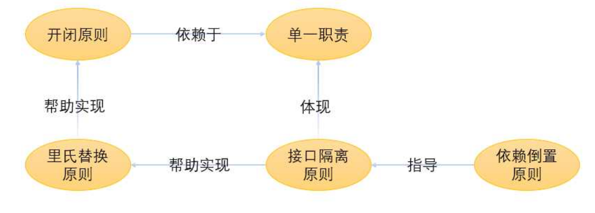

# 面向对象编程的 SOLID 原则
## SOLID
### 1、单一职责原则（SRP）
一个类或一个方法只做一件事。
例如：IUserServices是与User操作相关的接口，只能创建与用户操作相关的方法。
```cs
public interface IUserServices : IServices
{
 public Task CreateUser(CreateUserCommand command, CancellationToken cancellationToken);
 public Task UpdateUser(UpdateUserCommand command, CancellationToken cancellationToken);
 public Task DeleteUser(DeleteUserCommand command, CancellationToken cancellationToken);
 public Task<UserDto> GetUserById(GetUserByIdRequest request, CancellationToken cancellationToken);
}
```
一些规范：
xxxdataProvider 负责获取数据
xxxEngine 负责处理没有IO的逻辑
xxxService 组合相应的逻辑

细化颗粒度，明确职责也能提高代码复用率，减低循环依赖注入的风险。


### 2、开闭原则（OCP）
一个类独立运行之后，不应该去进行修改，而是通过扩展的功能去实现它的新功能。
软件实体（类、方法、模块）对扩展开发，对修改关闭。
实际上就是对不变部分的代码作为一个接口或抽象类，当后续有需要根据业务对基础逻辑进行修改的时候，继承并实现该接口，以添加新的功能。

### 3、里氏替换原则（LSP）
子类可以扩展父类的功能，但不能改变基类原有的功能。
比如：鸟类可以定义飞行的方法，但鸵鸟虽然是鸟却不能飞行。
解决：所有会飞的鸟继承接口 IFlyBird，该接口再继承自 IBird，而鸵鸟直接继承自 IBird。

### 4、接口隔离原则（ISP）
不要在已有接口上增加新的方法来实现新的功能。相反的，可以创建新的接口，如果有必要，可以让类实现多个接口。
每个接口都有其单一的功能，这也体现了单一责职原则。

### 5、依赖倒置原则（DIP）
高层模块不应该依赖低层模块,二者都应该依赖于抽象。
就是一种依赖注入，不关心所需要的参数是怎么实现的，直接获取使用即可。
```cs
public class UserServices : IUserServices
{
 private readonly SmallShoppingDbContext _dbContext; // 
 public UserServices(SmallShoppingDbContext dbContext)
 {
 _dbContext = dbContext;
 }
}
```

## 总结

