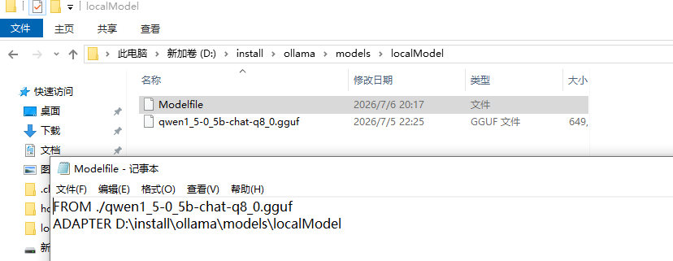
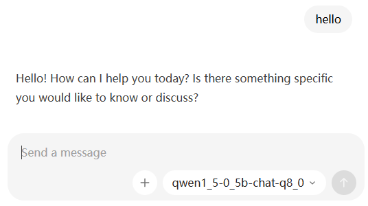

https://github.com/WenyuChiou/awesome-agentic-ai-zh

# 通用基础

## Stage 0 
Python — 寫一個 Python script 呼叫 https://api.github.com/users/torvalds 並印出 follower 數量:
```py
def ReadUrl():
    url = "https://api.github.com/users/torvalds"
    res = requests.get(url, proxies=proxies)
    data = res.json()
    print(data["followers"])
```


YAML — 用 Python 讀一個 .yaml 設定檔，改一個值，再寫回去
```py
def CruYaml():
    with open("config.yml", 'r', encoding='utf-8') as f:
        data = yaml.safe_load(f)
    # 修改
    # print(data.get("app", {}).get("version"))
    data["app"]["version"] = "2.0"

    with open("config2.yml", 'w', encoding='utf-8') as f:
        yaml.dump(data, f, allow_unicode=True, sort_keys=False)
```


API auth — 去 github.com/settings/tokens 產生一個 personal access token（給最少權限：read:user），呼叫 https://api.github.com/user 需 auth 的 endpoint，看 401（無 token）vs 200（帶 token）的差別
```py
def CallGithub():
    token = "ghp_xxx"
    url = "https://api.github.com/user"
    res = requests.get(url)
    # 401
    print(res.json())

    # 200
    header = {"Authorization": f"Bearer {token}"}
    res = requests.get(url, headers=header)
    print(res.json())
```


## Stage 1 

### ollama 离线安装模型
https://huggingface.co/Qwen/Qwen1.5-0.5B-Chat-GGUF/tree/main

ollama只支持gguf文件



```
ollama create qwen1_5-0_5b-chat-q8_0
```




### 实践

LLM API （Deepseek api）
```py
def LLMHelloWorld():
    client = OpenAI(
        api_key=setting.GetDeepSeekApiToken(),
        base_url="https://api.deepseek.com")
    res = client.chat.completions.create(model="deepseek-v4-pro",
                                         max_tokens=1000,
                                         messages=[
                                             {
                                                 "role": "user",
                                                 "content": "你好"
                                             }
                                         ])
    print(res)
    # === 自我驗證 ===
    text = res.choices[0].message.content
    print("回答：", text)
    print("usage:", res.usage)

    assert res.choices[0].finish_reason in ("stop", "length"), f"非预期 finish_reason: {res.choices[0].finish_reason}"
    assert len(text) > 0, "回應不應為空"
    assert res.usage.completion_tokens > 0, "output token 應 > 0"
    print("练习1 通过")
```

Tokens （ollama）
```py
def GetToken():
    client = OpenAI(base_url="http://localhost:11434/v1", api_key="ollama")
    PROMPTS = {
        "中文": "用一句话描述一只猫在做什么。",
        "English": "Describe in one sentence what a cat is doing.",
    }
    for label, prompt in PROMPTS.items():
        output_tokens = []
        for _ in range(10):
            r = client.chat.completions.create(model="qwen1_5-0_5b-chat-q8_0",
                                               max_tokens=80,
                                               temperature=1.0,  # 拉高 temperature 看 variance
                                               messages=[{"role": "user", "content": prompt}]
                                               )
            output_tokens.append(r.usage.completion_tokens)
            print(f"\n[{label}] prompt: {prompt}")
            print(f"  input tokens: {r.usage.prompt_tokens}")
            print(
                f"  output tokens — min={min(output_tokens)} max={max(output_tokens)}")
```

## Stage 2


# Track A


# Track B