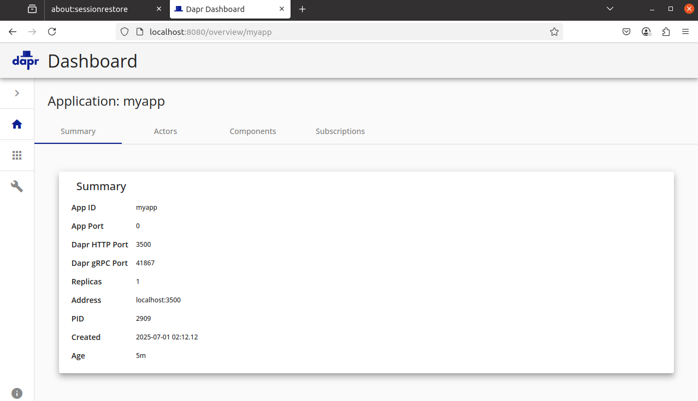

# Dapr
就是一个帮忙把可能要用到的组件都封装起来并集成在一起的个体，比如定时任务，不再需要自己去加hangfile库，直接用Dapr就可以了。他不是通过代码集成在项目里面，所以不算框架。相当于一个补给车，在旁边运行，应用程序需要时通过api让dapr干活。


Dapr 是一个盒子里的分布式系统工具包。它解决了应用程序的外围集成问题，通过标准化的 API 和 Sidecar 架构，将分布式系统的复杂性封装成可插拔的构建块，让开发者像搭积木一样构建弹性的微服务应用。

通过抽象层屏蔽底层实现的细节，让开发者使用统一的接口操作不同的技术组件。

应用永远只和本地的 localhost:3500（Dapr Sidecar）对话，Sidecar自动处理服务发现、加密、重试等脏活累活。

Dapr提供的分布式系统构建块有资源绑定、分布式锁、jobs等等，每个构建块 API 都是独立的，所以可以在应用中使用任意数量的它们。Dapr 还提供适用于使用的所有构建块的跨领域 API。

<hr>
帮助理解：
有一个应用需要redis，普通用k8s部署和加了dapr的区别：

|痛点|k8s方案|Dapr方案|
|--|--|--|
|连接字符串硬编码|ConfigMap/Secret存储，需重新部署|Component YAML定义，动态注入|
|切换数据库技术栈|需修改应用代码（驱动/API调用方式）|仅修改Component类型（代码0改动）|
|多环境适配|需要多套ConfigMap|通过Sidecar注入环境差异|
|运行时热更新|ConfigMap需要重启Pod生效|Component变更自动热加载（部分支持）|

<hr>

Dapr 以 sidecar 架构暴露其 HTTP 和 gRPC API，作为容器或进程，不需要应用代码包含任何 Dapr 运行时代码。

<hr>

|对象|定义|关系|
|---|---|---|
|Sidecar|一种架构/部署模式，一种思想，也是指一个单独的进程或容器|dapr使用它作为部署方式|
|Dapr|一个具体的微服务运行时系统|以Sidecar模式进行部署|


<hr>

Dapr可以在多种环境中托管，window/linux/k8s/物理或虚拟机集群上等等。

从现在开始需要概念与下面dotnet中的应用来回看。


## 自托管本地开发
自托管模式，Dapr作为一个独立的sidecar进程，每个运行的服务都有一个Dapr运行时检查。配置为使用状态存储、pub/sub、绑定组件和其他构建块。


### dapr安装
Ubuntu20
1、安装docker desktop
https://docs.docker.com/desktop/setup/install/linux/ubuntu/

似乎不用desktop，只用docker环境就可以了。

2、安装dapr
```
wget -q https://raw.githubusercontent.com/dapr/cli/master/install/install.sh -O - | /bin/bash
```


3、本地环境中配置dapr
dapr作为一个附属进程与应用程序一起运行。通过配置Dapr可以：
- 获取并在本地安装Dapr sidecar的二进制文件
- 创建一个简化应用程序开发的环境

```
sudo dapr init
```

如果是网络问题，参考离线安装：https://v1-7.docs.dapr.io/operations/hosting/self-hosted/self-hosted-airgap/


<hr>
window 配置
在powershell管理员下：

```
Set-ExecutionPolicy RemoteSigned -Scope CurrentUser

iwr -useb https://raw.githubusercontent.com/dapr/cli/master/install/install.ps1 | iex

script=iwr -useb https://raw.githubusercontent.com/dapr/cli/master/install/install.ps1; $block=[ScriptBlock]::Create($script); invoke-command -ScriptBlock $block -ArgumentList 1.15.1

dapr init
```

将安装路径`C:\dapr`添加到环境变量


<hr>

### dapr api
1、运行 Dapr sidecar
启动一个 Dapr sidecar，它将在端口 3500 上监听一个名为 myapp 的空白应用程序:
```
sudo dapr run --app-id myapp --dapr-http-port 3500
```


保存一个新的状态对象与获取对象名称对应的value：


2、开启控制面板
```
dapr dashboard
```




## K8S关联


- placement：管理Actor放置（分区）信息
- injector：自动将Dapr sidecar注入我们自己的应用Pod
- Sentry：mTLS证书颁发，身份认证
- Operator：处理k8s组件变化
- Scheduler：定时任务调度器

从编程角度看，Actor就是一个对象。由 Dapr 运行时托管的、可远程调用的、带状态的、单线程执行的对象。

## 构建模块
|构建模块|端点|描述|
|--|--|--|
|service invocation （服务间调用）|/v1.0/invoke|使应用程序能够通过http或gprc相互通信|
|publish/subscribe（发布和订阅）| /v1.0/publish /v1.0/subscribe |发送者（或发布者）将消息发布到主题，订阅者订阅该主题|
|workflow （工作流）|/v1.0/workflow| 用户下单后需要执行如下流程：下单 → 扣库存 → 创建支付单 → 等待支付结果 → 发货 这时可以用 Dapr Workflow 编排这个流程，无需手写复杂的状态管理、重试机制、分布式锁等|
|state management（状态管理）|/v1.0/state|帮助保存应用“临时状态”或“小规模数据”，基于键/值，具有可插拔的状态存储以实现持久性|
|bindings （绑定）|	/v1.0/bindings|允许通过 Dapr 绑定 API 调用外部服务，并允许应用程序被连接服务发送的事件触发|
|Actors（参与者）|/v1.0/actors|一个隔离的、独立的计算和状态单元，具有单线程执行。Dapr 提供基于虚拟 actor 模式的 actor 实现，提供单线程编程模型，并且当不使用时，actor 会被垃圾回收。|
|Secrets|/v1.0/secrets|像k8s的ConfigMap，可以调用 secret API 来检索 secret|
|configuration（配置）|/v1.0/configuration|Secrets 是敏感数据，configuration是非敏感配置项|
|distributed lock （分布式锁）|/v1.0-alpha1/lock|对资源进行锁定，以便应用程序的多个实例可以在不发生冲突的情况下访问资源|
|cryptography（加密）|/v1.0-alpha1/crypto|不用直接处理密钥，也不用硬编码加解密逻辑，比如要把某些字段（比如身份证号、银行卡）加密后存入数据库，用 Dapr 加密后再存，从数据库中读取加密字段，调用Dapr就可以解密|
|jobs（作业）|	/v1.0-alpha1/jobs| 调度和编排作业。示例场景包括：1、 安排批处理作业在每个工作日运行 2、 安排各种维护脚本进行清理 3、 安排 ETL 作业在特定时间（每小时、每天）运行以获取新数据，处理它，并使用最新信息更新数据仓库。|
|conversation（对话）|	/v1.0-alpha1/conversation|对话 API 使您能够提供提示与不同的大型语言模型（LLM）进行对话    AI相关的|

### 服务调用
dapr提供多种服务调用的方法，可以根据需求选择。

服务调用在两个集成Dapr应用程序之间的工作原理：
- 服务A发起一个HTTP或gRPC调用，目标是服务器B。调用发送到本地Dapr sidecar
- Dapr使用正在运行的名称解析组件在给定的托管平台上发现服务B的位置
- Dapr将消息转发到服务B的Dapr sidecar
- 服务B的Dapr sidecar将请求转发到服务B上的指定端点（或方法）。服务B然后运行其业务逻辑代码
- 服务B向服务A发送响应。响应发送到服务B的sidecar
- Dapr将响应转发到服务A的Dapr sidecar
- 服务A接收响应


## 组件
功能以组件形式提供，每个组件都有一个接口定义。所有组件都是可互换的，所以可以用具有相同接口的另一个组件替换一个组件。

一个构建块可以使用任意组合的组件。

`dapr components` 命令获取当前托管环境中可用的组件列表。

每个组件都有自己的规范（spec）通过YAML排至，位置在components/local或`dapr init`时创建的.dapr文件夹中（全局）

组件分为内置组件和可插拔组件，内置组件由社区开发和捐赠的公共组件；
自己开发的私有组件是可插拔组件，这些组件是自托管的（进程或容器）】

启用`HotReload`功能后，组件可以在运行时“热重载”，这样可以在不重启Dapr运行时的情况下更新组件配置。

可用组件类型：
- 名称解析
- Pub/sub代理
- 工作流
- 状态存储
- 绑定
- 秘密存储
- 配置存储
- 锁
- 加密
- 对话
- 中间件

## 弹性策略
通过一系列机制确保分布式应用在遇到故障（网络波动、服务宕机、超时等）仍能保持稳定运行的能力。核心目标是自动处理故障并恢复。

## 配置

可以更改：
- 单个Dapr应用程序的行为
- Dapr控制平面系统服务的全局行为

配置以 YAML 文件的形式定义并部署。

## 可观测性
通过追踪、指标、日志和健康检查观察应用程序。

## 安全性
- 使用service-invocation和pubsub PAI进行安全通行
- 通过配置应用与组件的安全策略
- 操作安全实践
- 状态安全，专注于静态数据


mTLS加密数据：一种加密传输中数据的安全机制
- 双向认证，客户端和服务器相互验证身份
- 加密通道，用于所有在途通信，在建立双向认证后


## dotnet中的应用
`dotnet new web --name dapr-test-pro`

添加`Dapr.PluggableComponents.AspNetCore`

在Program.cs替换等效代码：
```cs
using Dapr.PluggableComponents;

var app = DaprPluggableComponentsApplication.Create();

app.RegisterService(
    "<socket name>",
    serviceBuilder =>
    {
        // 使用此服务注册一个或多个组件。
    });

app.Run();
```


## 资料
- https://www.youtube.com/watch?v=5f9aY5vgq0o
- https://docs.dapr.io/zh-hans/concepts/overview/