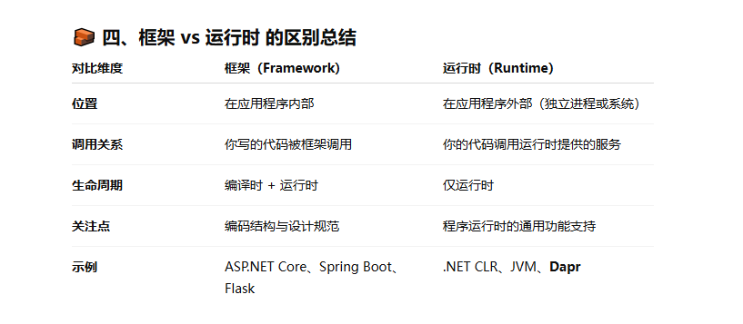
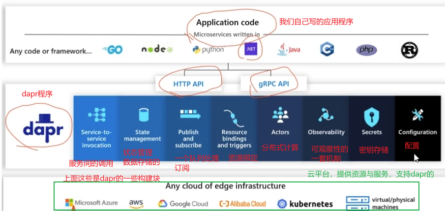
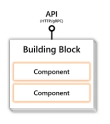
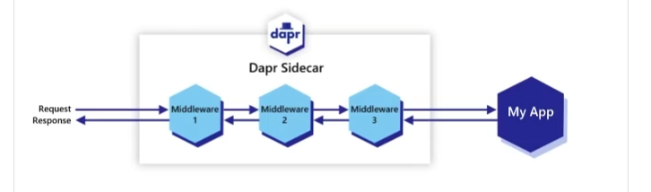
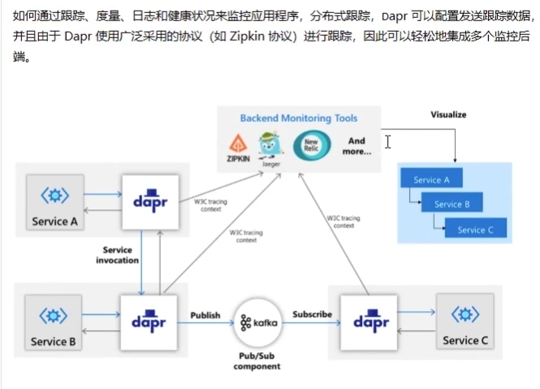
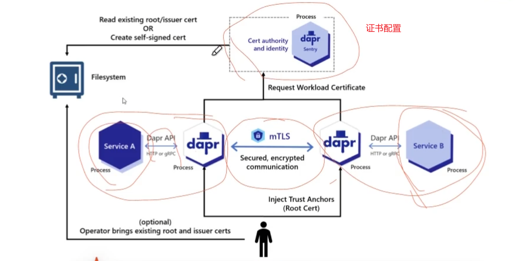
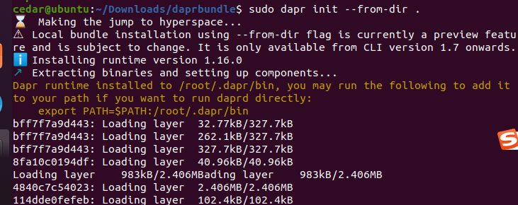
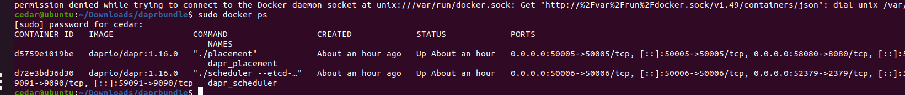
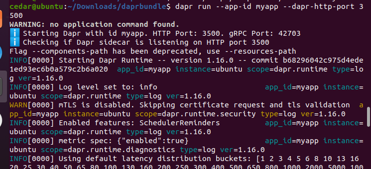
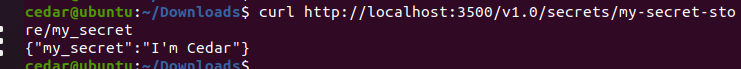

# Dapr
先理解下框架和运行时的区别：
- 框架：一组库（Libraries）+ 设计规范，用来帮助我们写应用程序代码
  - 框架需要我们“依附在它的结构中编写代码”
  - 它会调用我们写的代码（反转控制，IoC）
  - 例子：ASP.NET Core、Spring Boot、Django、React
- 运行时：应用程序在运行阶段由系统或外部组件提供的执行环境和通用功能支持层
  - 不是我们写业务逻辑需要用到的，而是在程序运行时，帮我们处理分布式通用问题（如服务发现、通信、状态存储等）的后台系统
  - 例子：.NET CLR（代码执行的运行时），JVM（代码运行的环境），Dapr（运行时支撑层）

| 类比对象    | 框架                      | 运行时                |
| ------- | ----------------------- | ------------------ |
| .NET 平台 | ASP.NET Core（写Web逻辑的框架） | .NET CLR（代码执行的运行时） |
| Java 平台 | Spring Boot（写业务的框架）     | JVM（代码运行的环境）       |
| 微服务生态   | Spring Cloud（写微服务框架）    | **Dapr（运行时支撑层）**   |



## Dapr简介入门
Dapr是一个可移植的，事件驱动的运行时，它使任何开发人员能轻松构建出弹性的，无状态和有状态的应用程序，并可运行在云平台或边缘计算中，它同时支持多种编程语言和开发框架。

dapr核心三部分：
- API：Dapr 通过一组统一的 HTTP/gRPC API 暴露功能，我们的服务通过这些 API 调用 Dapr 的能力，而不用关心底层实现
- Building Block 构建块：构建块是 Dapr 对常见分布式系统模式的抽象封装。它定义“我们能做什么”，但不关心“我们用什么做”
- Components 组件：组件是 具体实现层。每个构建块都可以通过组件来配置使用哪种后端（数据库、队列系统等），比如状态存储，组件类型有redis、mysql、Cosmos，我们可以换任何一个

| 层级              | 角色  | 谁调用谁            | 说明                          |
| --------------- | --- | --------------- | --------------------------- |
| API             | 入口层 | 应用 → Dapr API   | 业务直接调用 Dapr 的 HTTP/gRPC 接口  |
| Building Blocks | 抽象层 | Dapr API → 抽象逻辑 | 定义 Dapr 提供的分布式能力集合          |
| Components      | 实现层 | 构建块 → 组件        | 通过配置指定具体后端实现（Redis、Kafka 等） |







### 基于Sidecar结构
是一种设计上的模式，dapr以sidecar架构的方式公开其API，可以是容器，也可以是进程，不需要引用代码包含任何Dapr运行时代码。使得Dapr与其他运行的集成变得容易。

<hr>

```

┌───────────────────────────┐
│   你的应用（任何语言）       │
│  调用 Dapr HTTP/gRPC API   │
└─────────────┬─────────────┘
              │（localhost:3500）
              ▼
┌───────────────────────────┐
│      Dapr Sidecar          │ ← 独立进程（Dapr Runtime）
│ 提供服务调用、状态、Pub/Sub 等 |
└───────────────────────────┘

```

“调用 API” ≠ “引用代码”, 应用程序和 Dapr 之间的唯一耦合是 API 协议（HTTP/gRPC），而不是 Dapr 的库或运行时代码。所以才说不需要引用代码包含任何Dapr运行时代码。

<hr>

### 组件实现
dapr使用模块化设计，将功能作为组件来提供，每个组件都有接口定义，所有组件都是可插拔的，因此可以将组件换成另一个具有相同接口的组件。

### 中间件管道
dapr允许通过链接一系列中间件组件来定义自定义处理管道。



### 可观测性



### 传输安全性
Dapr用于加密传输中数据的安全机制之一是相互认证TLS(或简写为mTLS)
- 双向身份验证：客户端向服务器证明身份，反之亦然
- 建立双向认证后，所有进行中通信都走加密通道



## 配置Dapr环境
https://docs.dapr.io/zh-hans/getting-started/install-dapr-cli

1、安装


```
# 卸载 Docker Desktop
sudo apt remove docker-desktop -y
sudo rm -rf ~/.docker/desktop

# 安装 Docker Engine
sudo apt update
sudo apt install -y docker-ce docker-ce-cli containerd.io docker-buildx-plugin docker-compose-plugin

# 启动 Docker 服务
sudo systemctl start docker
sudo systemctl enable docker

# 测试
sudo docker run hello-world
docker ps   # 如果用户未加入 docker 组，需要 sudo

```


2、初始化dapr运行时
```
dapr init --slim --from-dir .
dapr --verson
docker ps

默认组件目录
explorer "%USERPROFILE%\.dapr\components"
```





离线安装：https://v1-7.docs.dapr.io/operations/hosting/self-hosted/self-hosted-airgap/

启动 Redis（用于状态存储、Pub/Sub）
```
sudo docker run -d \
  --name dapr_redis \
  -p 6379:6379 \
  redis:alpine
```

创建组件目录（如果不存在）
```
mkdir -p ~/.dapr/components

```

创建 Redis 组件文件(配置在dapr的作为组件)
```
vim  ~/.dapr/components/statestore.yaml

```
```
apiVersion: dapr.io/v1alpha1
kind: Component
metadata:
  name: statestore
spec:
  type: state.redis
  version: v1
  metadata:
  - name: redisHost
    value: localhost:6379
  - name: redisPassword
    value: ""

```

启动 Zipkin（用于分布式追踪）
```
sudo docker run -d \
  --name dapr_zipkin \
  -p 9411:9411 \
  openzipkin/zipkin

```

3、启动边车
```
dapr run --app-id myapp --dapr-http-port 3500
```



4、模拟我们的app 调用状态存储api接口
```
curl -X POST http://localhost:3500/v1.0/state/statestore \
  -H "Content-Type: application/json" \
  -d '[{"key":"ping","value":"pong"}]'
```
读取
```
curl http://localhost:3500/v1.0/state/statestore/ping
```


成功！

从本地删除dapr配置
```
dapr uninstall --all
```

## 定义一个Dapr组件
组件的开发是基于go

组件列表：https://github.com/dapr/components-contrib

1、建立一个yaml文件
```yaml
apiVersion: dapr.io/v1alpha1
kind: Component
metadata:
  name: my-secret-store        # 组件名称
  namespace: default           # 命名空间
spec:
  type: secretstores.local.file # 组件类型：本地文件密钥存储,和github上的目录对应起来
  version: v1
  metadata:
  - name: secretsFile           # 指定密钥文件路径
    value: <PATH TO SECRETS FILE>/mysecrets.json
  - name: nestedSeparator       # 嵌套 key 分隔符
    value: ":"

```

2、创建mysecrets.json
```
{
  "my_secret":"I'm Cedar"
}
```

3、运行Dapr Sidecar
```
dapr run --app-id myapp --dapr-http-port 3500 
```

4、请求测试
```
curl http://localhost:3500/v1.0/secrets/my-secret-store/my-secret
```



5、可以使用基于Dapr的 .net sdk开发包使用dapr
```cs
using Dapr.Client
var client = new DaprClientBuilder().Build();
var secret = await client.GetSecretAsync("my-secret-store", "my-secret");
if(secret.TryGetValue("my-secret", out string? val))
{
  Console.WriteLine(val);
}
```

云厂商提供的密钥管理服务：https://www.aliyun.com/product/kms (配置在对应的type)

## 服务间调用的构建块


## 资料
- 视频：https://www.bilibili.com/video/BV1Sj411g7cs?spm_id_from=333.788.videopod.episodes&vd_source=c3939bba6fb53dcccb38ed988f16994c
- 文档：https://docs.dapr.io/zh-hans/


