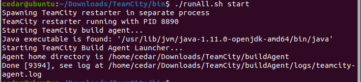
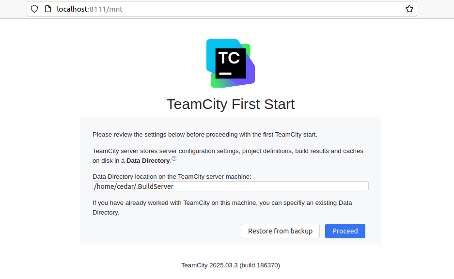
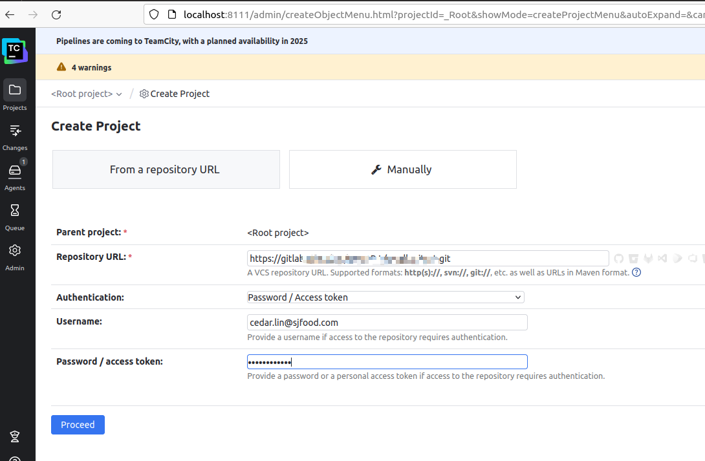
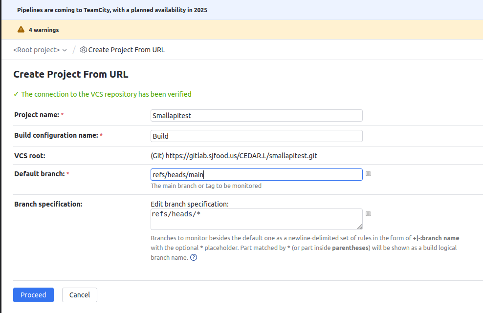
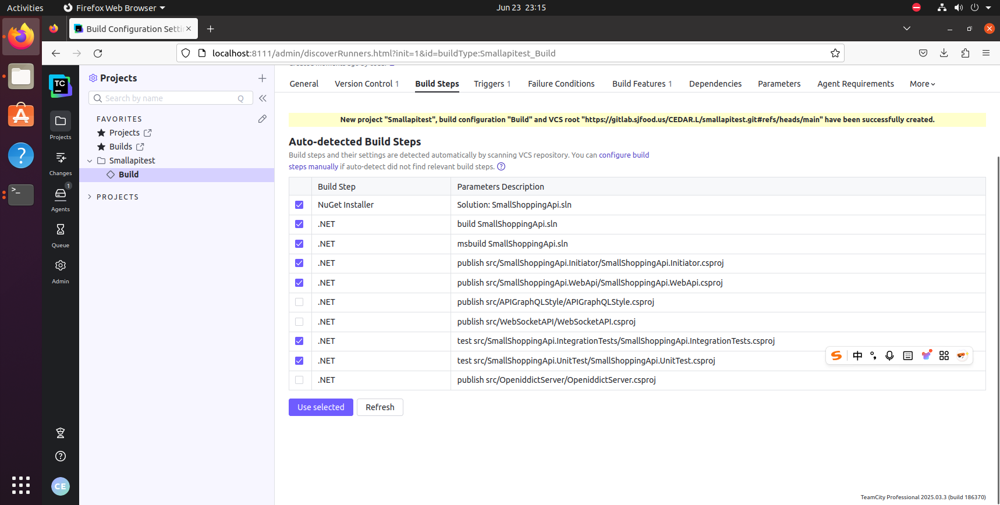
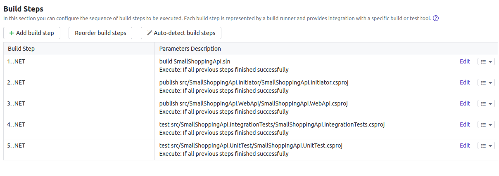

# TeamCity+octopus deploy部署项目整流程
机器：Ubuntu20虚拟机

## TeamCity
https://www.jetbrains.com/zh-cn/help/teamcity/quick-setup-guide.html

安装java11
```
# 更新软件包列表
sudo apt update

# 安装 OpenJDK 11
sudo apt install openjdk-21-jdk -y

# 验证安装
java -version
```

安装dotnet：
https://dotnet.microsoft.com/en-us/download

安装TeamCity：
1、先从官网下载免费版本的TeamCity
https://www.jetbrains.com/teamcity/download/#section=server

2、解压
```
tar xfz TeamCity<version number>.tar.gz
```

3、运行
```
cd TeamCity/bin/
./runAll.sh start
```
停止：
```
./runAll.sh stop
```



http://localhost:8111/mnt


4、创建一个项目







- NuGet Installer
  - 自动恢复项目依赖的NuGet包
  - 通常是必须的
- build 
  - 编译整个解决方案
  - 这是基础步骤，确保代码可以成功编译
- publish 
  - 如果项目需要部署（如WebApi、GraphQL、WebSocket等），选择对应的publish步骤
- test
  - 运行单元测试和集成测试
- MSBuild
  - 在 TeamCity 中，msbuild SmallShoppingApi.sln 和 dotnet build SmallShoppingApi.sln 功能类似
  - 推荐优先使用 dotnet build（更现代，兼容性更好）
  - 仅在需要高级 MSBuild 参数（如自定义属性、目标）时使用 msbuild




