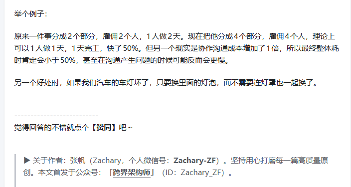
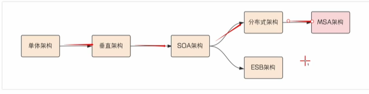
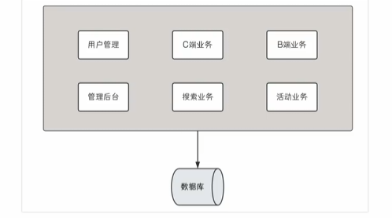
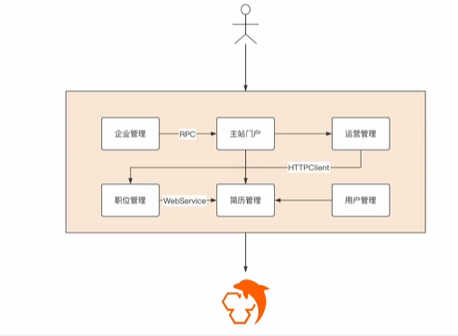
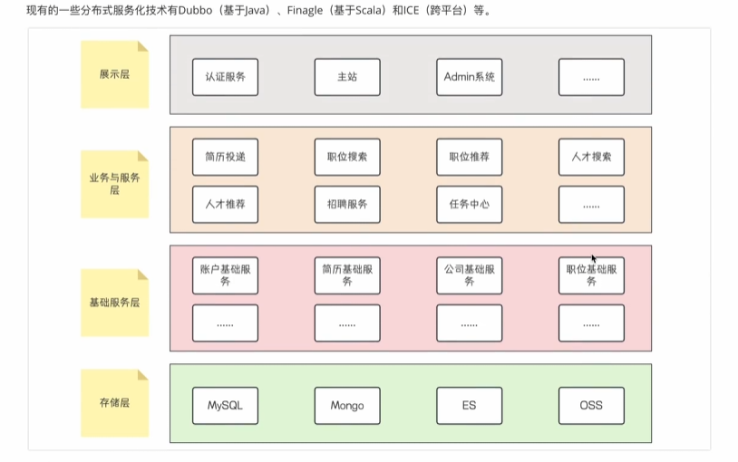
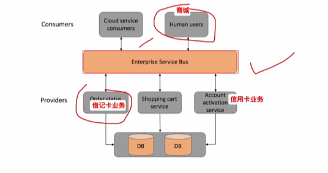
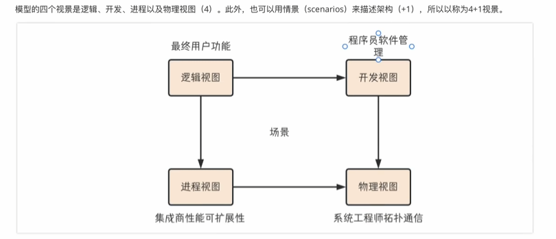
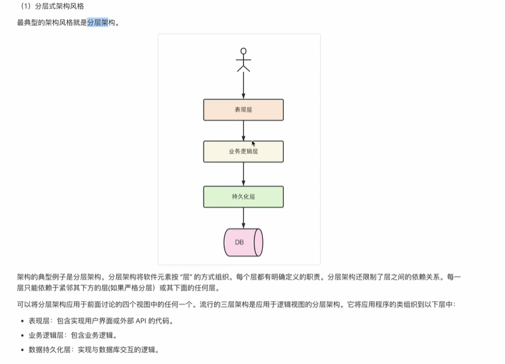
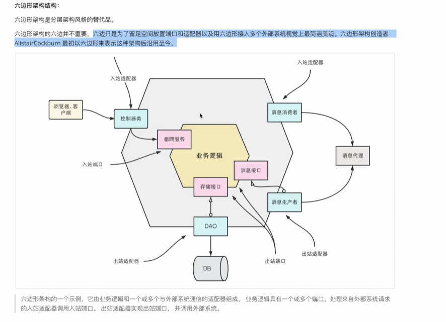
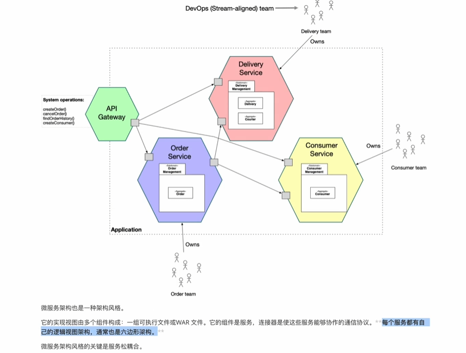

# 分布式系统与微服务架构设计体系
微服务是分布式服务架构的子集。

微服务架构是按能力分散，分布式服务是按部署分散。（分布式是一个大系统划分为多个业务模块，业务模块分别部署到不同服务器上。而微服务强调的是一个大系统划分为多个业务模块，这些模块可以部署在同一个服务器上）

## 微服务架构（MSA）综述
### 1 架构演进历程

#### 1.1 单体架构
很多平台级的应用，最初的样子都是一个单体架构。

优点：
- 开发节奏快
- 架构简单:MVC、MVP架构
- 易于测试
- 易于部署
缺点：
- 严重耦合
- 系统变更对部署影响大
- 影响开发效率
- 扩展性受限

#### 1.2 垂直架构
为了避免上面的问题，开始做模块的垂直划分。基于业务特性做，核心目标是业务之间互不影响，二是为了提高效率，减少之间的依赖。

是一个过渡性架构

优点：
- 实现流量分组，解决并发问题
- 可以针对不同模块进行优化
- 方便水平扩展，负载均衡，容错率提高
- 相互独立，互不影响

缺点：
- 服务之间互相调用，某个服务端口或ip地址发生改变，调用的系统得手动改变
- 搭集群后，实现负载均衡比较复杂
- 服务之间调用方式不统一：RPC、HTTPClient、WebService
- 服务监控不到位：调用成功率、失败率、超时率、总耗时、慢链路等监控指标都没有

#### 1.3 面相服务的架构 SOA
SOA关注点是服务，以服务为基本的业务单元。

几乎任何的业务功能都可以定义为服务，服务也意味着要对外提供开放的能力，比如商品的管理抽取为一个服务，对外提供商品的管理功能。服务是可大可小的。分布式架构是SOA的一种落地方式，但不能等同于SOA。

SOA落地方式：
- 分布式服务化（分布式架构，是一种去中心化架构）
  - 最典型的落地技术栈：Dubbo+Zookeeper
  - 
- 集中式管理
  - 用于传统企业内部遗留系统包袱重的。以ESP作为基础支撑技术，以整合集成为核心，将各个新旧系统的业务能力逐渐在ESB容器上聚合和集成起来。商业ESB一般内部设计基本是黑盒，费用高。
  - 

#### 1.4 微服务架构

微服务架构 VS SOA的分布式架构：
- 微服务架构相对于SOA结构服务的拆分颗粒度更细，更小
- 服务的治理能力强
- 微服务的技术栈更全，更成提现，技术栈内部的技术组件也是基于微服务的思想来做
  - Dubbo：RPC、负载均衡、熔断降级...
  - Feign：远程调用

### 2 软件架构
软件架构：有关软件整体结构与组件的抽象描述，用于指导大型软件系统各个方面的设计，包括：软件组件、组件之间的关系，组件特性以及组件间关系的特性

4+1视图模型

- 逻辑视图：开发人员创建的软件元素，元素指的是类和包，它们之间的关系是类和包的关系，包括：继承、关联、依赖
- 开发视图：构建编译系统的输出，此视图表示要打包代码的模块和组件组成。在java中模块时jar文件，组件通常是War或可执行的jar
- 进程视图：运行时的组件，每个元素都是一个进程，进程之间的关系代表进行间的通信方式
- 物理视图：进程如何映射到机器上，该视图的元素由计算机和进程组成。机器之间的关系表示是网络拓扑
- 场景：负责把视图串联在一起，每个场景负责描述在一个视图中的多个架构元素如何协作，以完成一个请求

架构意义：
应用程序有两个层面需求
- 功能性需求：应用程序要做什么，实现什么功能，通常包含在用例或用户故事中
- 非功能需求（质量性需求）：安全性、扩展性、可靠性、可维护性、可测试性...

架构风格：组件和组件关系的不同组合
（不管是分层式还是六边形，都是表示的逻辑视图）
- 分层式
  - 
  - 弊端
    - 表现层单一，不支持多种客户端
    - 定义数据源的持久化层，不支持多数据库
    - 业务逻辑依赖于数据持久层
- 六边形
  - 
  - 名称解释
    - 端口：端口定义一组操作，端口表示接口
      - 入站端口：业务逻辑公开的API，外部的应用可以调用，入站端口的实例就是一个服务接口
      - 出站端口：业务逻辑调用外部系统的方式，出站端口的一个实例时存储接口，定义数据范围操作方式
    - 适配器
      - 入站适配器：最典型是MVC Controller，提供一组REST接口或一组Web页面，还有一个实例时订阅MQ的消息订阅者
      - 出站适配器：会实现出站端口，通过调用外部应用程序或服务接口来处理自己的业务逻辑请求。其中的一个实例就是DAO对象，实现了存储接口，而存储接口是一个出站端口。当然也可以调用远程服务的代理类
- 微服务结构
  - 

### 3 微服务架构本质
一些技术进步推动微服务发展：
- 云服务、平台
- 虚拟化和容器快速发展
- 敏捷、DevOps理念

特点（小独轻松）：
- 服务小到恰到好处，“微”表达一种设计思想和指导方针，需要我们找到平衡点，分散负责开发/维护/测试的负责人
- 独立进程：可以独立开发、运行、测试、部署
- 轻量级通信机制，因为“独”的特性，可以根据实际需求选择不同的编程语言、技术栈、存储库（每个微服务都只能访问自己的数据库）
- 松耦合的交付，对一个微服务修改，不会影响其他微服务

### 4 微服务架构特征
特征：
- 基础设施自动化
  - 每个服务分别部署，都要有相应的健康检查、错误回滚、日志、成本（部署/运维）很高的，
- 业务数据独立
- 技术多样性
  - 允许不同服务使用不同编程语言、技术包、存储组件
- 以服务为组件
  - 和传统抽取共享库不同，组件可以独立进行部署
- 围绕业务组织团队
- 关注产品而非项目
  - 让团队负责整个服务的生命周期，从服务立项、分析、需求、开发、测试、部署、运维

## 资料
- 视频资料：https://www.bilibili.com/video/BV1eFtRezERp/?spm_id_from=333.337.search-card.all.click&vd_source=c3939bba6fb53dcccb38ed988f16994c