# 分布式系统与微服务架构设计体系
微服务是分布式服务架构的子集。

微服务架构是按能力分散，分布式服务是按部署分散。（分布式是一个大系统划分为多个业务模块，业务模块分别部署到不同服务器上。而微服务强调的是一个大系统划分为多个业务模块，这些模块可以部署在同一个服务器上）


## 微服务架构（MSA）综述
### 1 架构演进历程


#### 1.1 单体架构
很多平台级的应用，最初的样子都是一个单体架构。


优点：
- 开发节奏快
- 架构简单:MVC、MVP架构
- 易于测试
- 易于部署
缺点：
- 严重耦合
- 系统变更对部署影响大
- 影响开发效率
- 扩展性受限

#### 1.2 垂直架构
为了避免上面的问题，开始做模块的垂直划分。基于业务特性做，核心目标是业务之间互不影响，二是为了提高效率，减少之间的依赖。

是一个过渡性架构


优点：
- 实现流量分组，解决并发问题
- 可以针对不同模块进行优化
- 方便水平扩展，负载均衡，容错率提高
- 相互独立，互不影响

缺点：
- 服务之间互相调用，某个服务端口或ip地址发生改变，调用的系统得手动改变
- 搭集群后，实现负载均衡比较复杂
- 服务之间调用方式不统一：RPC、HTTPClient、WebService
- 服务监控不到位：调用成功率、失败率、超时率、总耗时、慢链路等监控指标都没有

#### 1.3 面相服务的架构 SOA
SOA关注点是服务，以服务为基本的业务单元。

几乎任何的业务功能都可以定义为服务，服务也意味着要对外提供开放的能力，比如商品的管理抽取为一个服务，对外提供商品的管理功能。服务是可大可小的。分布式架构是SOA的一种落地方式，但不能等同于SOA。

SOA落地方式：
- 分布式服务化（分布式架构，是一种去中心化架构）
  - 最典型的落地技术栈：Dubbo+Zookeeper
  - 
- 集中式管理
  - 用于传统企业内部遗留系统包袱重的。以ESP作为基础支撑技术，以整合集成为核心，将各个新旧系统的业务能力逐渐在ESB容器上聚合和集成起来。商业ESB一般内部设计基本是黑盒，费用高。
  - 


#### 1.4 微服务架构


微服务架构 VS SOA的分布式架构：
- 微服务架构相对于SOA结构服务的拆分颗粒度更细，更小
- 服务的治理能力强
- 微服务的技术栈更全，更成提现，技术栈内部的技术组件也是基于微服务的思想来做
  - Dubbo：RPC、负载均衡、熔断降级...
  - Feign：远程调用


### 2 软件架构
软件架构：有关软件整体结构与组件的抽象描述，用于指导大型软件系统各个方面的设计，包括：软件组件、组件之间的关系，组件特性以及组件间关系的特性

4+1视图模型


- 逻辑视图：开发人员创建的软件元素，元素指的是类和包，它们之间的关系是类和包的关系，包括：继承、关联、依赖
- 开发视图：构建编译系统的输出，此视图表示要打包代码的模块和组件组成。在java中模块时jar文件，组件通常是War或可执行的jar
- 进程视图：运行时的组件，每个元素都是一个进程，进程之间的关系代表进行间的通信方式
- 物理视图：进程如何映射到机器上，该视图的元素由计算机和进程组成。机器之间的关系表示是网络拓扑
- 场景：负责把视图串联在一起，每个场景负责描述在一个视图中的多个架构元素如何协作，以完成一个请求

架构意义：
应用程序有两个层面需求
- 功能性需求：应用程序要做什么，实现什么功能，通常包含在用例或用户故事中
- 非功能需求（质量性需求）：安全性、扩展性、可靠性、可维护性、可测试性...


架构风格：组件和组件关系的不同组合
（不管是分层式还是六边形，都是表示的逻辑视图）
- 分层式
  - 
  - 弊端
    - 表现层单一，不支持多种客户端
    - 定义数据源的持久化层，不支持多数据库
    - 业务逻辑依赖于数据持久层
- 六边形
  - 
  - 名称解释
    - 端口：端口定义一组操作，端口表示接口
      - 入站端口：业务逻辑公开的API，外部的应用可以调用，入站端口的实例就是一个服务接口
      - 出站端口：业务逻辑调用外部系统的方式，出站端口的一个实例时存储接口，定义数据范围操作方式
    - 适配器
      - 入站适配器：最典型是MVC Controller，提供一组REST接口或一组Web页面，还有一个实例时订阅MQ的消息订阅者
      - 出站适配器：会实现出站端口，通过调用外部应用程序或服务接口来处理自己的业务逻辑请求。其中的一个实例就是DAO对象，实现了存储接口，而存储接口是一个出站端口。当然也可以调用远程服务的代理类
- 微服务结构
  - 

### 3 微服务架构本质
一些技术进步推动微服务发展：
- 云服务、平台
- 虚拟化和容器快速发展
- 敏捷、DevOps理念


特点（小独轻松）：
- 服务小到恰到好处，“微”表达一种设计思想和指导方针，需要我们找到平衡点，分散负责开发/维护/测试的负责人
- 独立进程：可以独立开发、运行、测试、部署
- 轻量级通信机制，因为“独”的特性，可以根据实际需求选择不同的编程语言、技术栈、存储库（每个微服务都只能访问自己的数据库）
- 松耦合的交付，对一个微服务修改，不会影响其他微服务

### 4 微服务架构特征
特征：
- 基础设施自动化
  - 每个服务分别部署，都要有相应的健康检查、错误回滚、日志、成本（部署/运维）很高的，
- 业务数据独立
- 技术多样性
  - 允许不同服务使用不同编程语言、技术包、存储组件
- 以服务为组件
  - 和传统抽取共享库不同，组件可以独立进行部署
- 围绕业务组织团队
- 关注产品而非项目
  - 让团队负责整个服务的生命周期，从服务立项、分析、需求、开发、测试、部署、运维

# 开发高可用的微服务项目
## 1 微服务技术体系
### 1.1 微服务架构包含哪些组件

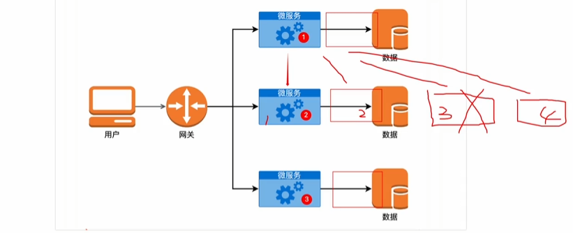

微服务架构带来的核心问题与对应解决组件：
- 如何发现新服务节点以及检查服务节点状态————**服务注册/发现中心**
  - 最核心组件，起到服务节点的注册与状态维护作用
  - 微服务架构中任何服务都要将自己的元数据（描述吱声数据、服务名称、IP、端口等）向注册中心注册，服务注册执行（组件）维护所有服务元数据。
  - 服务发现：将服务注册执行维护的元数据信息拉去到本地（周期性拉取）
  - 注册执行通常用心跳机制最大程度保证其持有的服务节点列表都是可用的
- 如何发现服务及负载均衡如何实现————**负载均衡**
  - 服务都在注册中心注册了，包括所有副本，注册中心将可用节点列表返回给调用者，这个过程是服务发现
  - 服务调用者接收到多个可用节点，通过负载均衡策略选择合适的节点发起通信请求
  - 一般服务都有内置负载均衡器
- 服务间如何进行消息通信————**服务通信**
  - 微服务定义中服务间通信用轻量级协议，通常是HTTP RESTful风格，但因为RESTful风格过于灵活，必须加以约束，通常在应用时进行上层封装，例如Spring Cloud中提供Feign和RestTemplate两种技术屏蔽底层实现RESTful通信细节，所有开发者是基于封装后统一的SDK进行开发
- 如何对使用者暴露服务API————**API服务网关**
  - 对最终用户来说，微服务通信与各种实现细节是透明的，用户值关注他要用的API接口即可
  - 微服务架构引入服务网关控制用户访问权限，服务网关是外部环境访问内部微服务唯一途径，在这个基础上扩展出其他功能：用户认证与授权、客错限流、动态路由、A/B测试、灰度发布等
- 如何集中管理众多服务节点的配置文件————**配置中心**
  - 微服务节点都包含自己各种配置文件：JDBC地址、自定义配置、环境配置等等
  - 通过配置中心服务器，将分散的配置文件集中到配置中心，一般配置中心会提供UI界面
- 如何收集服务节点的日志并统一管理————**集中式日志管理**
  - ELK、EFK通过搭建独立日志收集系统，定时抓取增量日志形成有效统计报表
- 如何实现服务间调用链路追踪————**分布式链路追踪**
  - 一个复杂业务流程可能需要连续调用多个微服务，我们需要记录一个完整业务逻辑涉及的每一个微服务运行状态、再通过可视化链路图展示
- 如何对系统进行链路保护，避免微服务雪崩————**服务保护**
  - 服务间通信过程中，如果某个微服务出现相应高延迟可能导致线程池满载，严重会引起系统崩溃，所以需要引入服务保护组件实现高延迟服务的快速降级，避免系统崩溃
  - 服务保护对应技术：服务限流、熔断（保险丝）、降级

### 1.2 Spring Cloud微服务体系（了解，主要看Dapr篇）
Spring Cloud提供以微服务为核心的分布式系统构建标准，所以Spring Cloud其实是一套规范，用于构建微服务架构的规范而不是一个拿来即用的框架。

两层意思：
- 是一套微服务构建的规范
- 是一套微服务解决方案，一对开发微服务组件的集合，框架

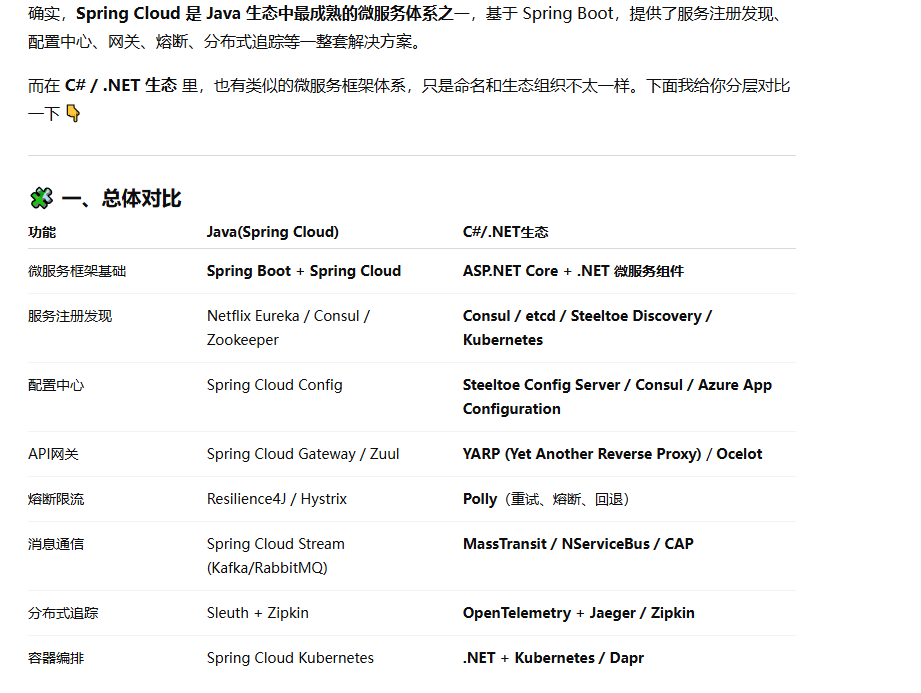


Spring Cloud Netflix是Spring Cloud 第一代实现
Spring Cloud Alibaba是Spring Cloud第二代实现
两代可以配合使用，不是非此即彼的关系

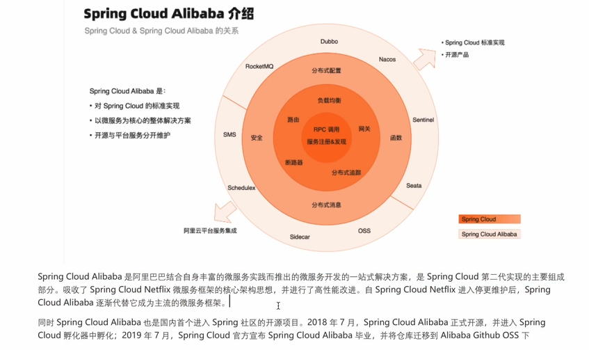

### 1.3 工程案例（主要是微服务知识点，不涉及实际操作）
工程结构：

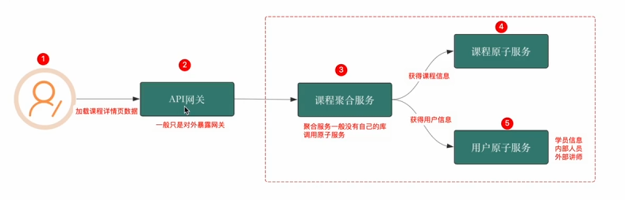

- API网关：主要处理请求路由、安全管理和流量控制等功能，是客户端与微服务之间的中介
- 聚合服务：负责从多个原子服务中获取数据并进行整合，提供给客户端一个简化的接口
- 原子服务：实现具体的业务功能和数据操作，遵循单一职责原则，独立部署和扩展，一般每个原子服务都有自己的数据库，原子服务是被调用的，原子服务之间不进行调用，更不能反向调用聚合服务


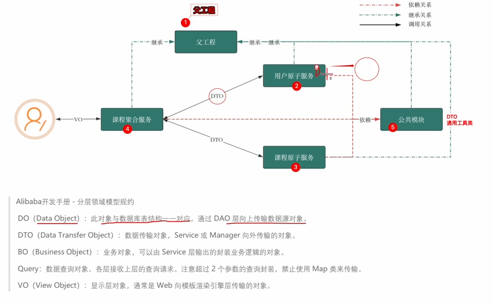


对于dotnet可以像这样组织：
```
MyMicroservices.sln
│
├── CourseService/
│   └── CourseService.csproj  (ASP.NET Core Web API)
│
├── UserService/
│   └── UserService.csproj  (ASP.NET Core Web API)
│
├── SharedLibrary/
│   └── SharedLibrary.csproj  (Class Library)
│
├── Docker/
│   └── docker-compose.yml (定义多个服务容器)

```
.csproj 文件是 .NET 项目的核心配置文件，因此，有 .csproj 文件的项目是可以单独部署的。

.sln 文件是 Visual Studio 解决方案文件，它是 一个或多个 .NET 项目的集合。在 .NET 开发中，解决方案（Solution）文件用来管理和组织多个项目（Projects）。可以把 .sln 文件看作是一个容器，它包含了多个独立的项目和它们之间的关系。

就是不同项目各自负责各自业务，然后让聚合服务通过api调用原子服务上的数据再整合返回给用户。

## 2 服务注册中心
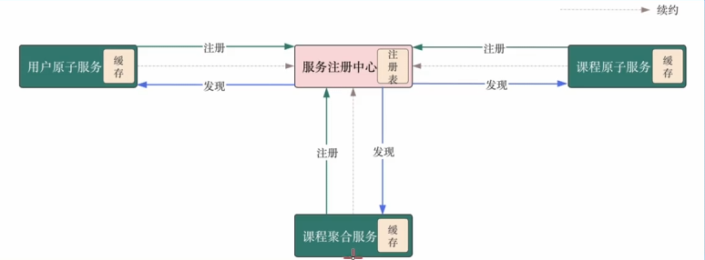

### 2.1 服务注册
一个微服务在启动时向一个服务注册中心（Eureka，Consul，Nacos等）报告它自己的地址和端口等信息。

主要步骤：
- 微服务启动：微服务实例启动时向服务注册中心发送一个注册请求
- 发送实例信息：注册请求包含微服务实例具体信息：ip，端口，元数据等
- 注册中心记录：服务注册中心接收到请求后将该微服务实例信息记录在服务注册表中
- 确认注册：服务注册中心通常返回一个确认信息，告知微服务实例注册成功

作用：
- 集中管理
- 动态变化：服务可以动态加入或退出系统（服务下线可以发送通知退出注册），服务注册中心能实时更新服务信息

### 2.2 服务发现
一个微服务在需要调用其他微服务时，通过服务注册中心查找获取目标服务实例的地址和端口等信息

主要步骤：
- 服务查询：一个微服务需要调用另外一个微服务时，它会向注册中心发送一个查询请求
- 服务注册中心查找：服务注册中心根据请求中的服务名查找对应服务实例信息
- 返回实例信息：服务注册中心将符合条件的服务实例地址列表返回给请求的微服务
- 调用目标服务：请求的微服务根据返回的实例信息，选择一个可用的服务实例进行调用

作用：
- 负载均衡：调用方可以获取多个服务实例信息，实现负载均衡
- 故障转移：如果某个服务实例不可用，服务发现可以通过获取其他实例信息实现故障转移

### 2.3 客户端缓存和周期性刷新
客户端缓存：
- 客户端第一次发现服务实例后，可以将实例信息保存在本地缓存中心
- 后续调用可以直接使用缓存

周期性刷新：
- 客户端会周期性刷新缓存，定期向服务注册中心发送请求获取最新实例列表

### 2.4 续约
心跳机制。微服务实例需要定期向服务注册中心发送心跳检测，表明仍然处在正常运行状态。

主要步骤：
- 定期发送心跳
- 续约成功：服务注册中心接收到心跳后，更新该微服务实例的租约信息表示该实例仍然存活
- 失效检测：如果服务注册中心在一定时间内未收到某个微服务实例的心跳信息，则认为该实例失效，从注册表中移除该实例信息

作用：
- 健康检查
- 动态更新

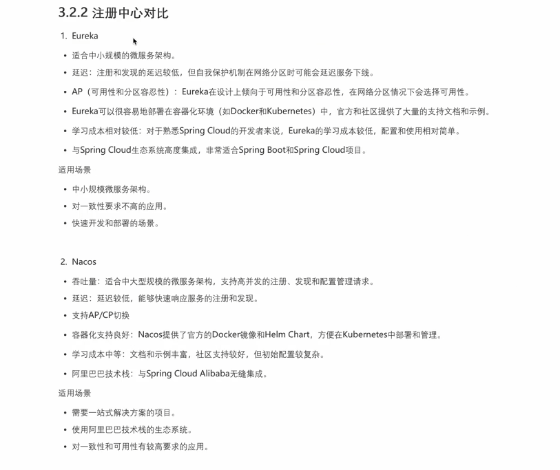

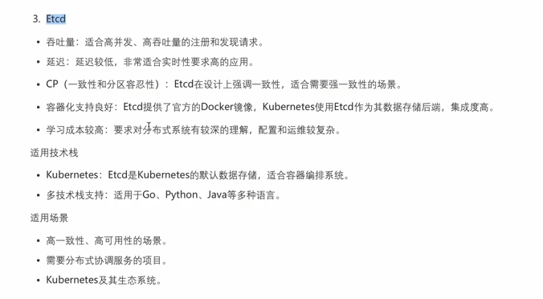

服务注册中心也是一个服务（我们自己建的项目）

### 2.5 Eureka框架
使用Eureka框架启动一个服务注册中心服务

对于要注册的服务就是使用Euraka客户端（一个库），做出对应的配置

自我保护机制是在检测到大量客户端实例在短时间失联时，暂时停止从注册表中删除这些实例的功能，目的是防止网络分区或临时故障导致服务实例被错误地移除，从而提高系统的可用性和容错性。

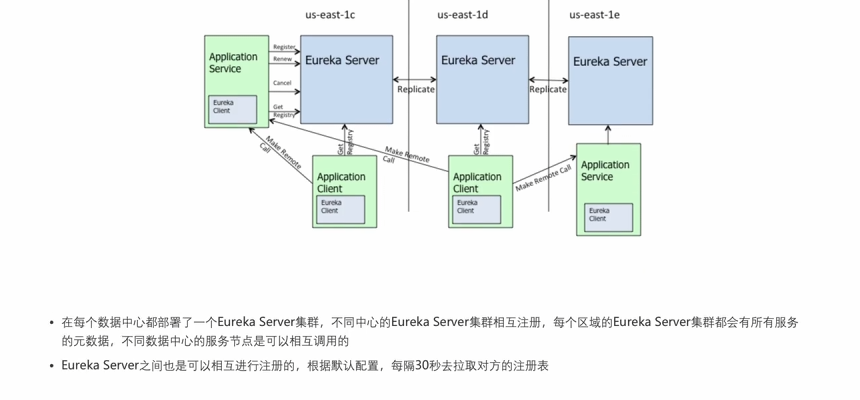

看看人的微服务项目架构

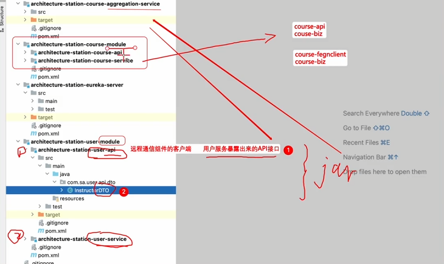

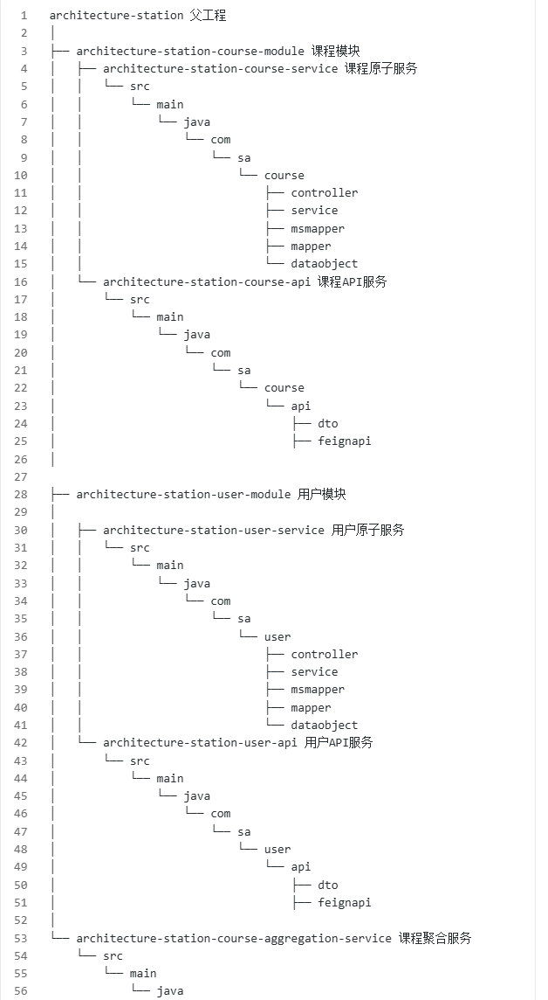

### 2.6 Nacos
既可以作为服务注册中心又可以作为服务配置中心

这个是一个开箱即用的服务，下载下来用命令启动就可以的


## 3 高可用REST远程通信
### 3.1 OpenFeign通信
在 Spring Cloud 中，Feign  是一个声明式的 HTTP 客户端，通过使用 OpenFeign，开发者可以像调用本地方法一样调用远程 HTTP 服务，而不需要编写大量的模板代码。

OpenFeign 是 Spring Cloud 生态系统的一部分，用来实现微服务之间的通信。

特性：
- 声明式接口：通过定义接口（在API服务上）和注解（在HTTP客户端上，也就是聚合服务），OpenFeign 可以自动生成 HTTP 客户端代码
  - 注解是定义在聚合服务中，服务调用的发起方
  - 接口通常与Controller方法签名是匹配的
- 负载均衡：与 Spring Cloud LoadBalancer 集成，支持客户端负载均衡
- 重试机制
- 请求拦截器：自定义请求拦截器，在请求发送前进行处理
  - 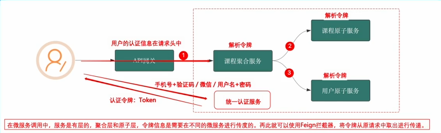
- 日志记录

### 3.2 loadbalancer 负载均衡
loadBalancer 通过与 Spring Cloud 其他组件（如 Eureka、Nacos、OpenFeign 等）无缝集成

特性：
- 客户端负载均衡：在客户端实现负载均衡，分发请求到多个服务实例
- 与 Spring Cloud 集成：与 Spring Cloud 生态系统无缝集成，支持 Eureka、OpenFeign 等组件
- 可扩展性：允许开发者自定义负载均衡策略和规则
- 重试机制：支持配置重试策略，自动重试失败的请求
- 易于配置

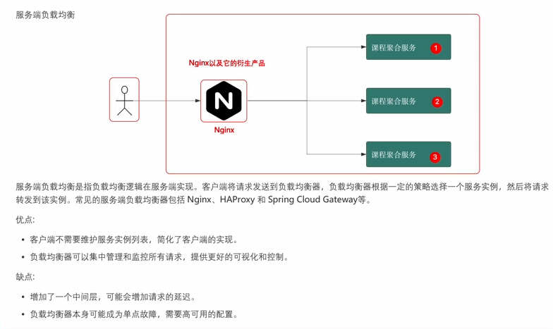

是属于客户端负载均衡，也就是在聚合服务用的负载均衡

常见负载均衡算法：
- 轮询 按顺序将请求分配给每个服务实例
- 加权轮询 为每个服务实例分配一个权重，根据权重按比例分配请求
- 随机
- 加权随机 可以通过服务注册中心保存权重信息
- 最少连接
- 加权最少连接
- 一致性哈希 根据请求的某个属性（客户端IP，请求URL等）计算哈希值，将请求分配给对应的服务实例


## 4 分布式配置中心
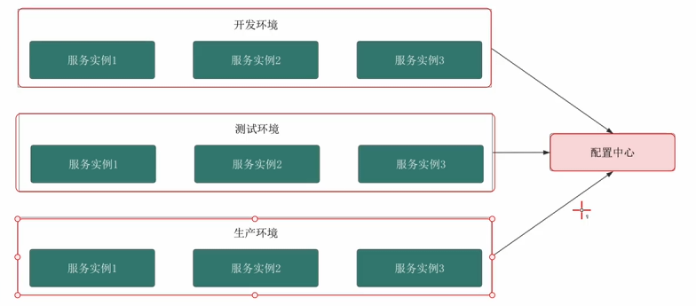

特点：
- 集中管理配置
- 动态更新配置：无需再重启应用
- 版本控制和回滚
- 权限管理
- 配置加密和安全
  - 支持对敏感配置信息进行加密存储
  - 提供安全传输通道，如HTTPS，以保护配置在传输过程中的安全
- 多环境支持
- 配置推送和订阅
- 审计和日志
- 多语言和框架支持
- 高可用和可扩展性

配置中心技术路线：
- 以Zookeeper（存储+监听）和etcd为代表的分布式键值存储系统
- 以Spring Cloud Config、Nacos和Apollo为代表的专用配置管理工具


除了Nacos可以做为配置中心，还有Apollo（定制化的）也是常用的配置中心。
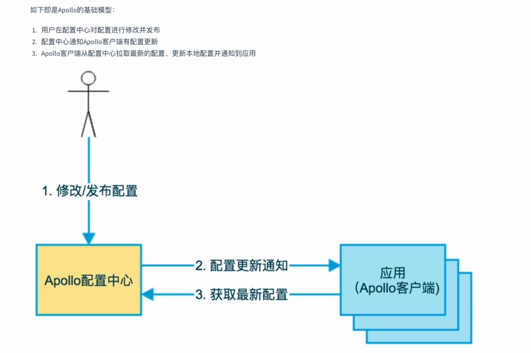

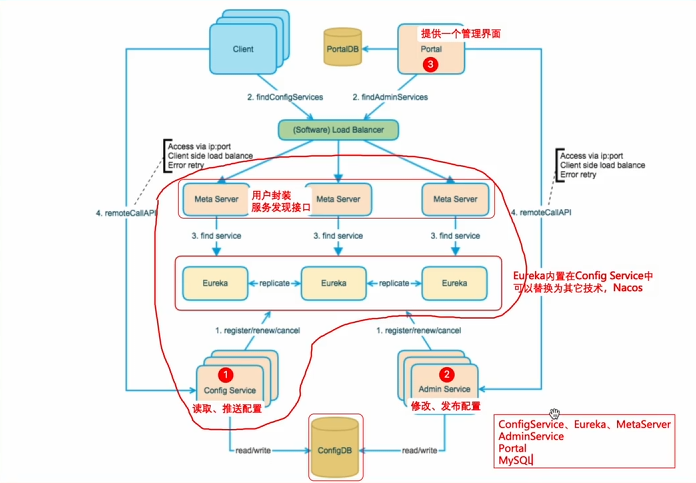

## 5 API网关
- API：表示它专注于管理和处理应用程序编程接口（API）的请求
- 网关：强调它作为系统的入口点，控制并管理所有进入和离开的流量，类似于传统网络中的网关设备

功能：
- 请求路由和分发
  - 将客户端的请求路由到正确的后端服务。它将外部请求转换为内部的服务调用
  - 通过定义路由规则，API 网关可以根据请求的路径、方法、头信息等将请求分发到相应的微服务
- 安全控制与验证
  - 支持多种认证机制（如OAuth2、JWT），保护后端服务免受未经授权的访问
- 流量管理和负载均衡
- 数据转换和协议适配
- 监控与日志


网关技术路线：
- 基于 Nginx + Lua 脚本的 API 网关  （Nginx+OpenResty+（+Kong））
  - 思路
    - nginx:作为最主要高性能HTTP服务和反向代理，处理高并发连接并提供基础路由和负载均衡
    - lua脚本：通过OpenResty集成Lua脚本，在Nginx上实现复杂业务逻辑：身份验证，API速率限制，请求和响应的修改等
    - Kong：在OpenResty基础上提供丰富插件系统，通过插件轻松扩张网关功能：身份验证，流量控制，监控和日志记录等
- 基于 Java 或者 Spring Cloud 的 API 网关 （Spring Cloud + Zuul）
  - Spring Cloud Gateway：基于 Spring Boot 和 Spring WebFlux，提供了一种响应式编程模型，可以灵活定义路由、过滤器链，实现 API 网关功能
  - Zuul：作为 Spring Cloud 的早期网关解决方案，基于 Servlet 容器，提供路由、过滤和监控功能，但已经逐渐被 Spring Cloud Gateway 取代

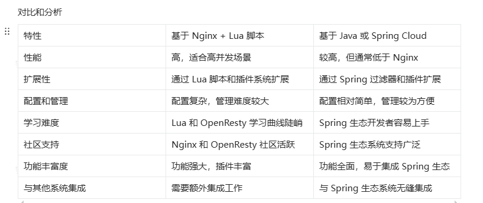


API网关与WAF：API网关和WAF防火墙功能上有一些重叠，但它们的功能和使用场景有所不同的

API网关使用场景：
- 微服务架构：在微服务架构中充当流量管理和安全的中间层
- 统一入口：为多个后端服务提供统一的入口点
- API 版本管理：管理不同版本的 API 并提供向后兼容

Web 应用防火墙（WAF）功能：
- 防止常见网络攻击：如 SQL 注入、跨站脚本（XSS）、跨站请求伪造（CSRF）、文件包含攻击等
- DDoS 防护：检测和阻止分布式拒绝服务攻击
- 流量过滤：基于预定义规则或自定义规则过滤恶意流量
- 安全监控和报告：监控流量并生成安全报告，以帮助识别和响应安全威胁
- 合规性支持：帮助企业满足各种安全合规要求，如 PCI DSS

WAF使用场景：
- Web 应用保护：保护网站和 Web 应用免受常见的网络攻击
- DDoS 防护：保护网络资源不受分布式拒绝服务攻击的影响
- 增强安全性：对网络流量进行深度检查，检测和阻止恶意流量


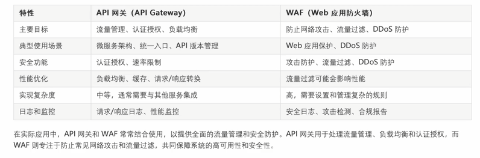

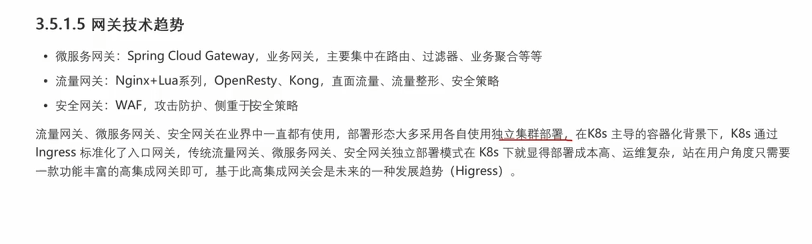

安全网关->流量网关->微服务网关
安全网关->流量网关
安全网关->微服务网关
流量网关->微服务网关
流量网关
微服务网关
（不能只要安全网关，因为没有起到一个路由作用）


网关限流方案：
| 算法                             | 核心思想                     | 优点          | 缺点           | 常见场景           |
| ------------------------------ | ------------------------ | ----------- | ------------ | -------------- |
|  **漏桶算法 (Leaky Bucket)**     | 请求先进入桶，按照固定速率“漏出”处理      | 输出平稳，不会突发   | 不支持短时间突发流量   | 网络整形、平滑输出      |
| **令牌桶算法 (Token Bucket)**    | 桶里有令牌才能通过，请求消耗令牌，令牌按速率补充 | 支持突发流量，有弹性  | 实现稍复杂        | API 限流、微服务限流   |
|  **固定窗口算法 (Fixed Window)**   | 按时间片统计请求数，超出限制就拒绝        | 简单、易实现      | 时间边界突发（边缘效应） | 简单限流，如每秒100次   |
| **滑动窗口算法 (Sliding Window)** | 在时间滑动区间内实时统计请求数          | 精度高，无突发边界问题 | 实现复杂、性能稍差    | 高频精确限流（如金融、交易） |


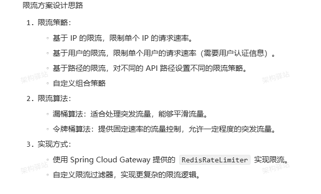

## 6 流量治理组件
“流量治理组件” 可以在网关层，也可以在服务层使用，但两层的作用不同

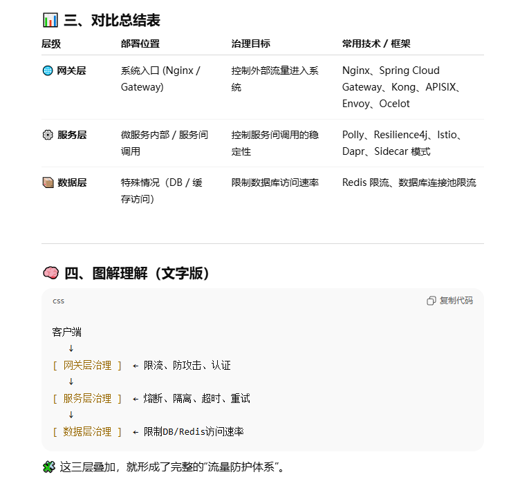

### Sentinel
Sentinel 是阿里巴巴开源的分布式流量防护组件，主要在服务层起作用，但能覆盖网关层。
它是 Java / Spring Cloud Alibaba 微服务体系中最重要的“服务保护组件”。

功能：
- 流量控制
  - 流量控制有以下几个角度:
    - 资源的调用关系，例如资源的调用链路，资源和资源之间的关系
    - 运行指标，例如 QPS、线程池、系统负载等
    - 控制的效果，例如直接限流、冷启动、排队等
- 熔断降级
  - 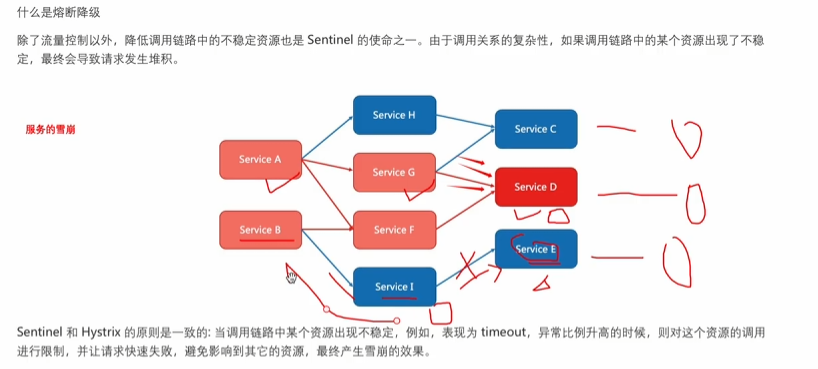
  - D出现问题后影响了G，从而影响了A，这个叫做雪崩
  - 发现问题后不再调用该服务，这个叫做熔断
  - 熔断后为了不影响上一层的调用，可以返回本地缓存的数据，这个叫做降级
- 系统负载保护

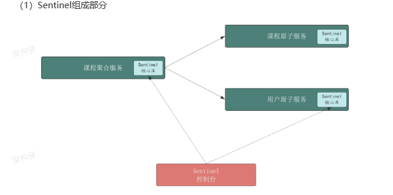


熔断器（Circuit Breaker）是一种用于提高系统稳定性和容错能力的设计模式。在微服务架构中，熔断器可以防止某个服务的故障影响整个系统的稳定性。熔断器有三种主要状态：
- 关闭
- 打开
- 半开

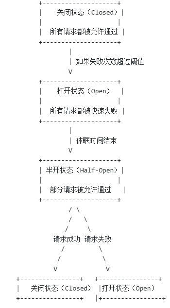

**热点参数限流**
热点就是进程访问的数据。

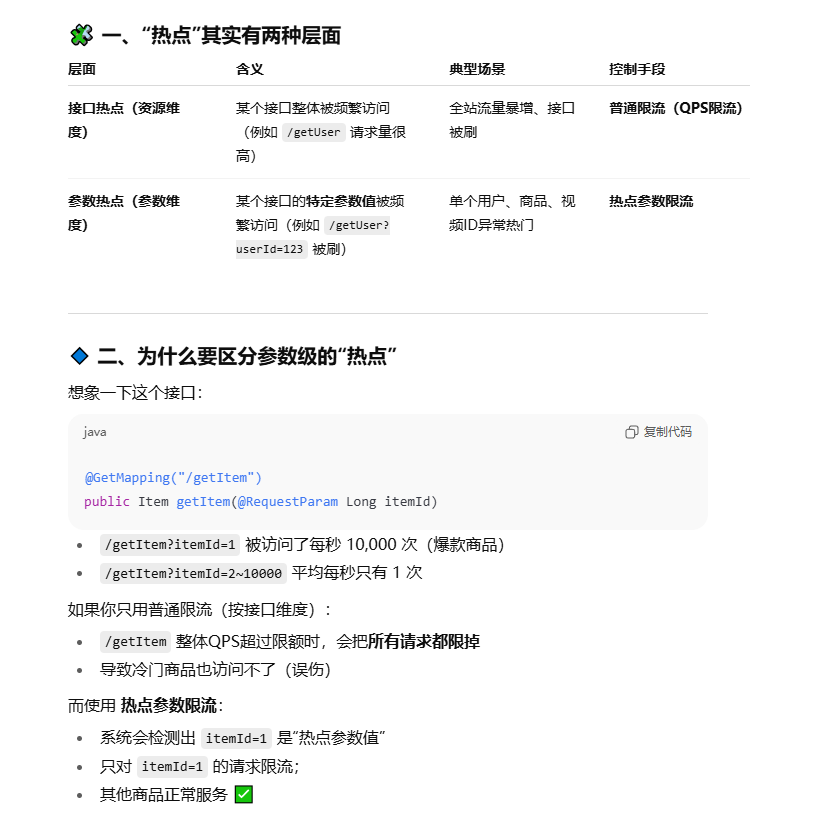

可以实现对不同的热点数据（参数）定制不同的限流策略。之前的限流都是接口级别的，该规则是参数级别的。


热点参数限流会统计传入参数中的热点参数，工具配置的限流阈值与模式，对包含热点参数的资源调用进行限流。

Sentinel利用LRU策略统计最近最常访问的热点参数，结合令牌桶算法进行参数级别的流控。

## 7 分布式事务解决方案
单体应用中基本不会有分布式事务问题，不涉及跨库操作就基本没有分布式事务问题。

分布式事务产生的原因：存储和服务的拆分

- 存储层拆分
  - 最典型的就是数据库分库分表，当单表容量达到千万级别，就要考虑数据库拆分。从单一数据库 变成多个分库分表。在业务中如果需要进行跨库/跨表更新，同时要保证数据的一致性，就产生了分布式事务问题
  - 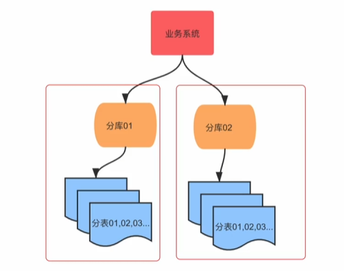
- 服务层拆分
  - 用户如果在某个网站上进行一个下单操作，那么会同时依赖订单服务、库存服务、支付服务等，这几个操作如果有一个失败，那下单操作就完成不了，这就需要分布式事务来保证(这里和雪崩有点混乱了，需要记录一下，雪崩是系统某个核心服务宕机或响应变慢，导致其上游调用方大量阻塞或重试，进而引发级联故障，造成整个系统崩溃。)

分布式事务解决方案：
- 2PC两阶段提交
  - 是非常经典的强一致性、中心化的原子提交协议，在各种事务和一致性的解决方案中，都能看到两阶段提交的应用
  - 这个mysql事务就用到了
- 3PC三阶段提交
  - 是在 2PC 之上扩展的提交协议，主要是为了解决两阶段提交协议的阻塞问题，从原来的两个阶段扩展为三个阶段，增加了超时机制
- TCC分段提交
  - TCC 是一个分布式事务的处理模型，将事务过程拆分为 Try、Confirm、Cancel 三个步骤
- 基于消息补偿的最终一致性
  - 异步化在分布式系统设计中随处可见，基于消息队列的最终一致性就是一种异步事务机制
  - 在具体实现上，基于消息补偿的一致性主要有本地消息表和第三方可靠消息队列等

目前主流的分布式事务框架：Seata， MQ Apache RocketMQ

做“分布式事务”，需要一个协调者去管理各个参与者的事务状态。Seata 正是扮演这个“协调者”的角色。

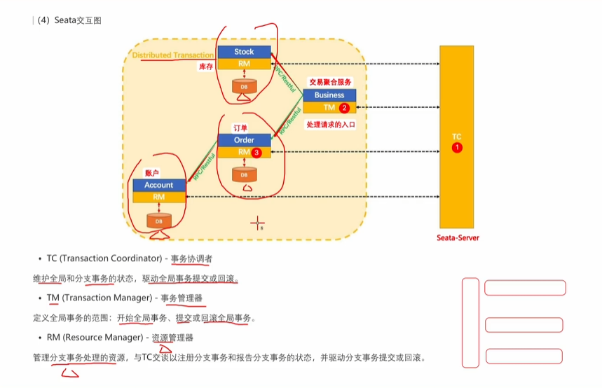

### 7.1 Seata AT模式
Seata的AT模式是一种设计用于处理分布式事务的机制。它通过在本地事务的基础上进行自动化的全局事务管理，实现了对分布式事务的支持。

实际上用的是 Seata 自带的数据源代理 DataSourceProxy

AT 模式是 Seata 创新的一种非侵入式（不用写很多代码）的分布式事务解决方案。

AT模式的核心思想是将本地事务与全局事务分离，并通过一个全局事务协调器（TC，Transaction Coordinator）来管理分布式事务的提交和回滚过程。
- Transaction Coordinator (TC)：全局事务协调器，负责管理全局事务的生命周期，包括开始、提交、回滚等。
- Transaction Manager (TM)：事务管理器，通常嵌入在应用服务器中，负责开启和结束全局事务。
- Resource Manager (RM)：资源管理器，通常嵌入在数据库驱动或数据源中，负责管理分支事务（Branch Transaction），包括记录Undo Log以及执行回滚操作。

使用前提是：
- 基于支持本地 ACID 事务的关系型数据库
- Java 应用，通过 JDBC 访问数据库

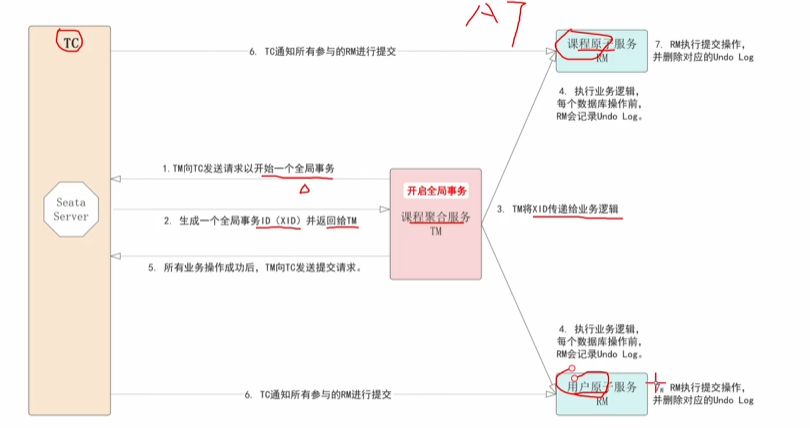

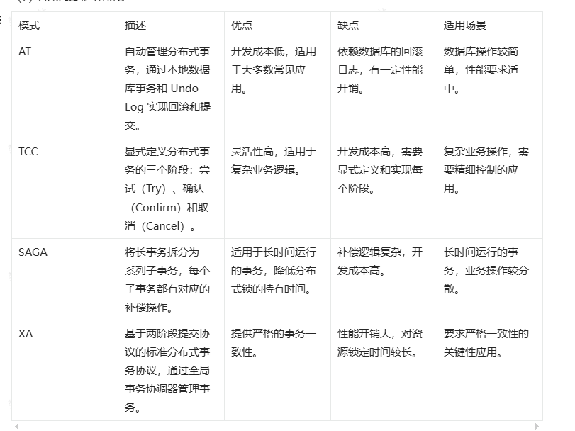


### 7.2 Seata TCC模式

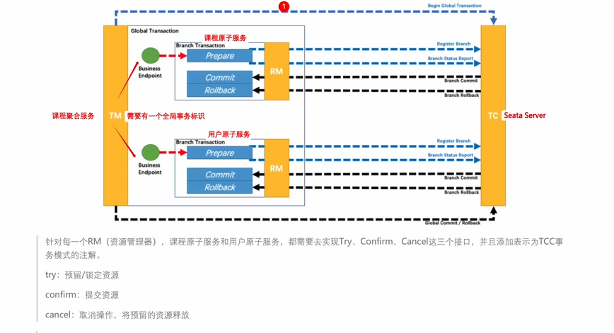

TCC模式不依赖底层数据资源的事务支持。

TCC经典问题：幂等、悬挂、空回滚（Seata现在版本已经有解决方案了，但是需要了解下着几个问题是什么意思）

幂等性：
- 同一个操作可能会被多次执行，如果不加以控制，可能导致数据不一致或重复操作，例如Confirm阶段的请求被重复发送，可能会导致资金被多次扣除
- 解决方案
  - 状态记录：数据库中记录每个TCC事务状态，在Confirm和Cancel阶段，首先检查状态
  - 幂等操作设计：确保Confirm和Cancel操作是幂等的，即无论调用多少次结果都保持一致，例如，使用唯一标识符（如事务ID）判断操作是否已经执行
  - 补偿机制：如果某个操作因为网络问题未能成功执行，可以设计补偿操作，确保数据的一致性

悬挂：
- 通常发生在Confirm或Cancel阶段，由于网络延迟等原因，Try阶段操作已经成功，但Confirm和Cancel请求未能及时到达服务提供方，导致资源被长时间锁定。
- 解决方案
  - 超时机制：超时后自动执行默认操作，释放资源
  - 状态检查：执行Confirm或Cancel操作前先检查Try阶段的执行状态，避免因悬挂导致的资源锁定
  - 悬挂记录：在数据库中维护悬挂事务记录，以便在后续操作中能进行合理的处理

空回滚：
- 没有执行Try阶段情况下，直接执行Cancel，空回滚可能会导致正常的事务被错误地回滚，影响数据一致性
- 解决方案
  - 状态验证：Cancel阶段首先检查Try阶段状态
  - 记录事务结果：Try阶段成功执行后记录下该事务状态，只有在状态确认的情况下，才能Cancel操作
  - 设计合理流程：确保业务逻辑在Try阶段成功后才能进入Confirm或Cancel阶段

### 7.3 Seata XA模式
XA模式实现了XA协议。

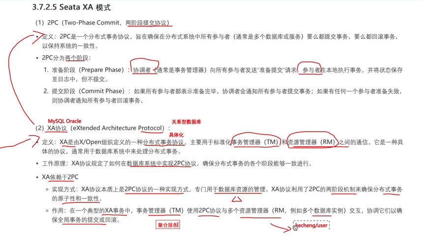

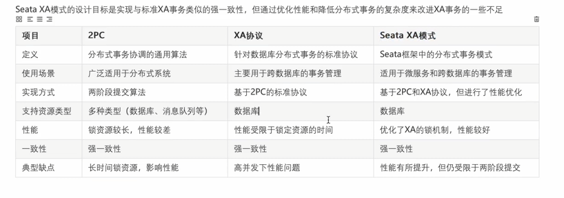

补偿型事务模式（AT，TCC，Saga都是补偿型）：
- 分布式事务，以AT为例：在第一阶段时真正提交分支事务了，是将数据真正写入到数据库中，回滚时通过undo_log进行恢复的。对于数据库层面，它不知道分布式事务的存在，在一个分支事务写入并且执行了commit，所谓回滚是通过undo_log查询数据然后再写入到原有表中（回滚）
- 也就是说AT、TCC、Saga模式每个分支事务的Prepare阶段都是真正写入到mysql中，但是在应用场面来看其实还在分布式事务第一阶段

事务资源对分布式事务的无感知存在一个根本性问题：无法做到真正的全局统一（就是可能会读到脏数据）

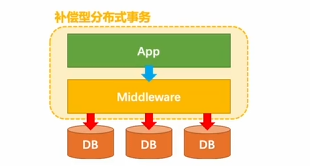


但是XA模式做到全局一致性了。

第一阶段：完全基于数据库的事务
- 1、写入 insert 在数据库层面 不 commit
- 2、commit （数据库层面）

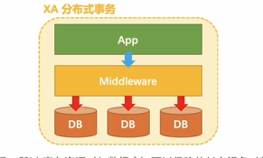

### 7.4 Saga模式
saga模式中，事务被分解为一系列独立的子事务，这些子事务按顺序执行，如果某个子事务失败，会触发已执行的子事务的补偿动作，以撤销它们的影响从而保证系统最终一致性。

Saga模式在分布式系统中的主要作用是通过补偿操作处理由于失败而导致的数据不一致问题。

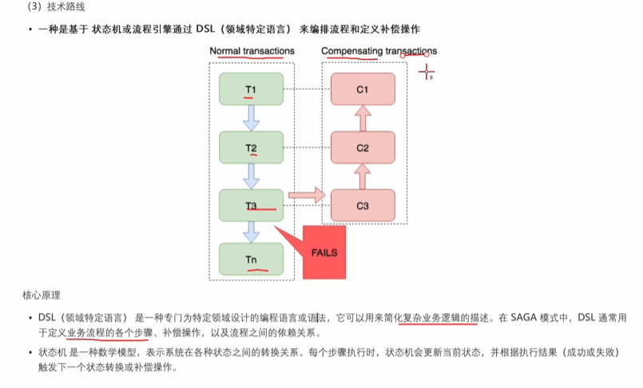

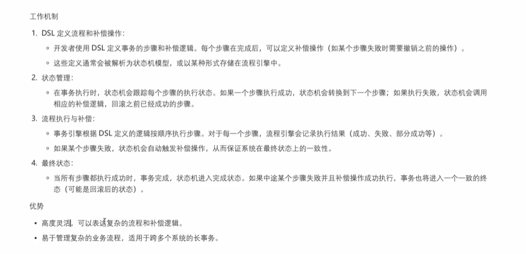

## 8 认证授权解决方案

- 认证 Authentication
  - 用于验证用户或系统身份的过程
  - 认证流程
    - 用户提供凭证：输入用户名和密码，或生物特征
    - 系统验证凭证：系统检查用户提供的凭证是否与存储的凭证匹配
    - 生成会话或令牌：如果凭证有效，系统生成一个会话（Cookie、Session）或令牌（Token）标识用户身份
    - 返回结果：系统通知用户认证结果
- 授权 Authorization
  - 在用户身份认证的基础上，判断用户是否有权访问某个资源或执行某个操作
  - 授权流程
    - 定义资源和操作：系统定义需要保护的资源和操作
    - 分配角色和权限：根据用户或用户组分配具体的角色和权限
    - 权限检查：当用户请求访问某个资源时，系统检查用户是否有相应权限
    - 允许或拒绝
  - 常见授权模式：
    - 基于角色访问控制 RBAC
      - 用户有一个或多个角色，角色对应特定权限
    - 基于属性访问控制 ABAC
      - 基于用户属性、资源属性和环境属性等条件决定权限
    - 基于策略的访问控制 PBAC
      - 用策略文件或访问控制列表（ACL）管理权限
- 鉴权 Access Control
  - 算是对授权的一个补充，在系统重检查和控制用户或进程对资源的访问权限，是授权的一部分，更加注重实际的访问控制和执行层面，确保只有被授权的实体才能访问特定的资源
  - 鉴权流程
    - 收到请求
    - 提取身份和权限信息
    - 权限验证
    - 访问控制决策：系统决定是允许还是拒绝访问请求
    - 记录和监控

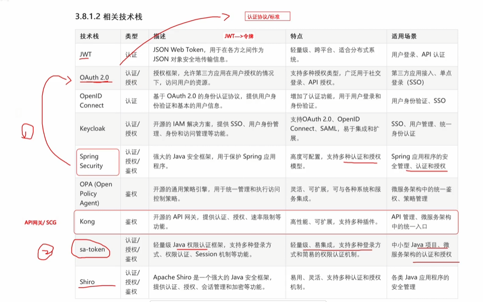

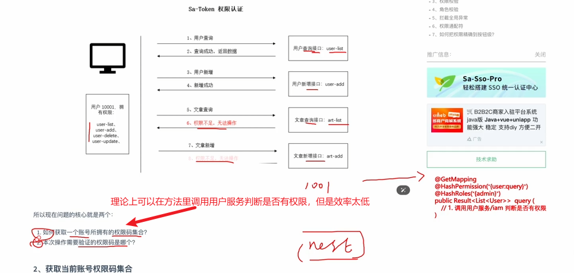
可以有一个接口获取登录用户的所有角色和能够调用该接口的所有权限，然后做授权的逻辑，然后再用注解标识该接口。

## 9 分布式链路跟踪解决方案
分布式链路追踪是为了满足微服务架构和分布式系统中追踪请求链路、定位性能瓶颈、故障诊断等需求而诞生的一种技术。

单体架构时，一个请求的调用链路就很清晰，一般由负载均衡（如nginx）将调用方的请求转发到后端服务，后端服务进行业务处理后返回给调用方，当架构变成微服务架构时，可能带来一系列问题：
- 接口响应慢，怎么排查
- 服务间的依赖关系如何查看
- 请求贯穿多个服务，如何将日志串联起来

一个里程碑事件：Dapper论文的发表

Dapper明确分布式链路
两个追踪目标
- 任意部署
- 持续监控

三个具体设计准则：
- 低开销：确保核心系统不会因为额外的性能开销拒绝使用
- 应用级透明：对应用开发透明，无需开发人员协助
- 可扩展

第二个里程碑事件：OpenTracing开源项目，提供一个标准化API，使开发者能在不同的追踪系统之间无缝切换

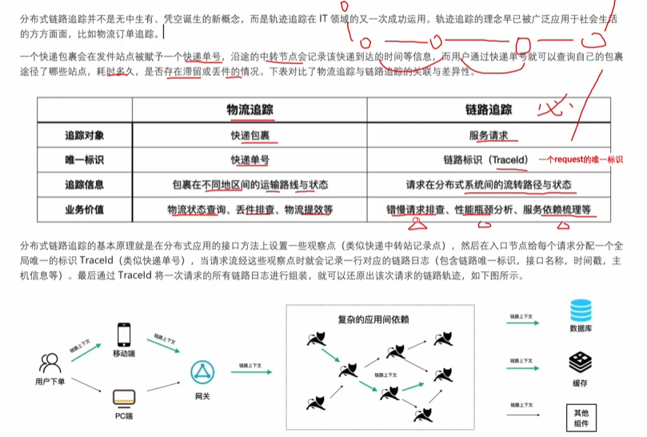

基础术语
- Trace：一条Trace代表一次入口请求在IT系统内的完整调用轨迹及其关联数据集合
- Span：请求在每一跳的接口方法上执行什么动作，耗时多久，执行状态，承载这些信息的是Span
  - Operation Name：描述当前接口行为语义，比如/api/createOrder代表执行一次创建订单动作
  - SpanId/ParentSpanId:接口调用层级表示
  - Start/FinishTime：接口调用的开始和结束时间
  - StatusCode
  - Tags & Events：调用附加信息
- Tags：SpanName仅回答这个接口是做什么的，如果需要进一步记录请求的行为特征，可以使用Tags扩展语义
- Logs：Tags会随着链路上下文自动向下游透传，如果希望记录一些不需要透传的时间，使用Logs字段


应用性能管理（APM）是涵盖多种技术和实践的领域，确保软件应用程序的高性能和可用性。前面的分布式链路跟踪就是APM的一部分。

APM系统通常提供以下核心功能
- 性能监控
- 事务追踪
- 资源利用监控
- 用户体验监控
- 告警和通知
- 日志和事件管理

APM代表产品：New Relic、Dynatrace，Datadog，Cat...


## 资料
下面这个视频对于服务的拆分，项目之间的关系创建讲的很好，主要是一个系统的设计思想，很适合用在实际开发中
- 视频资料：https://www.bilibili.com/video/BV1eFtRezERp/?spm_id_from=333.337.search-card.all.click&vd_source=c3939bba6fb53dcccb38ed988f16994c


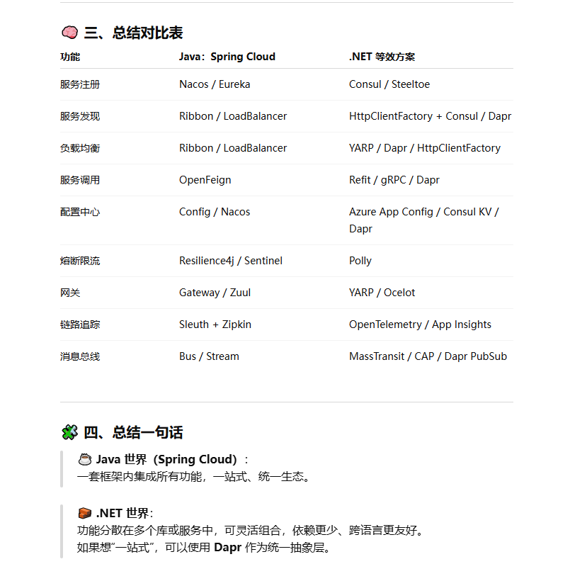