## TLS、HTTPS、证书 基础

**什么是HTTP**

在客户端和服务器端传递的数据，不是杂乱无章的，而是遵循一定的规则和标准，比如客户端以何种请求方法（get, post, put...）向服务器端发起请求，客户端发送的请求中应该包含哪些信息（请求头Content-Type, Content-Length...），这些信息以何种格式进行传输，服务器端处理完请求后返回给客户端的状态码（1xx，2xx，3xx...）等信息。这一系列规则和标准就是超文本传输协议（Hyper Text Transfer Protocol）。

世界上所有Web服务都实现了HTTP协议。

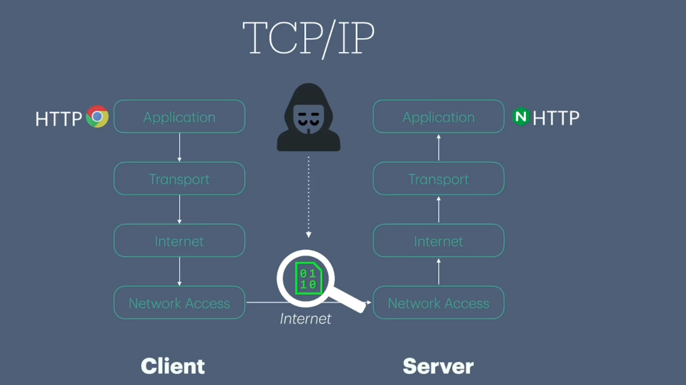

在OSI七层网络模型或TCP/IP 4 层网络模型中，HTTP协议处于最上层的应用层协议，它产生的数据通常是浏览器在经过TCP等一系列下层网络层后最终通过Internet发往对端，之后依次向上传递到达应用层服务器端的Web服务（比如Nginx）在接收到数据后开始对数据进行解析，所有经过网络的数据都是以最原始的状态进行传输。

HTTP协议存在一定的缺陷：
- HTTP协议中所有数据都是以明文的方式进行传输

**什么是HTTPS**

为了解决这个问题，引入了HTTPS协议（Hyper Text Transfer Protocol Secure）

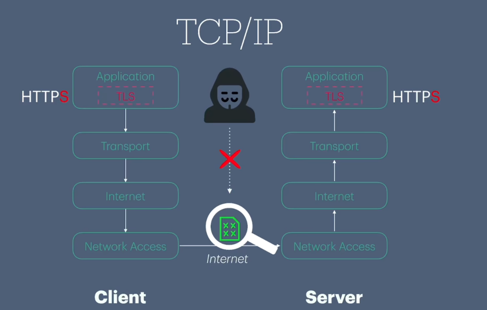

在HTTPS协议中引入了TLS协议的概念，TLS是专门用于对数据进行加密和解密操作的。当客户端产生数据后，会首先经过TLS进行加密，加密后的数据经由下层网络，最终通过Internet传到对端服务器，服务器端在接收到数据后，会再次经过TLS对数据进行解密，再将解密后的数据传给HTTP服务端。

**什么是TLS**
Transport Layer Security：传输加密协议，规定了如何为网络中传输的数据进行加密和解密。

SSL（Secure Socket Layer）：早期由网景公司设计的加密协议，后贡献给IETF组织，并最终重命名为TLS。

TLS 并不是操作系统级“默认开启”的服务，但服务器软件（如 Nginx、Node.js、Kestrel）集成了 TLS 实现，只要配置了 SSL/TLS，它们就能启用 TLS 协议。这也是运行一个网站需要web服务应用程序的原因。

TLS被广泛应用在HTTPS协议中，事实上任何基于TCP协议的上层协议以及应用程序（SFTP协议，SMTP协议，数据库间通信加密等待）都可以利用TLS协议对其进行加密。

**TLS用什么方式对数据进行加密和解密操作：对称加密**

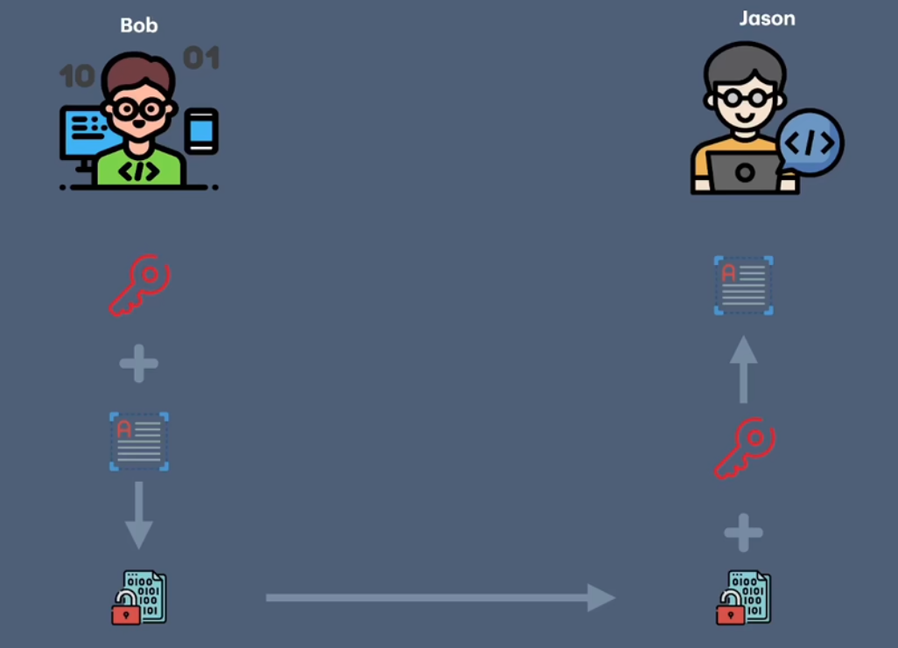

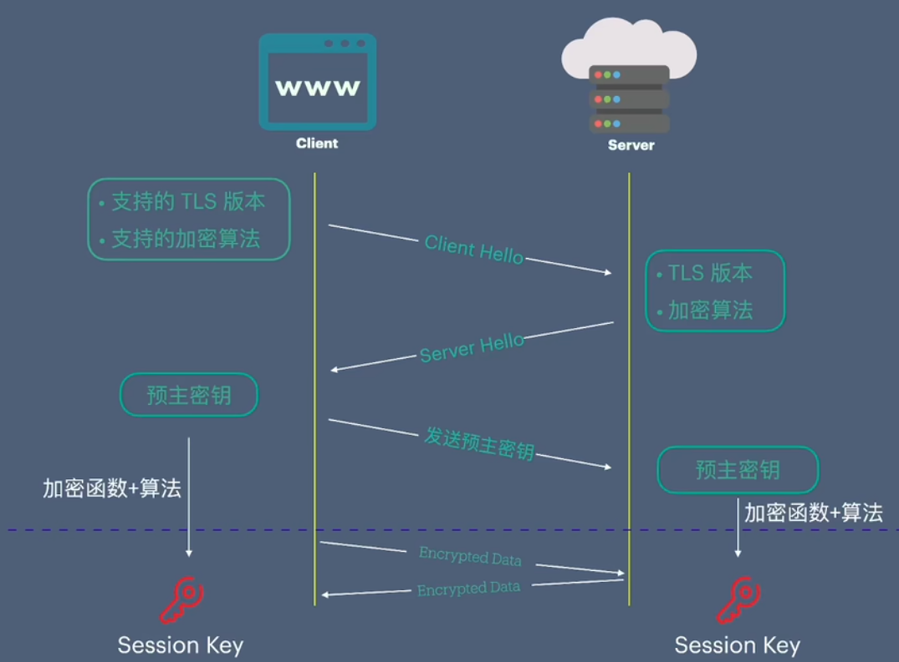

- 当客户端访问某个Web服务时会首先向服务端发送一个hello请求，该请求中包含客户端所支持的TLS版本和加密算法等信息
- 服务器端在接收来着客户端请求后，从中选取最优的TLS版本以及加密算法，将这些信息反馈给客户端
- 客户端接收服务器端返回的响应后会先生成一段随机字符串（预主密钥），通过使用指定的加密函数和加密算法，这段随机字符串将生成一对密钥（会话密钥），用于后续数据的加密和解密
- 客户端将预主密钥发送给服务器端并告知服务器端生成对称密钥的算法等信息
- 服务器端接收到预主密钥和算法信息后以同样的方式生成一个与客户端完全一致的会话密钥
- 至此通讯双方便可以开始使用会话密钥对数据进行加密解密操作

对称加密解决了数据加密问题，但是如何确保预主密钥能够安全传输给服务端成了最大的难题。因为如果预主密钥被中途获取，黑客完全可以创建出于客户端相同的会话密钥。

**为了解决这个问题，TLS引入另一种加密技术：非对称加密。**
非对称加密包含两个不同的密钥文件（PKI）：
- 公钥
  - 用于加密
  - 对外公开，任何人都可以随意获取
- 私钥
  - 用于解密
  - 只有拥有者自己知道

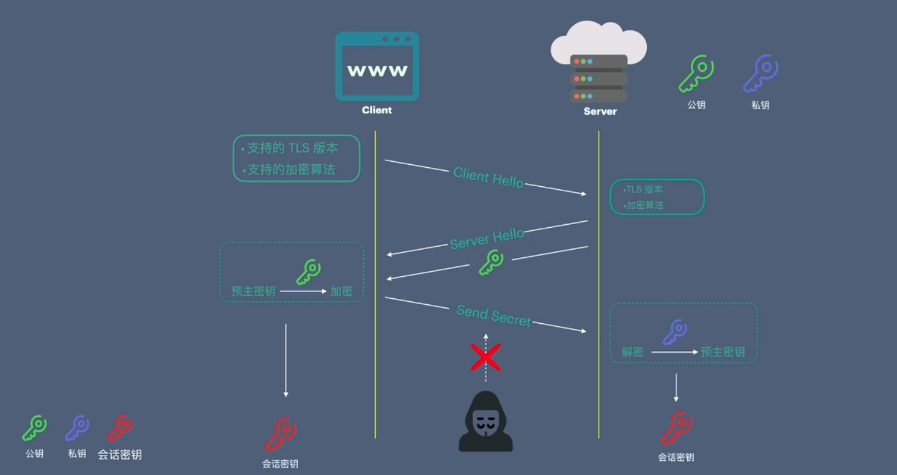

- Web服务器端在建站初期生成一对PKI密钥对
- 与对称加密一样，客户端和服务器端首先协商好要使用的TLS版本及加密算法等信息，除此外，服务器端还会将自己的公钥发送给客户端
- 客户端接收这些信息后首先在本地生成预主密钥，并使用接收到的公钥对其进行加密，再将其传递给服务器端
- 服务器端接收到加密后的预主密钥后，使用自己的私钥对其进行解密，从而获取到真正的预主密钥
- 客户端与服务器端通过同一预主密钥最终生成会话密钥

还有一个安全隐患：因为任何人都可以随意创建PKI密钥对，当浏览器访问某一个网站时，如果这个访问过程从一开始便被黑客截获，黑客完全可以创建自己的公钥和私钥，并将其伪装成服务器端生成的公钥传回给客户端。客户端拿到这个公钥加密预主密钥传给服务端后再次被黑客截获，黑客就可以用自己手中的私钥对其进行解密拿到预主密钥从而获取到预主密钥。意味着随后生成的所有加密数据都不再安全。

**为了解决这个问题，证书被引入进来**
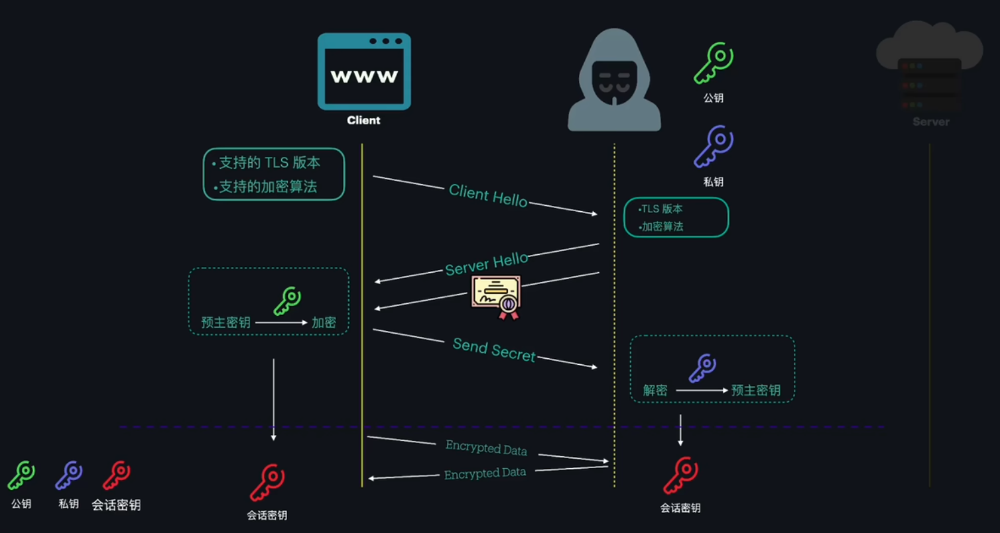

这个过程中，客户端获取的就不是公钥，而是网站的证书。

**什么是数字证书**
由证书办法机构Certificate Authority （CA）所签发。唯一标识一个站点的身份信息。

就是网站的身份证或护照，用于帮助我们鉴别一个网站的真伪。

查看证书：
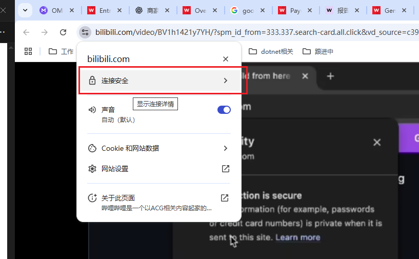

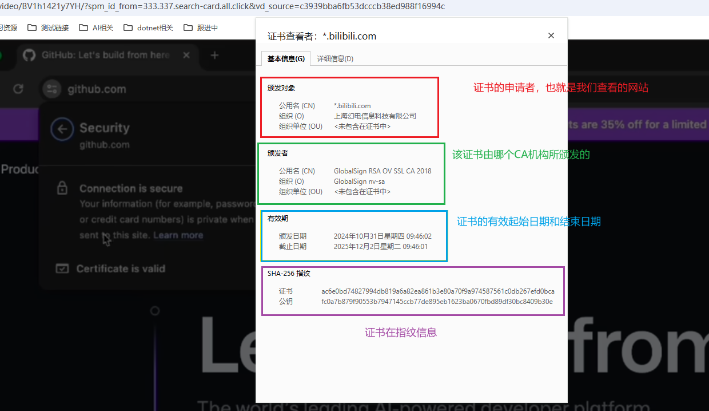

申请证书：
证书是由专门的证书签发机构CA所签发，CA是全球性的权威组织机构，分布在各个国家，常见的CA机构有Digicert，entrust，GlobalSign，Let's Encrypt等。
- 当需要为网站开启https时，向某个CA机构提交证书申请
- 申请者需要创建一个证书申请请求文件CSR（Certificate Signing Request），CSR包含网站域名、IP地址、公司名称、地理位置、邮箱地址、公钥等信息
- 将CSR发送给CA
- CA机构接收到CSR文件后，根据其中的信息以及公钥进行核实，必要时可能还会接入人工审核流程，一旦审核完成，CA便为该站点签发一个证书，并返回给申请者
- 申请者接收到CA签发的证书后将其部署到Web服务中

证书的工作原理：
- 证书指纹：用于唯一标识一个证书（确保证书完整性）
  - Hash加密:单向加密算法
    - 不可逆性：无法对一个散列值做逆向操作来获取原始数据
    - 唯一性：不同的数据其计算得出的散列值永远不同，而同一输入计算得出的散列值永远一样
- 证书签名：用于验证证书身份的真实性
  - 利用PKI进行加密和解密操作，验证证书真伪
    - CA使用私钥加密，公钥解密
  - 预安装
    - 所有操作系统都默认安好了所有受信任的CA的根证书

CA组织为申请者生成证书时，对证书的内容和公钥分别进行Hash计算，将得到的Hash值作为证书指纹附加到证书中，同时说明使用的hash算法，当客户端浏览器从服务器端获取到证书后，会使用相同的算法对证书进行hash计算，将计算后的结果与附加在证书中的指纹做对比，如果完全一致，说明证书在网络传输中没有被截获并篡改内容。证书中最常用的hash算法是hash256。

除了核实证书身份外，浏览器还需要核实证书的真实性，这里用到证书签名。

在数字签名过程中，在CA生成好证书后，会使用自己的私钥对证书进行加密，将加密结果附加到证书中传回给服务器端。客户端在获取到完整证书后，使用CA对应的公钥对其进行解密，一旦解密成功，说明服务器端所使用的公钥与CA加密时所使用的私钥为一对密钥。

好像回到了起点：如何安全获取CA的公钥————预安装

当CA对证书进行签名时，不仅会用到私钥，还会用到另外一个证书文件————根证书。根证书最主要的作用之一是为其他证书签名。CA的公钥也被附加到了CA的根证书中。每个操作系统都会维护一个根证书库，默认安装好了全球各地受信任的CA跟证书。当需要验证证书签名时，直接从系统中找到对应CA的根证书即可。这样避免网络传输中被窃听被掉包的风险。

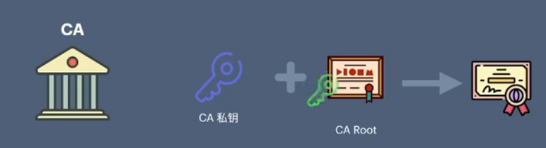

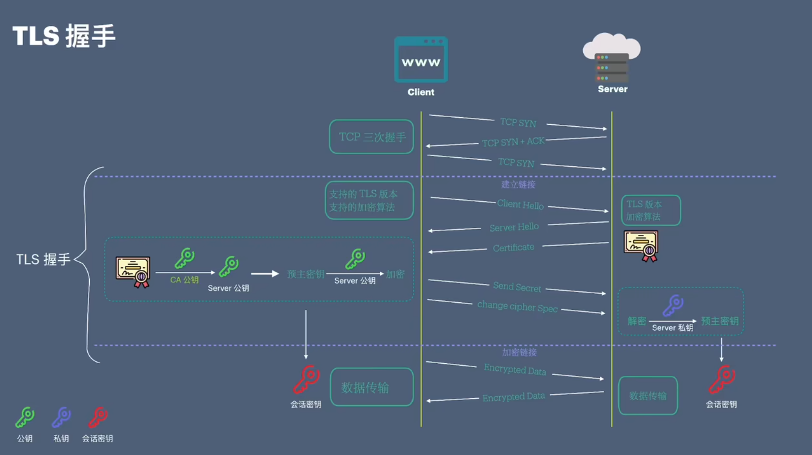

## 创建自己的自签名证书
1、申请证书首先是要创建CSR文件
- 在线创建（不推荐，网络创建很可能泄露）
- 本地创建
  - OpenSSL
    - 创建密钥文件
      - genpkey
      - genrsa
    - 创建CSR文件
      - req
  - cfssl

这里用OpenSSL命令。

创建PKI密钥：
- 加密算法
  - RSA：目前最广泛使用的加密算法
  - DSA：由于安全原因不再推荐使用
  - ECDSA
  - EdDSA
- 密钥大小
  - 密钥越大越安全，加密解密时间越长，对于RSA来说，至少要确保密钥长度为2048位
- 密钥密码
  - 为创建的密钥指定一个密码，进一步保护密钥安全性，同时也带来一些密钥使用的复杂性

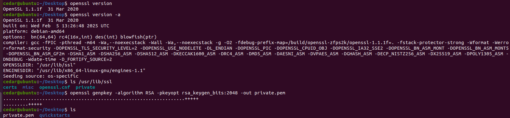

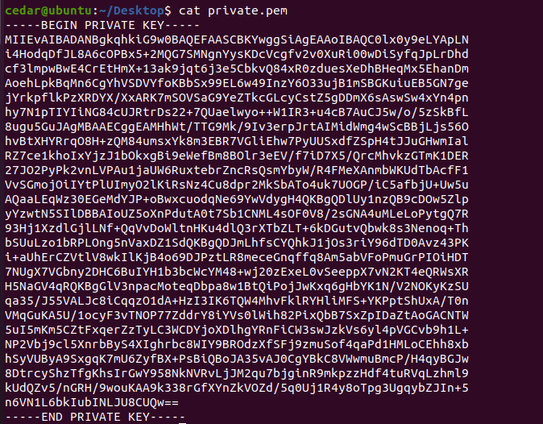

用pkay命令将密钥以可读性更高的方式打印出来：

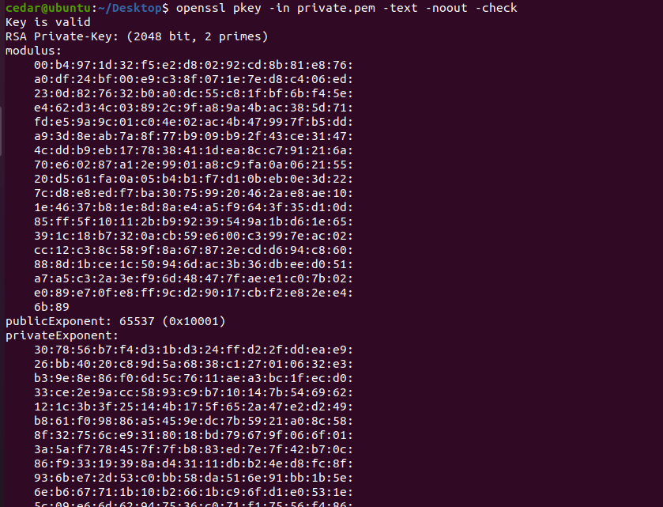

提取公钥文件：

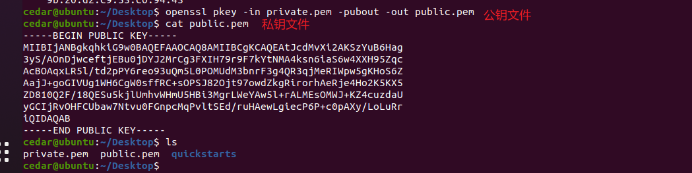

手动提前公钥不是必要的，当执行其他需要公钥文件的命令时，openssl会自动从密钥文件中提取公钥信息。

创建CSR文件：

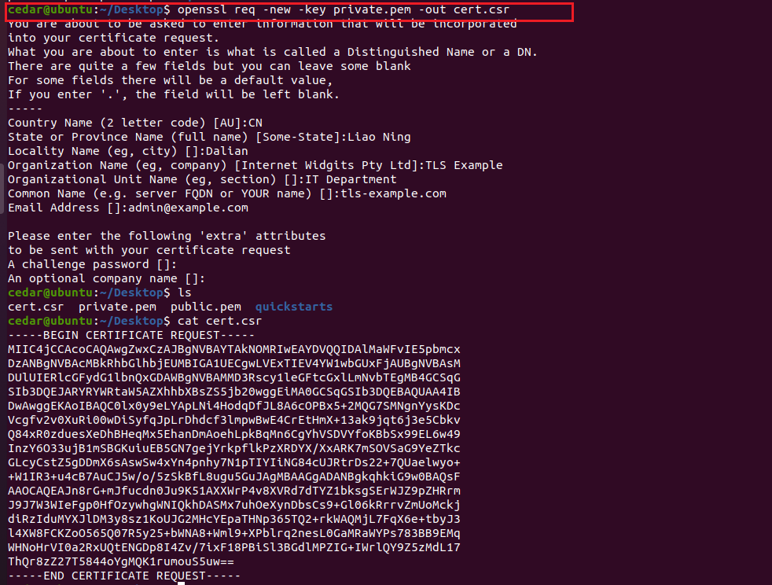

可读方式查看：

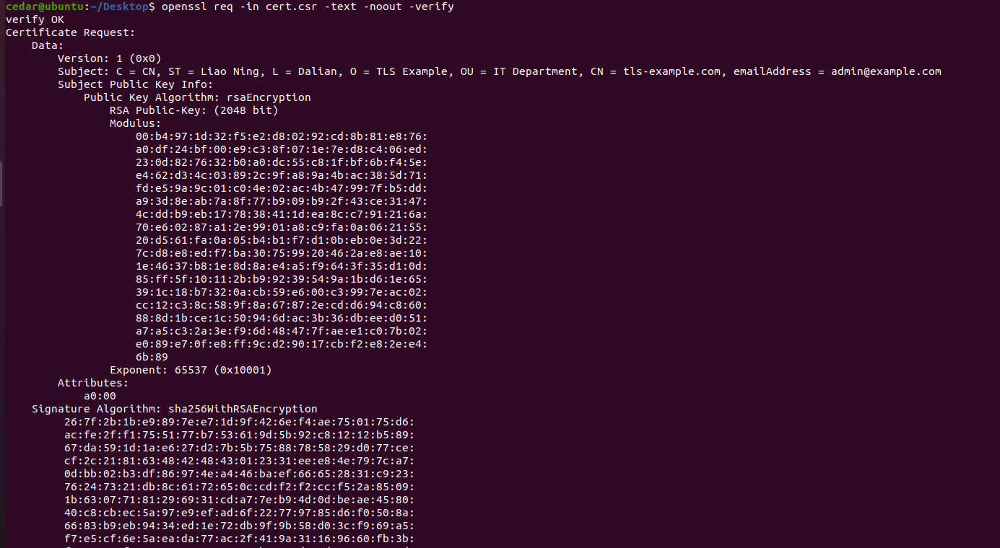

2、创建自签名证书

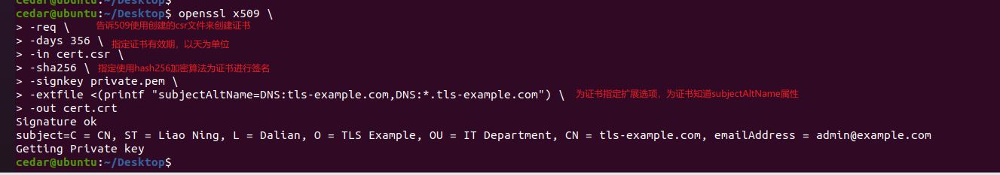

上面还没更新完

# 哈希算法
将任意长度的输入数据（文件，字符串，对象等）转换为固定铲毒字符串（通常是十六进制形式）的数学函数。生成的字符串成为哈希值或摘要。

特点：
- 确定性
- 单线性
- 抗碰撞性
- 雪崩效应
- 固定输出长度

缺点：
- 哈希碰撞：理论上存在不同数据生成相同哈希值的可能（需选择强抗碰撞算法如 SHA-256）
- 不可逆
- 暴力破解风险：弱哈希算法（如 MD5）易被彩虹表或暴力攻击破解

使用哈希算法场景：
- 密码存储：存储用户密码的哈希值（需加盐处理，如使用 Bcrypt 或 Argon2）
  - 加盐：为每个密码生成随机盐值，防止彩虹表攻击
- 数据完整性验证
- 数字签名
- 数据去重：判断文件或内容是否重复
- 区块链和加密货币
- 哈希表：通过哈希函数快速定位数据

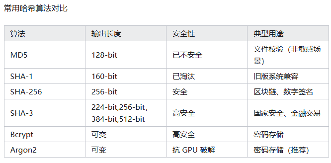

- https://www.bilibili.com/video/BV1h1421y7YH/?spm_id_from=333.337.search-card.all.click&vd_source=c3939bba6fb53dcccb38ed988f16994c
- 哈希算法：https://zhuanlan.zhihu.com/p/22299467717

