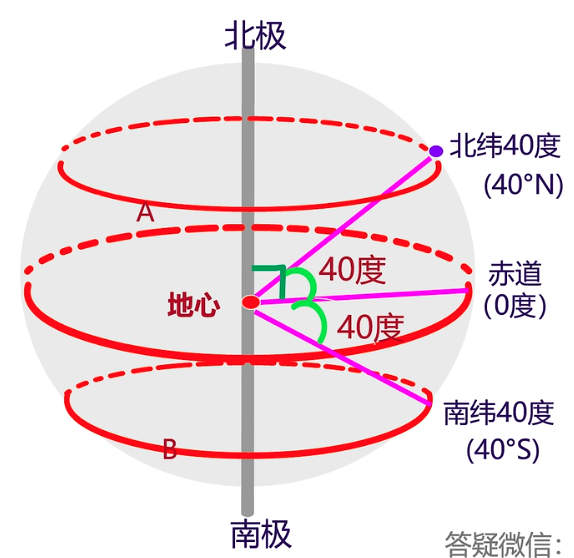
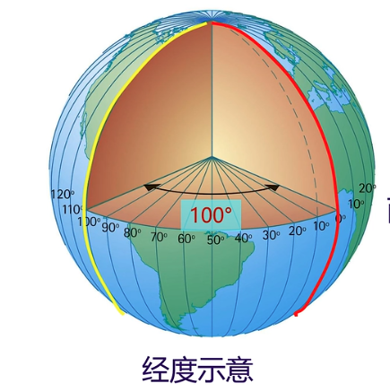
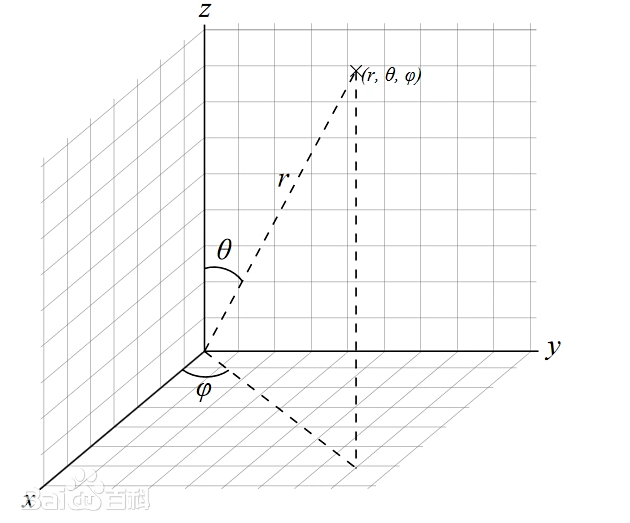
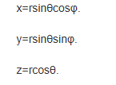
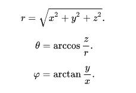
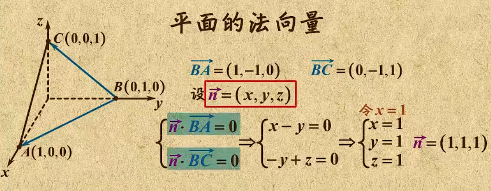
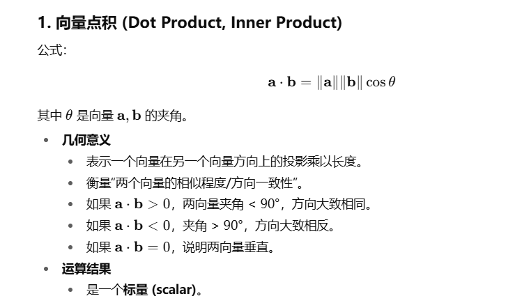
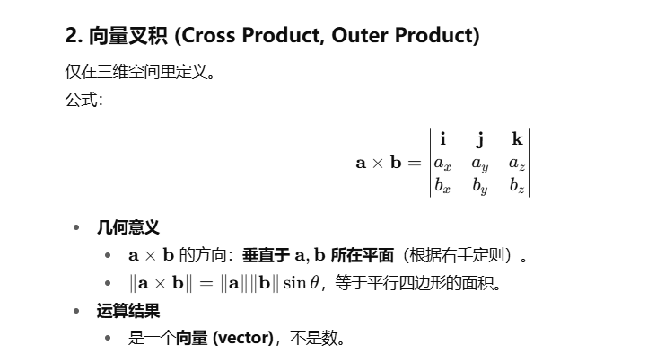

## 经纬度

- 东西半球的坐标范围是-180到180，0度经线就是本初子午线，负坐标代表西半球，正坐标代表东半球。
- 南北半球的坐标范围是-90到90，0度维线是赤道，负坐标代表南半球，正坐标代表北半球。

## 球坐标系

（r, θ, ψ）表示一个点 p 在三维空间的位置的三维正交坐标系, r是原点到 P 点的距离 r

球坐标系(r,θ,φ)与直角坐标系(x,y,z)的转换关系:

直角坐标系(x,y,z)与球坐标系(r,θ,φ)的转换关系为:

直角坐标转经纬度：
v = (x,y,z) 是单位向量，长度为1
$$lat = arcsin(z) · \frac{180}{\pi}$$
$$lon = arctan2(y,x) · \frac{180}{\pi}$$

## 法向量
法向量乘垂直的平面上的任意向量都为0.

这是获取AB所在圆平面对应的单位法向量：

$$
N = \frac{A \times B}{\|A \times B\|}
$$

获取球面上某点P到A与B形成的平面的投影向量：

$$
Q = \frac{P-(P·N)N}{||P-(P·N)N||}
$$

- P⋅N 是 P 在法向量方向的分量
- P-(P·N)N 去掉了法向量方向，得到 平面内的向量
- 再单位化||P-(P·N)N||使其落在球面上

判断投影Q是否在弧AB上：

$$(A\times Q)·N >=0 且 (Q \times B)·N >=0$$

Q是在A与B平面上，所以法向量只能是与N同方向或反方向。如果都是同方向，说明投影Q在弧AB上。

## 计算球面两点间的大圆距离
**Haversine 公式**
$$
d = 2R arcsin(\sqrt {sin^2(\frac{lat2-lat1}{2}) + cos(lat2)cos(lat1) sin^2(\frac{lon2-lon1}{2})})
$$

- R 是地球半径

**向量**
$$
cosθ = A·B
$$

$$
d = R · θ = R · arccos(A·B)
$$

