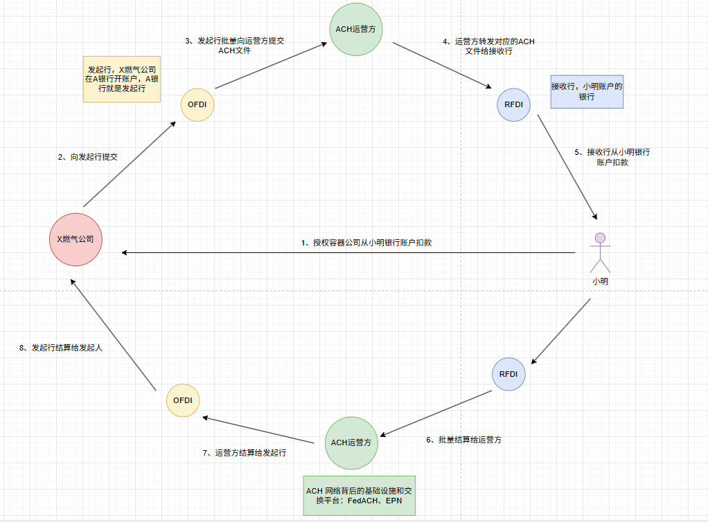
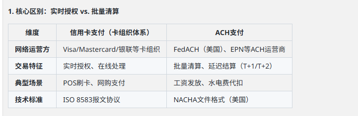
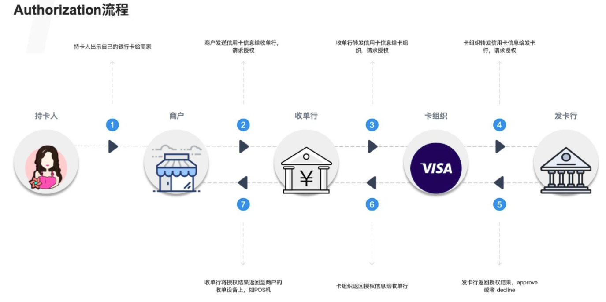
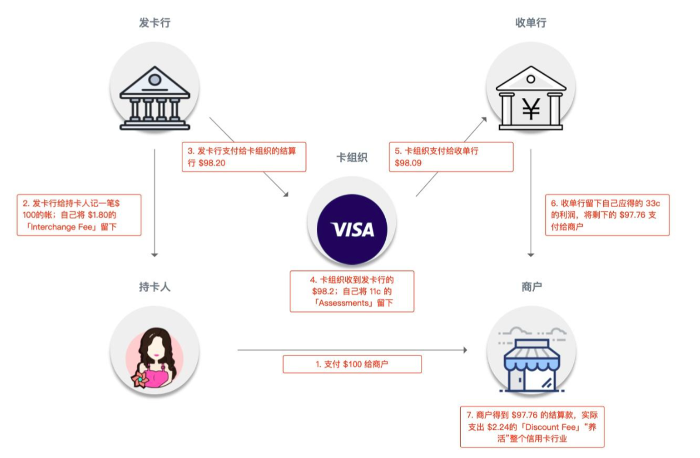

## 美国支付清算体系

- 清算 clearing
  - 就是一个传输、记录、核对各个参与方债务、债权的过程（谁欠谁多少）
  - Worldpay 将交易提交给这些清算网络
- 结算 settlement
  - 资金所有权的一个转移的过程， 清算后做实际资金划拨
  - 银行间的账户结算
  - Worldpay 不直接结算，是通过银行网络完成
- 支付 payment
  - 广义上指一切支持资金转移的网络（卡网络、ACH、Wire），狭义时指发起支付和入账动作的部分
  - Worldpay 不是支付系统本身，而是连到这些系统
  - 类别
    - 大额支付系统
    - 零售（小额）支付系统
  

## ACH
职责：
- 接收 OFDI 上传的大批量 ACH 文件
- 按照路由信息把交易拆分给对应的 RFDI
- 汇总全网资金流向
- 定期（每天或多次）做净额清算
- 生成最终的结算指令提交给中央银行或直接做账户划拨

ACH是银行自发建立的私营支付网络，通过NACHA（National Automated Clearinghouse Association）制定规则。

## CHIPS 
CHIPS 由纽约清算所协会 (NYCHA) 经营，是全球最大的私营支付清算系统之一。各个国家的、各家银行间的大额美元清算交易几乎全部都是跑在这个系统上的。

## VISA
银行卡支付行业，主要的参与者由以下几方组成：
- 持卡人（Card Holder）：我是用银行卡花钱的
- 商户（Merchant）：我是从银行卡收钱的
- 收单行（Acquirer）：我是商户的开户行
- 发卡行（Issuer）：我是持卡人的开户行，卡是我签发的
- 卡组织：上面的支付、清算信息流都是跑在我的网络上的
从卡组织的视角出发，他的清算网络本质上是在为：持卡人、商户、收单行、发卡行提供服务，所以所谓的「四方」就是这四方（当然有时候收单行和发卡行是同一个银行，银行的身份是多重的）。

信用卡支付清算流程：
- 1、持卡人向商户付款
- 2、利用pos机等设备获取到银行卡信息后，将其安全的传输到收单机构，申请收款
- 3、收单行/收单机构要求visa向发卡行获取支付授权
- 4、visa向发卡行提交支付交易信息，请求获得支付授权
- 5、发卡行授权商户可以向持卡人收款
- 6、发卡行将钱结算给收单行，随后收单行将付款存入商户账户

信用卡清算流程分为：
- 支付授权 Authorization
  - 
- 清算 Clearing
  - 发卡行将确认的交易（支出）记到持卡人头上的过程;收单行将确认的交易（收入）记到商户头上的过程
- 结算 Settlement
  - 大家对清算结果无争议的前提下，结算周期内，发卡行要把对应的钱支付给收单行，这是一个债务清偿的过程
  - 结算时使用的系统就是CHIPS

- https://zhuanlan.zhihu.com/p/245542926
- https://zhuanlan.zhihu.com/p/267139374
- https://zhuanlan.zhihu.com/p/267752005
- https://www.youtube.com/watch?v=9bjwfntoRGU&list=PLdQDWw95rTMduhc9_KvM6nsm2x-7zsYvK&index=2