# 了解篇
没什么内容，纯纯激发学网络安全的兴趣~


工具：网络安全空间测绘工具，是可以寻找全球网络设备，只要有IP地址的设备都可以寻找到 https://en.fofa.info/
ip查询：www.cip.cc
漏洞破解：网络搜索相关漏洞 e.g. https://www.cnblogs.com/yier-G/p/16632842.html
批量辅助工具：https://github.com/ScriptKid-Beta/WebBatchRequest


Netdiscover:一种网络扫描工具，通过ARP扫描发现活动主机 ，可以通过被动和主动两种模式进行扫描。

怎么控制别人的电脑：
- 使用远程控制的木马
- 通过漏洞
- 通过账号和密码
- 其他很多方式。。。

**通过账号和密码**
SAM文件位于C:\Windows\System32\config目录下，用于存储本地所有用户的凭证信息
System文件时SAM文件的密钥文件
一般不能删不能改不能看不能复制，改了电脑开不了机，开机会根据这个文件做校验，密码正确才能登录进去
读取SAM文件工具：MIMIKATZ，MSF，samdump  （用户，权限，早期密码，显示出来的是密码加密之后的内容） 解密网站 https://cmd5.com
wmicexe远程登录系统工具 进行协议认证 好处是杀毒软件一般不会杀，因为是正常行为

wannaCry病毒：勒索病毒，通过加密用户计算机中的文件来进行勒索

## Kail基础
kali是一个linux操作系统，系统中包含很多使用渗透和审计工具，大多数做安全测试的开源工具都被囊括在内。

https://www.kali.org
installer images:ISO镜像文件 已经被淘汰不用了
virtual Machines：虚拟机版本 现在主流的
mobile：手机版本

汉化设置：
```
sudo apt update
sudo dpkg-reconfigure locales
sudo reboot //重启
```
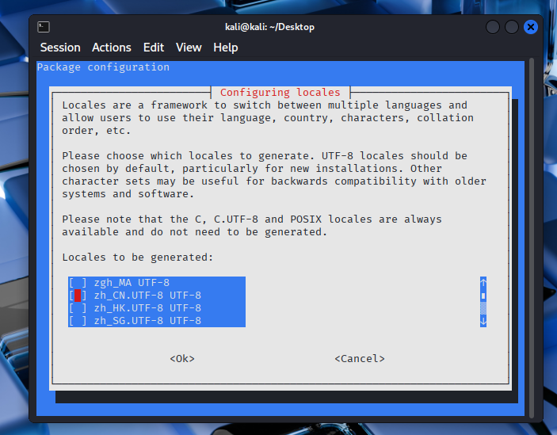
空格加回车  重启后保留旧名称

ipconfig/all
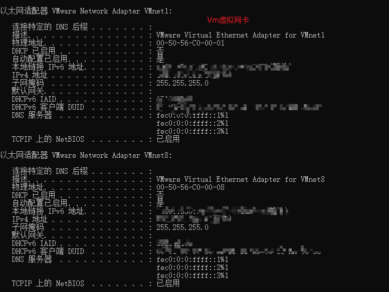

## SQLMAP工具
开源，自动化的SQL注入漏洞检测与利用工具，帮助安全测试人员、渗透测试工程师发现并验证Web应用程序中存在的SQL注入漏洞，进而评估漏洞可能带来的安全风险（数据泄露、服务器控制权被夺取等），它基于python开发，支持多种数据库类型和注入技术，是web安全领域最常用的工具之一。

web应用程序对用户输入的数据合法性没有过滤或判断，攻击者可以在web应用程序中事先定义好查询语句的结尾上添加额外sql语句，在管理员不知情情况下实现非法操作。

检查是否有注入漏洞：
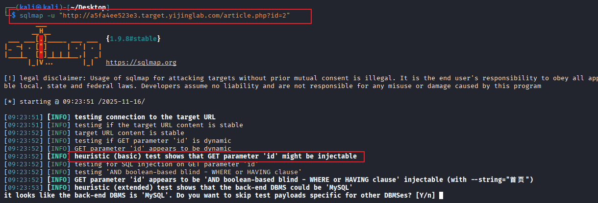

测试当前数据库名字
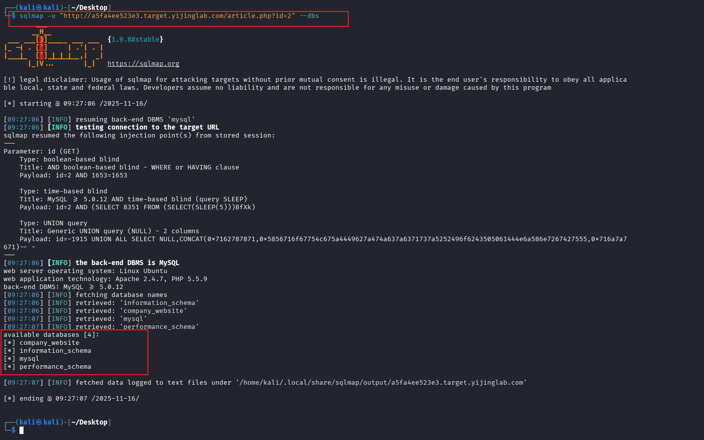

查找数据库里有哪些表
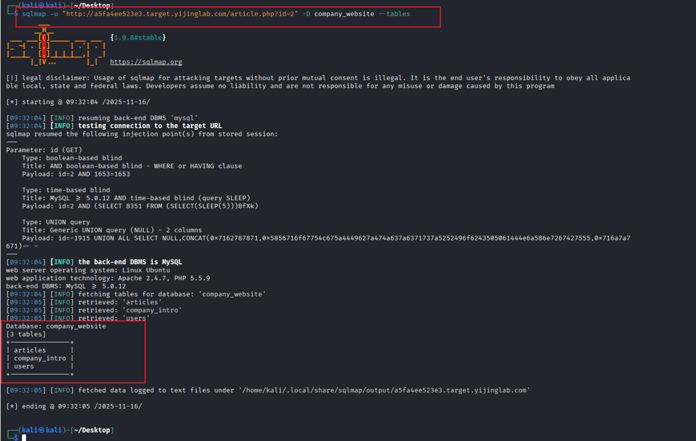

查看表内容
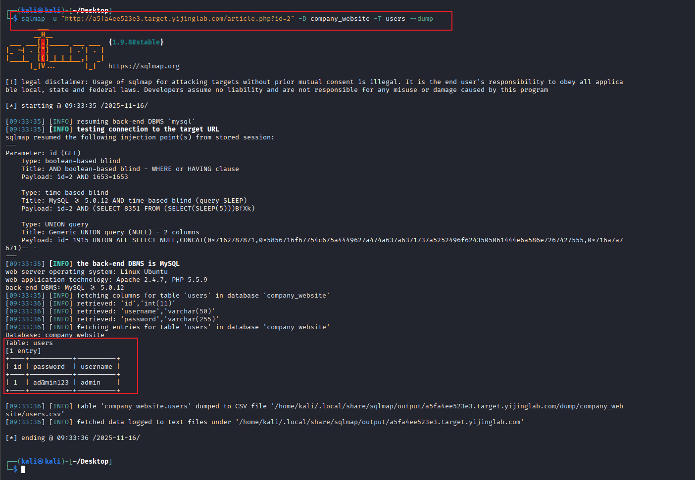


文件上传漏洞：
上传木马，控制对方服务器

中国蚁剑：远控工具

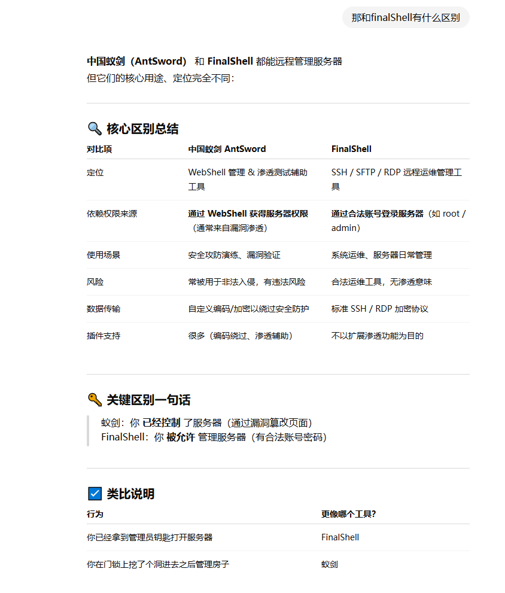


## Burpsuite
需要java环境
kali里有但是很慢，在虚拟机里也很慢，所以推荐安装在自己电脑上

burp Suite是用于攻击web应用程序的集成平台，包含许多工具。bp为这些工具设计很多接口以加快关机应用程序的过程。所有工具共享一个请求，能处理对应http消息、持久性、认证、代理、日志、警报

其实就是我们访问一个链接，然后bp在中间拦截了对访问请求做一些修改，通过修改这些挖掘目标服务器的漏洞（url也是攻击者发起的）

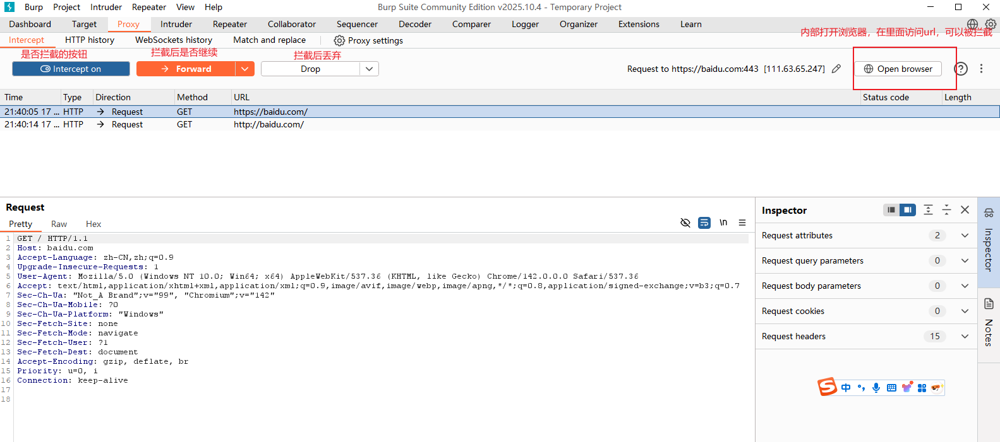

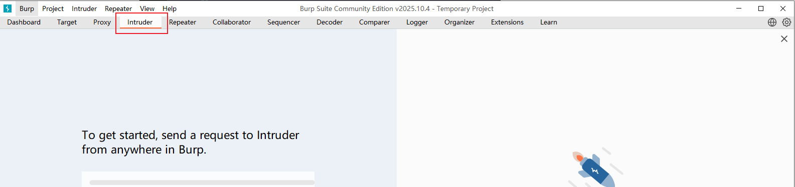

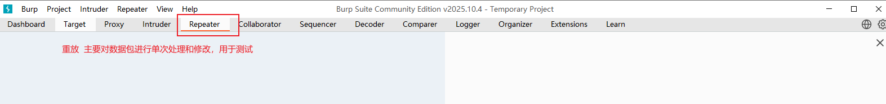

上面分别是抓包、测试包、修改包

### 网站运行原理和http协议
协议通俗来解释就是语言，两个中国人进行交流，用的是中文交流，中文就是A与B之间的协议。HTTP也是Web浏览器和Web服务器之间通信的协议。

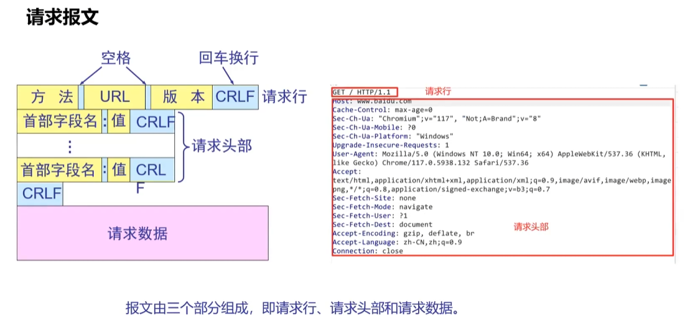

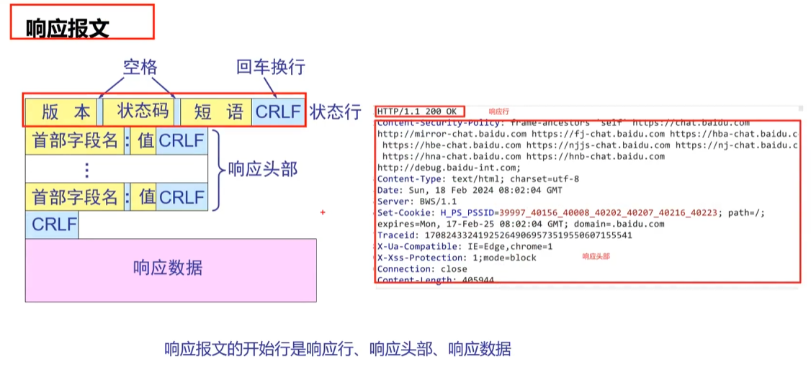

### 挖洞口令
任意用户枚举漏洞 （xxx用户已存在）
用户口令破解
弱口令漏洞
账号密码泄露漏洞  密码泄露 可能直接就写在源代码里面


pikachu 漏洞靶场平台

### 典型验证码逻辑漏洞
- 短信验证码
  - 验证码爆破
  - 验证码回显
  - 验证码与手机未绑定认证关系
  - 修改返回包绕过验证码
  - 验证码转发
  - 任意验证码登录
  - 验证码为空登录
  - 固定验证码登录
  - 验证码轰炸
- 图片验证码
- 滑块验证码
- 语言验证码

**短信验证码爆破**
短信验证码服务端未对验证时间、次数做出限制，存在爆破可能性。
4位纯数字验证码：0000~9999 5分钟之内
6位纯数字验证码：5分钟内跑不完

先自己搭建靶场 
```yml
version: '3.1'

services:
  mysql:
    image: mysql:5.7
    container_name: pikachu_mysql
    restart: always
    environment:
      MYSQL_ROOT_PASSWORD: root
      MYSQL_DATABASE: pikachu
    ports:
      - "3306:3306"

  pikachu:
    image: area39/pikachu:latest
    container_name: pikachu_web
    restart: always
    ports:
      - "8000:80"
    environment:
      DB_HOST: mysql
      DB_PORT: 3306
      DB_USER: root
      DB_PASS: root
      DB_NAME: pikachu
    depends_on:
      - mysql

```
docker compose up -d
``

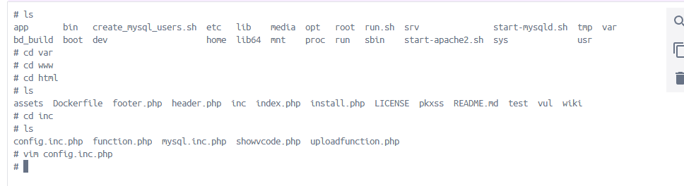
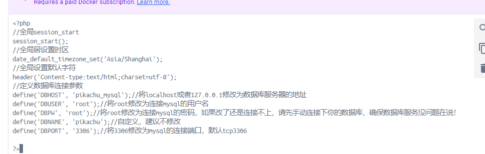
http://localhost:8000

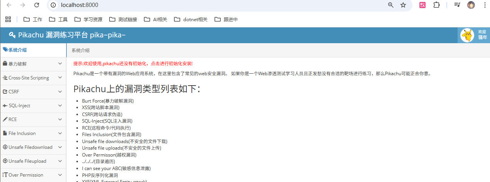

拦截

发送到爆破
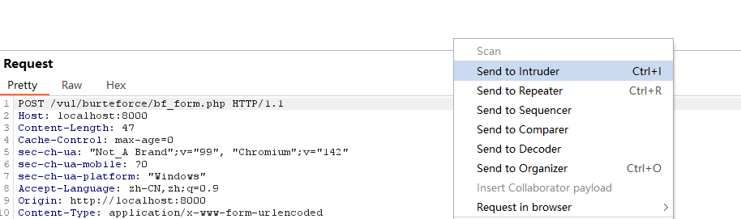
添加payload
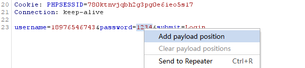
设置爆破规则
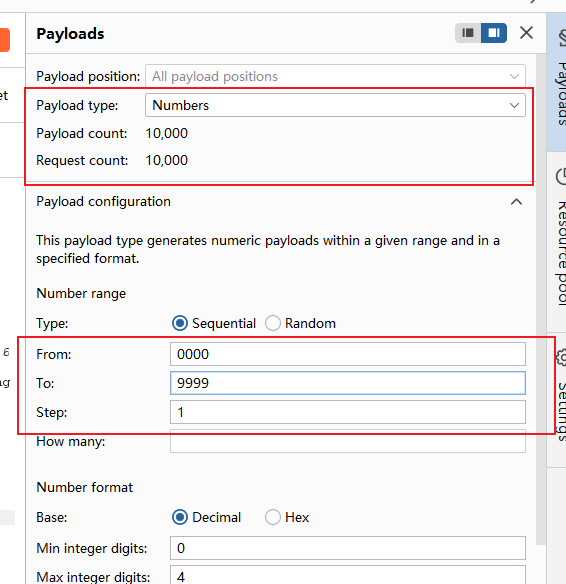
开始攻击
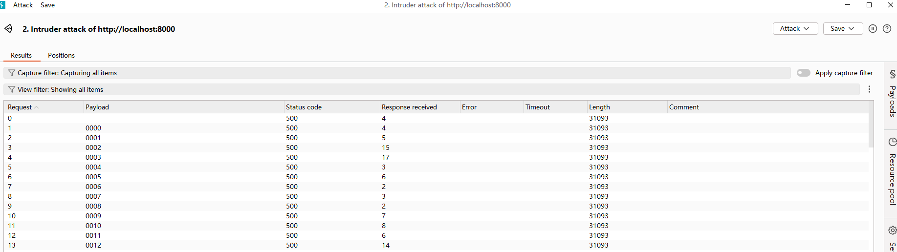


对于6位验证码的，为了在5分钟内跑完，可以分批跑，准备10个BP，每个BP负责一部分数据。把intruder的数据包复制到其他bp里面就可以了

**验证码回显**
验证码回显是指验证码在发送的时候会存在数据包中，通过观察回显的数据包中的数据，找到验证码

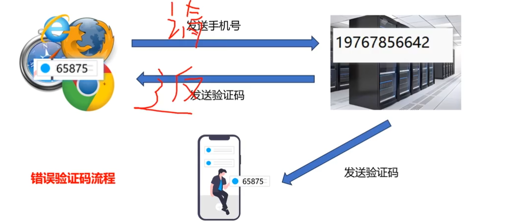

这种是开发人员的失误导致的


**验证码与手机未绑定认证关系**
手机验证码的短信一般只能用一次，如果手机验证码和手机号没有绑定认证关系，就会存在：A手机收到的验证码B手机可以用

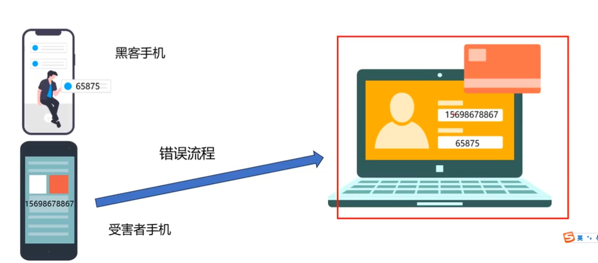

**验证码转发**
有些开发人员在接收手机号的时候用的是数组接收或遍历手机号，没有对手机号进行校验，可以同时发生验证码到两个手机从而达到绕过

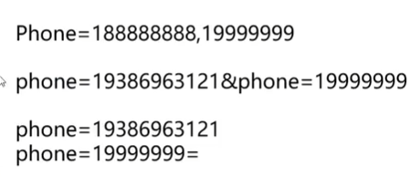


## Fuzz
知道某些特定条件下，对未知的部分进行逐个猜测
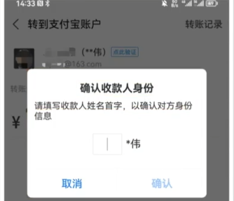
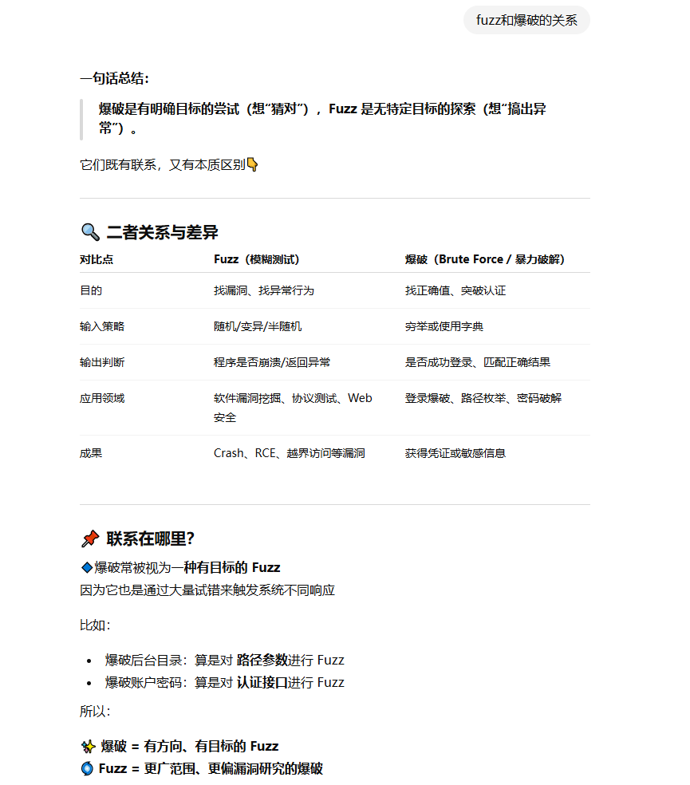

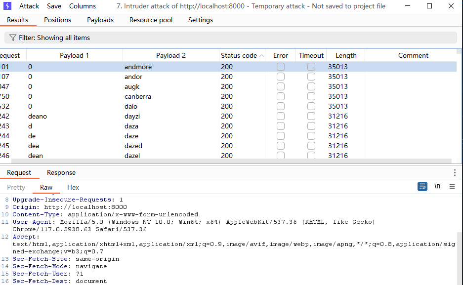


需要用到fuzz的技巧场景：
- 破解密码
- 扫描目录
- 扫描参数
- 测试漏洞


## 资料
- https://www.bilibili.com/video/BV1n5k6BWEog/?spm_id_from=333.337.search-card.all.click&vd_source=c3939bba6fb53dcccb38ed988f16994c
